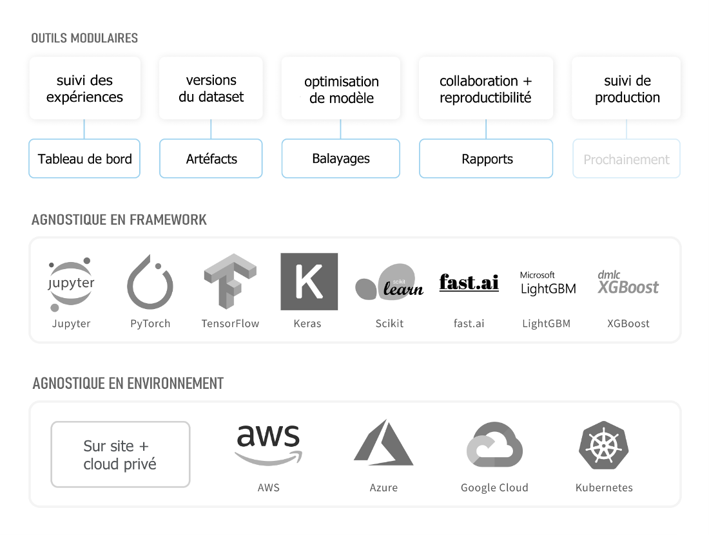

# Weights & Biases

Weights & Biases vous aide à suivre l’évolution de vos projets d’apprentissage automatique. Utilisez notre outil pour enregistrer des hyperparamètres et obtenir des mesures après vos essais, puis visualisez et comparez les résultats et partagez vos découvertes avec vos collègues.

Nos outils fonctionnent avec vos infrastructures d’apprentissage automatique : AWS, GCP, Kubernetes, Azure, et machines sur site.

### Outils

1.  ****[**Tableau de bord** ](https://docs.wandb.ai/app): Suivez vos expériences, visualisez les résultats
2. \*\*\*\*[**Rapports**](https://docs.wandb.ai/reports) ****: Sauvegardez et partagez vos découvertes reproductibles
3. \*\*\*\*[**Balayages**](https://docs.wandb.ai/sweeps) **:** Optimisez vos modèles avec des réglages d’hyperparamètres
4.  ****[**Artéfacts**](https://docs.wandb.ai/artifacts) ****: Versions de dataset et de modèle, suivi des pipelines



## Mise en place

 Ajoutez facilement notre librairie Python `wandb` à votre script d’apprentissage automatique.  

* [Bien débuter](https://docs.wandb.ai/quickstart)
* [Intégration Keras](https://docs.wandb.ai/integrations/keras)
* [Intégration PyTorch](https://docs.wandb.ai/integrations/pytorch)
* [Intégration TensorFlow](https://docs.wandb.ai/integrations/tensorflow)
* [Intégration Jupyter notebook](https://docs.wandb.ai/integrations/jupyter)

Voici un exemple d’impression écran pour un [projet d’Identification d’Espèces](https://wandb.ai/stacey/curr_learn/reports/Species-Identification--VmlldzoxMDc2NA) dans W&B.

## Exemples

Si vous aimeriez voir des exemples de projets, voici quelques ressources à consulter :

*  [App Galerie](https://app.wandb.ai/gallery) : Une galerie de rapports mis en valeur dans notre application web
*  [Exemples de Projets ](https://docs.wandb.ai/examples): Code et projets sur GitHub et Colab

