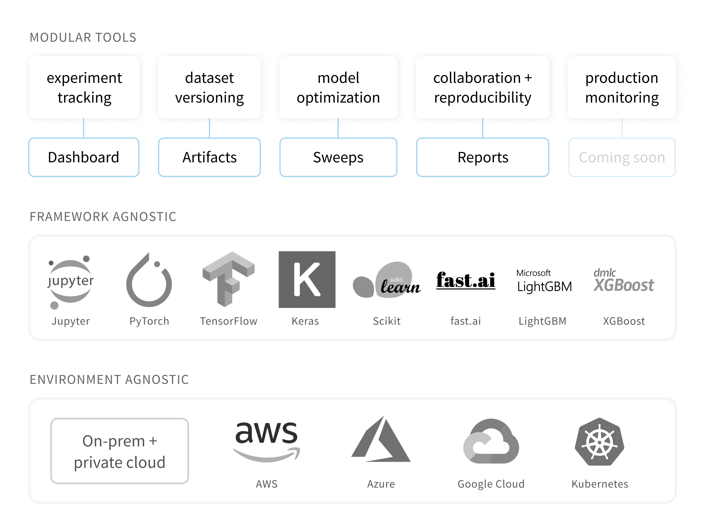

# Weights & Biases

Weights＆Biasesは、あなたが機械学習プロジェクトを円満に追跡できるようにサポートします。あなたは当社のツールを使用することにより、実行のハイパーパラメータとメトリック出力をログに記録し、さらに、結果を視覚化して比較し、結果を同僚とすばやく共有することが可能になります。

 当社のツールは、AWS、GCP、Kubernetes、Azure、およびオンプレミスのマシンなどの機械学習インフラストラクチャを基盤にしています。

##  ツール

1.  [**ダッシュボード**](https://app.gitbook.com/@weights-and-biases/s/docs/~/drafts/-MNTAj1Pg4WBXiUUFUpS/v/japanese/app)：実験を追跡し、結果を視覚化します
2.  [**レポート**](https://app.gitbook.com/@weights-and-biases/s/docs/~/drafts/-MNTAj1Pg4WBXiUUFUpS/v/japanese/reports)：再現可能な調査結果を保存して共有します
3.  [**スイープ**](https://app.gitbook.com/@weights-and-biases/s/docs/~/drafts/-MNTAj1Pg4WBXiUUFUpS/v/japanese/sweeps)：ハイパーパラメータの調整を使用してモデルを最適化します
4. [**アーティファクト**](https://app.gitbook.com/@weights-and-biases/s/docs/~/drafts/-MNTAj1Pg4WBXiUUFUpS/v/japanese/artifacts)：データセットおよびモデルのバージョン管理、パイプライン追跡



##  入門

 当社のPythonライブラリ`wandb`をあなたの機械学習スクリプトに簡単に追加できます。

*  [クイックスタート](https://app.gitbook.com/@weights-and-biases/s/docs/~/drafts/-MNTAj1Pg4WBXiUUFUpS/v/japanese/quickstart)
*  [Kerasの統合](https://app.gitbook.com/@weights-and-biases/s/docs/~/drafts/-MNTAj1Pg4WBXiUUFUpS/v/japanese/integrations/keras)
*  [PyTorchの統合](https://app.gitbook.com/@weights-and-biases/s/docs/~/drafts/-MNTAj1Pg4WBXiUUFUpS/v/japanese/integrations/pytorch)
*  [TensorFlowの統合](https://app.gitbook.com/@weights-and-biases/s/docs/~/drafts/-MNTAj1Pg4WBXiUUFUpS/v/japanese/integrations/tensorflow)
*  [Jupyterノートブックの統合](https://app.gitbook.com/@weights-and-biases/s/docs/~/drafts/-MNTAj1Pg4WBXiUUFUpS/v/japanese/integrations/jupyter)

 以下の図は、W＆Bの[種識別プロジェクト](https://wandb.ai/stacey/curr_learn/reports?view=stacey%2FSpecies%20Identification)サンプルのスクリーンショットです。

## 実例

サンプルプロジェクトに興味がある場合は、当社のいくつかのリソースをご覧ください。

*  [アプリギャラリー](https://wandb.ai/gallery)：ウェブアプリの注目レポートのギャラリー
*  [プロジェクトの例](https://app.gitbook.com/@weights-and-biases/s/docs/~/drafts/-MNTAj1Pg4WBXiUUFUpS/v/japanese/examples)：GitHubとColabのコードおよびプロジェクト

