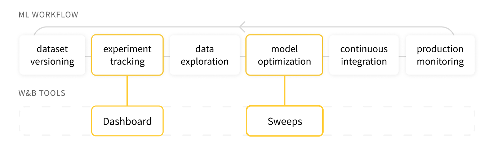

# Weights & Biases

Weights & Biases helps you keep track of your machine learning experiments. Use our tool to log hyperparameters and output metrics from your runs, then visualize and compare results and quickly share findings with your colleagues.

Our tools work with your machine learning infrastructure: AWS, GCP, Kubernetes, Azure, and on-prem machines.

Here's a sample screenshot from a [Species Identification project](https://app.wandb.ai/stacey/curr_learn/reports?view=stacey%2FSpecies%20Identification) in W&B.

## Getting Started

Easily add our package, `wandb`, to your model script.

* [Quickstart](quickstart.md)
* [Keras integration](library/frameworks/keras.md)
* [PyTorch integration](library/frameworks/pytorch/)
* [TensorFlow integration](library/frameworks/tensorflow.md)

## Examples

If you're interested in example projects, we have a few resources:

* [App Gallery](https://app.wandb.ai/gallery): A gallery of featured reports in our web app
* [Example Projects](library/example-projects/): Python scripts and the results in our web app

