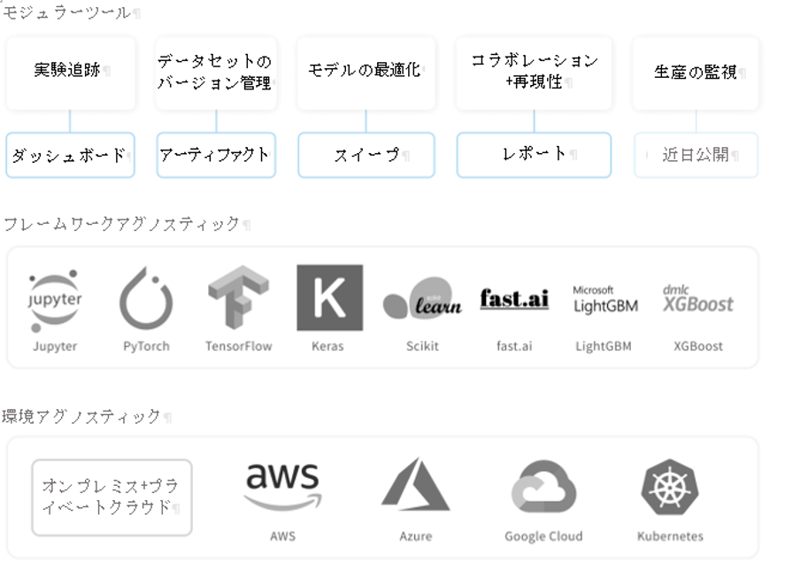

# Weights & Biases

 Weights＆Biasesは、機械学習プロジェクトの記録を助けます。当社のツールを使用することにより、ハイパーパラメータや実行の出力メトリックをログに記録し、それを可視化できます。そして結果や所見を迅速に人々と共有することができます。

弊社モジュラーツールの概要：

1. [**ダッシュボード**](https://app.gitbook.com/@weights-and-biases/s/docs/~/drafts/-MNTAj1Pg4WBXiUUFUpS/v/japanese/app)：実験の記録
2. [**アーティファクト**](https://app.gitbook.com/@weights-and-biases/s/docs/~/drafts/-MNTAj1Pg4WBXiUUFUpS/v/japanese/artifacts)：データセットおよびモデルのバージョン管理
3. [**スイープ**](https://app.gitbook.com/@weights-and-biases/s/docs/~/drafts/-MNTAj1Pg4WBXiUUFUpS/v/japanese/sweeps)：ハイパーパラメータの最適化
4. [**レポート**](https://app.gitbook.com/@weights-and-biases/s/docs/~/drafts/-MNTAj1Pg4WBXiUUFUpS/v/japanese/reports)：再現可能な調査結果を保存・共有 



##  **始めましょう**

当社のPythonライブラリ`wandb`をあなたの機械学習スクリプトに簡単に追加できます。

* [クイックスタート](https://app.gitbook.com/@weights-and-biases/s/docs/~/drafts/-MNTAj1Pg4WBXiUUFUpS/v/japanese/quickstart)​
* [Kerasの統合](https://app.gitbook.com/@weights-and-biases/s/docs/~/drafts/-MNTAj1Pg4WBXiUUFUpS/v/japanese/integrations/keras)​
* [PyTorchの統合](https://app.gitbook.com/@weights-and-biases/s/docs/~/drafts/-MNTAj1Pg4WBXiUUFUpS/v/japanese/integrations/pytorch)​
* [TensorFlowの統合](https://app.gitbook.com/@weights-and-biases/s/docs/~/drafts/-MNTAj1Pg4WBXiUUFUpS/v/japanese/integrations/tensorflow) ​
* [Jupyterノートブックの統合](https://app.gitbook.com/@weights-and-biases/s/docs/~/drafts/-MNTAj1Pg4WBXiUUFUpS/v/japanese/integrations/jupyter)​

 以下の図は、W＆Bの[種識別プロジェクト](https://wandb.ai/stacey/curr_learn/reports?view=stacey%2FSpecies%20Identification)のサンプルスクリーンショットです。

## **実例**

プロジェクト実例に興味がある場合は、当社のリソースをご覧ください。

* [アプリギャラリー](https://wandb.ai/gallery)：ウェブアプリの注目レポートのギャラリー
* [プロジェクトの例](https://app.gitbook.com/@weights-and-biases/s/docs/~/drafts/-MNTAj1Pg4WBXiUUFUpS/v/japanese/examples)：GitHubとColabのコードおよびプロジェクト

