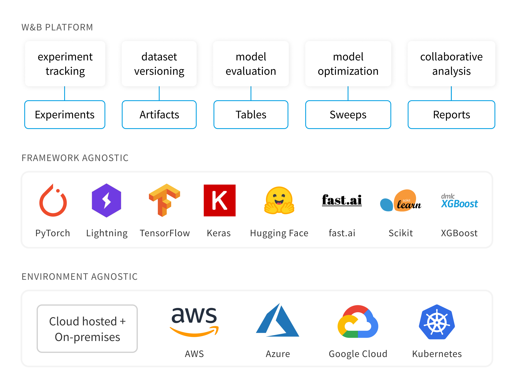

# Weights & Biases

Weights & Biases is the machine learning platform for developers to build better models faster. Use W\&B's lightweight, interoperable tools to quickly track experiments, version and iterate on datasets, evaluate model performance, reproduce models, visualize results and spot regressions, and share findings with colleagues.

Set up W\&B in 5 minutes, then quickly iterate on your machine learning pipeline with the confidence that your datasets and models are tracked and versioned in a reliable system of record.

### Guides

1. [Experiment Tracking](guides/track/): Visualize experiments in real time
2. [Integrations](guides/integrations/): PyTorch, Keras, Hugging Face, and more
3. [Hyperparameter Tuning](guides/sweeps/): Optimize models quickly
4. [Data + Model Versioning](guides/artifacts/): Version datasets and models
5. [Data Visualization](guides/data-vis/): Visualize predictions across model versions
6. [Collaborative Reports](guides/reports/): Describe and share findings
7. [Private-Hosting](guides/self-hosted/): Private cloud and local hosting of the W\&B app

### Reference

1. [App User Interface](ref/app/)
2. [Python Library](ref/python/)
3. [Command Line Interface](ref/cli/)



