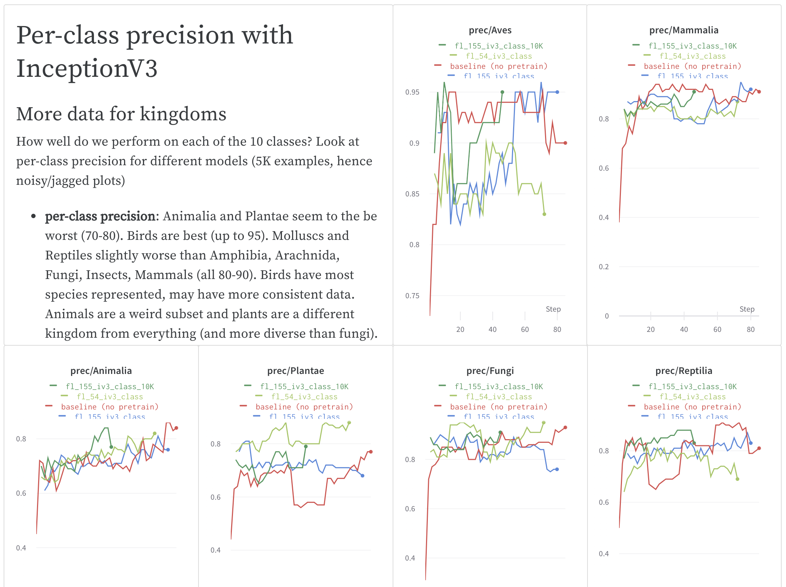

# Weights & Biases

Weights & Biases vous aide à suivre l’évolution de vos projets d’apprentissage automatique. Utilisez notre outil pour enregistrer des hyperparamètres et obtenir les métriques de vos essais, puis visualisez et comparez les résultats, et partagez vos découvertes avec vos collègues. 

Un bref aperçu de nos outils, modulaires et légers :

1. [**Tableau de bord** ](https://docs.wandb.ai/app): suivez vos expériences
2. [**Artéfacts**](https://docs.wandb.ai/artifacts) ****: versionnage des jeux de données et des modèles
3. [**Balayages**](https://docs.wandb.ai/sweeps) **:** optimisation des hyperparamètres
4. [**Rapports**](https://docs.wandb.ai/reports) ****: sauvegardez et partagez vos découvertes reproductibles



## **Démarrer avec wandb**

Ajoutez facilement notre librairie Python `wandb` à votre script d’apprentissage automatique.

* ​[Démarrage](https://docs.wandb.ai/quickstart) rapide​
* ​[Intégration Keras](https://docs.wandb.ai/integrations/keras)​
* ​[Intégration PyTorch](https://docs.wandb.ai/integrations/pytorch)​
* ​[Intégration TensorFlow](https://docs.wandb.ai/integrations/tensorflow)​
* [​Intégration notebook Jupyter​](https://app.gitbook.com/@weights-and-biases/s/docs/~/drafts/-MXbt1gq1datlx0W8QhK/v/fr/integrations/jupyter)

 Voici un exemple en capture d’écran d’un [projet d’identification d’espèces](https://wandb.ai/stacey/curr_learn/reports/Species-Identification--VmlldzoxMDc2NA) sur W&B.

##  **Exemples**

Si vous souhaitez voir des exemples de projets, voici quelques ressources à consulter :

* [Galerie App](https://app.wandb.ai/gallery) : Une galerie de rapports mis en valeur dans notre application web
* [Exemples de projets ](https://docs.wandb.ai/examples): Code et projets sur GitHub et Colab

