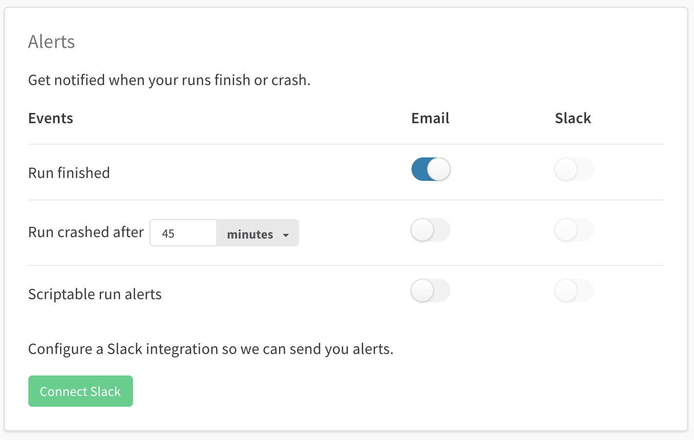

# Alerts

W&B can post notifications to email or Slack whenever your runs crash, complete, or call [wandb.alert\(\)](../../library/wandb.alert.md).

### User Alerts

Set up notifications when a run finishes, crashes, or you call `wandb.alert()`. These apply to all projects where you launch runs, including both personal and team projects. 

In your [User Settings](https://wandb.ai/settings):

* Scroll down to the **Alerts** section
* Click **Connect Slack** to pick a channel to post alerts. We recommend the **Slackbot** channel because it keeps the alerts private.
* **Email** will go to the email address you used when you signed up for W&B. We recommend setting up a filter in your email so all these alerts go into a folder and don't fill up your inbox.

### Team Alerts

Team admins can set up alerts for the team on the team settings page: wandb.ai/teams/`your-team`. These alerts apply to everyone on your team. We recommend using the **Slackbot** channel because it keeps the alerts private.

### Changing Slack Channels

To change what channel you're posting to, click **Disconnect Slack** and then reconnect, picking a different destination channel.

