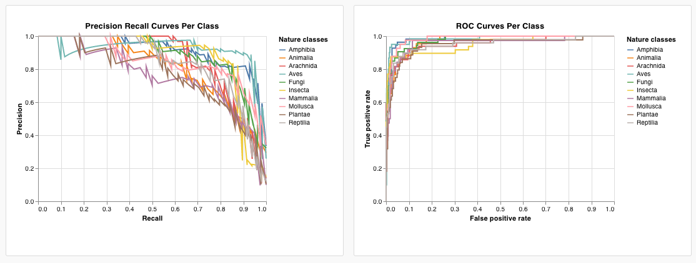
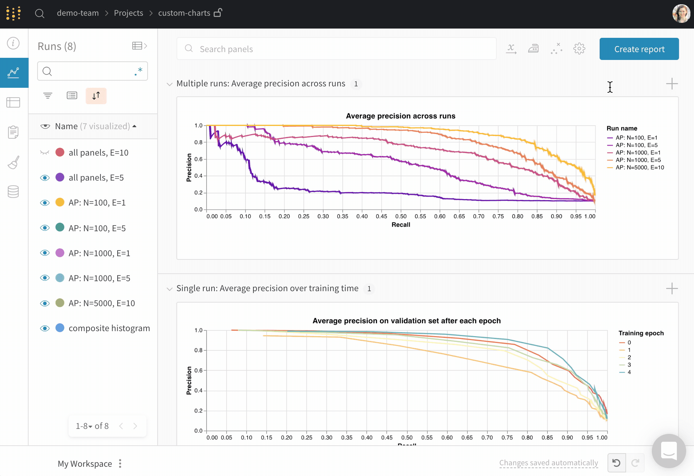
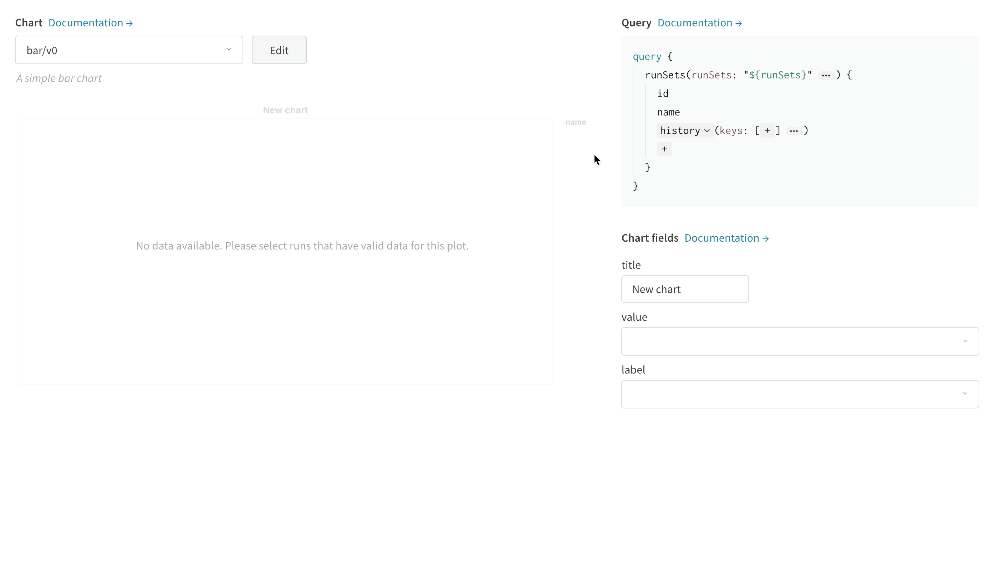

# Custom Charts

Use **Custom Charts** to create charts that aren't possible right now in the default UI. Log arbitrary tables of data and visualize them exactly how you want. Control details of fonts, colors, and tooltips with the power of [Vega](https://vega.github.io/vega/).

* **What's possible**: Read the[ launch announcement →](https://wandb.ai/wandb/posts/reports/Announcing-the-W-B-Machine-Learning-Visualization-IDE--VmlldzoyNjk3Nzg)
* **Code**: Try a live example in a[ hosted notebook →](https://tiny.cc/custom-charts)
* **Video**: Watch a quick [walkthrough video →](https://www.youtube.com/watch?v=3-N9OV6bkSM)
* **Example**: Quick Keras and Sklearn [demo notebook →](https://colab.research.google.com/drive/1g-gNGokPWM2Qbc8p1Gofud0_5AoZdoSD?usp=sharing)

Contact Carey \(c@wandb.com\) with questions or suggestions


### How it works

1. **Log data**: From your script, log [config](../../../library/config.md) and summary data as you normally would when running with W&B. To visualize a list of multiple values logged at one specific time, use a custom`wandb.Table`
2. **Customize the chart**: Pull in any of this logged data with a [GraphQL](https://graphql.org/) query. Visualize the results of your query with [Vega](https://vega.github.io/vega/), a powerful visualization grammar.
3. **Log the chart**: Call your own preset from your script with `wandb.plot_table()` or use one of our builtins.





## Log charts from a script

### Builtin presets

These presets have builtin `wandb.plot` methods that make it fast to log charts directly from your script and see the exact visualizations you're looking for in the UI.



`wandb.plot.line()`

Log a custom line plot—a list of connected and ordered points \(x,y\) on arbitrary axes x and y.

```python
data = [[x, y] for (x, y) in zip(x_values, y_values)]
table = wandb.Table(data=data, columns = ["x", "y"])
wandb.log({"my_custom_plot_id" : wandb.plot.line(table, "x", "y", title="Custom Y vs X Line Plot")})
```

You can use this to log curves on any two dimensions. Note that if you're plotting two lists of values against each other, the number of values in the lists must match exactly \(i.e. each point must have an x and a y\).


[See in the app →](https://wandb.ai/wandb/plots/reports/Custom-Line-Plots--VmlldzoyNjk5NTA)

[Run the code →](https://tiny.cc/custom-charts)



`wandb.plot.scatter()`

Log a custom scatter plot—a list of points \(x, y\) on a pair of arbitrary axes x and y.

```python
data = [[x, y] for (x, y) in zip(class_x_prediction_scores, class_y_prediction_scores)]
table = wandb.Table(data=data, columns = ["class_x", "class_y"])
wandb.log({"my_custom_id" : wandb.plot.scatter(table, "class_x", "class_y")})
```

You can use this to log scatter points on any two dimensions. Note that if you're plotting two lists of values against each other, the number of values in the lists must match exactly \(i.e. each point must have an x and a y\).


[See in the app →](https://wandb.ai/wandb/plots/reports/Custom-Scatter-Plots--VmlldzoyNjk5NDQ)

[Run the code →](https://tiny.cc/custom-charts)



`wandb.plot.bar()`

Log a custom bar chart—a list of labeled values as bars—natively in a few lines:

```python
data = [[label, val] for (label, val) in zip(labels, values)]
table = wandb.Table(data=data, columns = ["label", "value"])
wandb.log({"my_bar_chart_id" : wandb.plot.bar(table, "label", "value", title="Custom Bar Chart")
```

You can use this to log arbitrary bar charts. Note that the number of labels and values in the lists must match exactly \(i.e. each data point must have both\).


[See in the app →](https://wandb.ai/wandb/plots/reports/Custom-Bar-Charts--VmlldzoyNzExNzk)

[Run the code →](https://tiny.cc/custom-charts)



`wandb.plot.histogram()`

Log a custom histogram—sort list of values into bins by count/frequency of occurrence—natively in a few lines. Let's say I have a list of prediction confidence scores \(`scores`\) and want to visualize their distribution:

```python
data = [[s] for s in scores]
table = wandb.Table(data=data, columns=["scores"])
wandb.log({'my_histogram': wandb.plot.histogram(table, "scores", title=None)})
```

You can use this to log arbitrary histograms. Note that `data` is a list of lists, intended to support a 2D array of rows and columns.


[See in the app →](https://wandb.ai/wandb/plots/reports/Custom-Histograms--VmlldzoyNzE0NzM)

[Run the code →](https://tiny.cc/custom-charts)



`wandb.plot.pr_curve()`

Log a [Precision-Recall curve](https://scikit-learn.org/stable/modules/generated/sklearn.metrics.precision_recall_curve.html#sklearn.metrics.precision_recall_curve) in one line:

```python
wandb.log({"pr" : wandb.plot.pr_curve(ground_truth, predictions,
                     labels=None, classes_to_plot=None)})
```

You can log this whenever your code has access to:

* a model's predicted scores \(`predictions`\) on a set of examples
* the corresponding ground truth labels \(`ground_truth`\) for those examples
* \(optionally\) a list of the labels/class names \(`labels=["cat", "dog", "bird"...]` if label index 0 means cat, 1 = dog, 2 = bird, etc.\)
* \(optionally\) a subset \(still in list format\) of the labels to visualize in the plot


[See in the app →](https://wandb.ai/wandb/plots/reports/Plot-Precision-Recall-Curves--VmlldzoyNjk1ODY)

[Run the code →](https://colab.research.google.com/drive/1mS8ogA3LcZWOXchfJoMrboW3opY1A8BY?usp=sharing)



`wandb.plot.roc_curve()`

Log an [ROC curve](https://scikit-learn.org/stable/modules/generated/sklearn.metrics.roc_curve.html#sklearn.metrics.roc_curve) in one line:

```text
wandb.log({"roc" : wandb.plot.roc_curve( ground_truth, predictions, \
                        labels=None, classes_to_plot=None)})
```

You can log this whenever your code has access to:

* a model's predicted scores \(`predictions`\) on a set of examples
* the corresponding ground truth labels \(`ground_truth`\) for those examples
* \(optionally\) a list of the labels/ class names \(`labels=["cat", "dog", "bird"...]` if label index 0 means cat, 1 = dog, 2 = bird, etc.\)
* \(optionally\) a subset \(still in list format\) of these labels to visualize on the plot


[See in the app →](https://wandb.ai/wandb/plots/reports/Plot-ROC-Curves--VmlldzoyNjk3MDE)

[Run the code →](https://colab.research.google.com/drive/1_RMppCqsA8XInV_jhJz32NCZG6Z5t1RO?usp=sharing)



### **Custom presets**

Tweak a builtin preset, or create a new preset, then save the chart. Use the chart ID to log data to that custom preset directly from your script.

```python
# Create a table with the columns to plot
table = wandb.Table(data=data, columns=["step", "height"])

# Map from the table's columns to the chart's fields
fields = {"x": "step",
          "value": "height"}

# Use the table to populate the new custom chart preset
# To use your own saved chart preset, change the vega_spec_name
my_custom_chart = wandb.plot_table(vega_spec_name="carey/new_chart",
              data_table=table,
              fields=fields,
              )
```

[Run the code →](https://tiny.cc/custom-charts)


## Log data

Here are the data types you can log from your script and use in a custom chart:

* **Config**: Initial settings of your experiment \(your independent variables\). This includes any named fields you've logged as keys to `wandb.config` at the start of your training \(e.g. `wandb.config.learning_rate = 0.0001)`
* **Summary**: Single values logged during training \(your results or dependent variables\), e.g. `wandb.log({"val_acc" : 0.8})`. If you write to this key multiple times during training via `wandb.log()`, the summary is set to the final value of that key.
* **History**: The full timeseries of the logged scalar is available to the query via the `history` field
* **summaryTable**: If you need to log a list of multiple values, use a `wandb.Table()` to save that data, then query it in your custom panel.

### **How to log a custom table**

Use `wandb.Table()` to log your data as a 2D array. Typically each row of this table represents one data point, and each column denotes the relevant fields/dimensions for each data point which you'd like to plot. As you configure a custom panel, the whole table will be accessible via the named key passed to `wandb.log()`\("custom\_data\_table" below\), and the individual fields will be accessible via the column names \("x", "y", and "z"\). You can log tables at multiple time steps throughout your experiment. The maximum size of each table is 10,000 rows.

[Try it in a Google Colab →](https://tiny.cc/custom-charts)

```python
# Logging a custom table of data
my_custom_data = [[x1, y1, z1], [x2, y2, z2]]
wandb.log({“custom_data_table”: wandb.Table(data=my_custom_data,
                                columns = ["x", "y", "z"])})
```

## Customize the chart

Add a new custom chart to get started, then edit the query to select data from your visible runs. The query uses [GraphQL](https://graphql.org/) to fetch data from the config, summary, and history fields in your runs.



### Custom visualizations

Select a **Chart** in the upper right corner to start with a default preset. Next, pick **Chart fields** to map the data you're pulling in from the query to the corresponding fields in your chart. Here's an example of selecting a metric to get from the query, then mapping that into the bar chart fields below.



### How to edit Vega

Click **Edit** at the top of the panel to go into [Vega](https://vega.github.io/vega/) edit mode. Here you can define a [Vega specification](https://vega.github.io/vega/docs/specification/) that creates an interactive chart in the UI. You can change any aspect of the chart, from the visual style \(e.g. change the title, pick a different color scheme, show curves as a series of points instead of as connected lines\) to the data itself \(use a Vega transform to bin an array of values into a histogram, etc.\). The panel preview will update interactively, so you can see the effect of your changes as you edit the Vega spec or query. The [Vega documentation and tutorials ](https://vega.github.io/vega/)are an excellent source of inspiration.

**Field references**

To pull data into your chart from W&B, add template strings of the form `"${field:<field-name>}"` anywhere in your Vega spec. This will create a dropdown in the **Chart Fields** area on the right side, which users can use to select a query result column to map into Vega.

To set a default value for a field, use this syntax: `"${field:<field-name>:<placeholder text>}"`

### Saving chart presets

Apply any changes to a specific visualization panel with the button at the bottom of the modal. Alternatively, you can save the Vega spec to use elsewhere in your project. To save the reusable chart definition, click **Save as** at the top of the Vega editor and give your preset a name.

## Articles and guides

1. [The W&B Machine Learning Visualization IDE](https://wandb.ai/wandb/posts/reports/The-W-B-Machine-Learning-Visualization-IDE--VmlldzoyNjk3Nzg)
2. [Visualizing NLP Attention Based Models](https://wandb.ai/kylegoyette/gradientsandtranslation2/reports/Visualizing-NLP-Attention-Based-Models-Using-Custom-Charts--VmlldzoyNjg2MjM)
3. [Visualizing The Effect of Attention on Gradient Flow](https://wandb.ai/kylegoyette/gradientsandtranslation/reports/Visualizing-The-Effect-of-Attention-on-Gradient-Flow-Using-Custom-Charts--VmlldzoyNjg1NDg)
4. [Logging arbitrary curves](https://wandb.ai/stacey/deep-drive/reports/Logging-arbitrary-curves--VmlldzoyMzczMjM)

## Frequently asked questions

### Coming soon

* **Polling**: Auto-refresh of data in the chart
* **Sampling**: Dynamically adjust the total number of points loaded into the panel for efficiency

### Gotchas

* Not seeing the data you're expecting in the query as you're editing your chart? It might be because the column you're looking for is not logged in the runs you have selected. Save your chart and go back out to the runs table, and select the runs you'd like to visualize with the **eye** icon.

### Common use cases

* Customize bar plots with error bars
* Show model validation metrics which require custom x-y coordinates \(like precision-recall curves\)
* Overlay data distributions from two different models/experiments as histograms
* Show changes in a metric via snapshots at multiple points during training
* Create a unique visualization not yet available in W&B \(and hopefully share it with the world\) 

