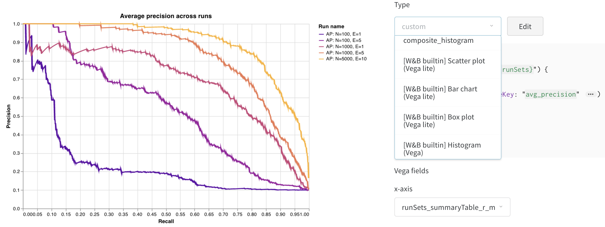
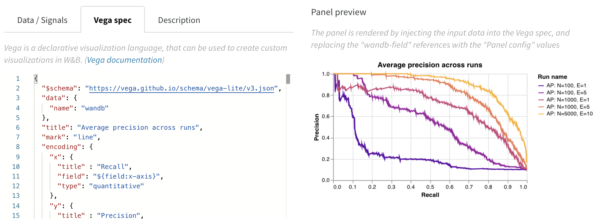

# Custom Charts \[Beta\]

Create custom charts to visualize your experiment data. This new beta feature allows you to fetch any of the data you've logged in a run and customize both the query and the visualization.

[Try it in a Google Colab →](http://bit.ly/custom-charts-colab)

[See live example charts →](https://app.wandb.ai/demo-team/custom-charts/reports/Custom-Charts--VmlldzoyMTk5MDc)

Contact **carey@wandb.com** with questions or suggestions.

### How it works

1. **Log data**: From your script, log [config](../../../library/config.md) and summary data as well as custom tables.
2. **Custom queries**: Pull in your data and transform in with a [GraphQL](https://graphql.org/) query.
3. **Custom visualizations**: Visualize your data with [Vega](https://vega.github.io/vega/), a visualization grammar. 


## Log data

### **Config and summary data**

* **Config**: Initial settings of your experiment \(your independent variables\)
* **Summary**: Results at the end of your training. By default, if you track a metric in history with `wandb.log()`we set the summary to the final value of that history key.
* **Table**: If you need to log a list of multiple values, use a `wandb.Table()` to save that data, then query it in your custom panel. 

### **Log a custom table**

Use `wandb.Table()` to log your data as a custom 2D array. Typically each row of this table represents one data point, and each column denotes the relevant fields/dimensions for each data point which you'd like to plot. As you configure a custom panel, the whole table will be accessible via the named key passed to `wandb.log()`\(in the example below, "custom\_data\_table"\), and the individual fields will be accessible via the column names \("x", "y", and "z"\). You can log tables at multiple time steps throughout your experiment. The maximum size of each table is 10,000 rows. 

[Try it in a Google Colab →](http://bit.ly/custom-charts-colab)

```python
# Logging a custom table of data
my_custom_data = [[x1, y1, z1], [x2, y2, z2]]
wandb.log({“custom_data_table”: wandb.Table(data=my_custom_data,
                                columns = ["x", "y", "z"])})
```

## Custom queries

Add a new custom chart to get started, then edit the query to select data from your visible runs. The query uses [GraphQL](https://graphql.org/) to fetch data from the config, summary, and history fields in your runs.


**Details of query editing**

* **Named subfields**: Any named fields you've logged as keys to `wandb.config` at the start of your training \(e.g. `wandb.config.learning_rate = 0.0001`\) or to the results summary via `wandb.log` \(e.g. `wandb.log({"val_acc" : 0.8})` will be accessible via those named keys in the custom query \(the subfields "learning\_rate" and "val\_acc"\).
* **Fold**: Use this to get each of the selected keys as a separate point. An example use case: you have `acc` and `val_acc` in history, and you'd like to display them as two separate lines on a chart, so you use historyFold in the query.

## Custom visualizations

Select a **Type** of visualization to switch between the built-ins: scatter plot, bar chart, box plot, histogram, violin plot, and contour plot. 

Select **Vega fields** below to map the data you're pulling in from the query to the fields in the chart. For example: pull `avg_precision` as a field in the query \(specifically, this loads the `summaryTables` named "avg\_precision" logged by earlier runs\). This feeds your data from wandb logs into the right Vega field and displays it in the chart. For example, for a simple bar chart, you could set the Vega field `value` to show "loss" \(displayed as`runSets_summary_loss`\) to see your final training loss across multiple runs. In the example below, average precision is represented as a series of coordinate points of \(recall, precision\), so we map the Vega field `x-axis` to the recall, or `"r_m"` field, and the Vega field `y-axis` to the precision or `"p_m"` field \(not shown\) to display the average precision curves on this chart.

[See live example charts →](https://app.wandb.ai/demo-team/custom-charts/reports/Custom-Charts--VmlldzoyMTk5MDc)



### Editing Vega

Click **Edit** at the top of the panel to go into [Vega](https://vega.github.io/vega/) edit mode. Here you can define a [Vega specification](https://vega.github.io/vega/docs/specification/) that creates an interactive chart in the UI.



Use the **Data / Signals** tab to debug. This shows you the tables that are available to you in the Vega view, coming in from the query.

### Saving Charts

Apply this visualization to the specific panel, or save the Vega spec to reuse elsewhere in your project. To save the reusable chart definition, click **Save as** at the top of the Vega editor and give your preset a name. 

## Frequently asked questions

### Coming soon

* **Run colors**: Matching the colors in the charts to the run colors set in the sidebar
* **Custom fields**: Adding custom string fields outside of the Vega spec
* **wandb.plot\(\)**: Call from Python to log custom visualizations
* **Polling**: Auto-refresh of data in the chart
* **Sampling**: Reducing the total number of points that come in to the panel
* **Save templates**: Use a Vega chart across different projects without needing to manually copy and paste

### Gotchas

* Not seeing the data you're expecting in the query as you're editing your chart? It might be because the column you're looking for is not logged in the runs you have selected. Save your chart and go back out to the runs table, and select the runs you'd like to visualize with the **eye** icon.

### Common use cases

* Overlay histograms of data from two different models
* Customize bar plots with error bars

