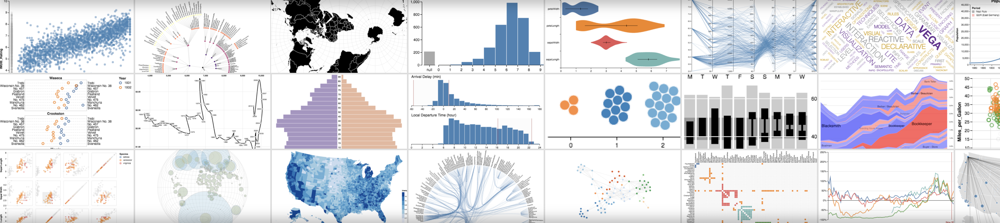

# Custom Charts

**사용자 정의 차트\(Custom Charts\)**를 사용하여 현재 기본값 UI에서는 불가능한 차트를 생성하실 수 있습니다. 여러분이 원하는 바로 그대로 임의의 데이터 테이블을 로그 및 시각화하실 수 있습니다. [Vega](https://vega.github.io/vega/)의 기능을 사용해서 폰트, 색상, 툴팁의 세부 사항을 제어합니다.

* **무엇을 할 수 있나요?\(What's possible\)**: [출시 발표 내용](https://wandb.ai/wandb/posts/reports/Announcing-the-W-B-Machine-Learning-Visualization-IDE--VmlldzoyNjk3Nzg)을 읽어보시기 바랍니다​
* **코드\(Code\):** [호스팅 된 notebook](https://tiny.cc/custom-charts)에서 라이브 예시를 사용해 보세요​
* **비디오\(Video\)**: [안내 비디오](https://www.youtube.com/watch?v=3-N9OV6bkSM)를 시청하세요​
* **예시\(Example\)**: Quick Keras 및 Sklearn [데모 notebook →](https://colab.research.google.com/drive/1g-gNGokPWM2Qbc8p1Gofud0_5AoZdoSD?usp=sharing)

질문 및 제안 사항이 있으시면 Carey \([c@wandb.com](mailto:c@wandb.com)\)로 연락해 주시기 바랍니다​



### **작동 방식**

1. **데이터 로그하기**: 스크립트에서 W&B로 실행하실 때, 평소에 사용하는 것과 같이 [구성\(config\)](https://docs.wandb.ai/v/ko/library/config) 및 요약 데이터를 로그합니다. 특정 시간에 로그된 여러 값의 리스트를 시각화하시려면 사용자 정의 `wandb.Table`를 사용하세요
2. **차트 사용자 정의하기:** [GraphQL](https://graphql.org/) 쿼리를 사용해서 로그된 데이터를 끌어옵니다. 강력한 시각화 문법\(visualization grammar\) [Vega](https://vega.github.io/vega/)를 사용해서 쿼리의 결과를 시각화하세요
3. **차트 로그하기**: wandb.plot\_table\(\)를 사용해 스크립트에서 여러분의 프리셋\(preset\)를 호출하거나 저희 기본 빌트인\(builtin\) 중 하나를 사용하세요




##  **스크립트에서 차트 로그하기**

###  **빌트인 프리셋\(Builtin presets\)**

 이 프리셋에는 스크립트에서 직접 신속하게 차트를 로그하고, 여러분께서 UI에서 기대한 바로 그 시각화를 확인할 수 있는 빌트인 `wandb.plot` 기능이 내장되어 있습니다.



`wandb.plot.line()`

임의의 축x와 y에 연결되고 정렬된 점\(x,y\)의 목록인 사용자 지정 라인 플롯\(line plot\)을 로그합니다.

```python
data = [[x, y] for (x, y) in zip(x_values, y_values)]
table = wandb.Table(data=data, columns = ["x", "y"])
wandb.log({"my_custom_plot_id" : wandb.plot.line(table, "x", "y", title="Custom Y vs X Line Plot")})
```

이 옵션을 2차원 상의 로그 곡선에 이용할 수 있습니다. 각 각에 대한 두 개의 값의 리스트를 비교하여 나타내는 경우, 리스트의 값의 수는 정확하게 일치해야 합니다. \(즉, 각 점에는 반드시 x와 y가 있어야 함\)


[앱에서 보기 →](https://wandb.ai/wandb/plots/reports/Custom-Line-Plots--VmlldzoyNjk5NTA)​

[코드 실행하기 →](https://tiny.cc/custom-charts)



`wandb.plot.scatter()`

임의의 축 x와 y의 쌍의 점 \(x, y\)의 목록인 사용자 정의 산점도\(scatter plot\)을 로그합니다.

```python
data = [[x, y] for (x, y) in zip(class_x_prediction_scores, class_y_prediction_scores)]
table = wandb.Table(data=data, columns = ["class_x", "class_y"])
wandb.log({"my_custom_id" : wandb.plot.scatter(table, "class_x", "class_y")})
```

 이를 사용해서 어느 두 차원에 산점도를 로그할 수 있습니다. 각 각에 대한 두 개의 값의 리스트를 비교하여 나타내는 경우, 리스트의 값의 수는 정확하게 일치해야 합니다. \(즉, 각 점에는 반드시 x와 y가 있어야 함\)


   [앱에서 보기 →](https://wandb.ai/wandb/plots/reports/Custom-Scatter-Plots--VmlldzoyNjk5NDQ)​ 

[코드 실행하기 →](https://tiny.cc/custom-charts)



`wandb.plot.bar()`

Log a custom bar chart—a list of labeled values as bars—natively in a few lines:

```python
data = [[label, val] for (label, val) in zip(labels, values)]
table = wandb.Table(data=data, columns = ["label", "value"])
wandb.log({"my_bar_chart_id" : wandb.plot.bar(table, "label", "value", title="Custom Bar Chart")
```

You can use this to log arbitrary bar charts. Note that the number of labels and values in the lists must match exactly \(i.e. each data point must have both\).


[See in the app →](https://wandb.ai/wandb/plots/reports/Custom-Bar-Charts--VmlldzoyNzExNzk)

[Run the code →](https://tiny.cc/custom-charts)



`wandb.plot.histogram()`

Log a custom histogram—sort list of values into bins by count/frequency of occurrence—natively in a few lines. Let's say I have a list of prediction confidence scores \(`scores`\) and want to visualize their distribution:

```python
data = [[s] for s in scores]
table = wandb.Table(data=data, columns=["scores"])
wandb.log({'my_histogram': wandb.plot.histogram(table, "scores", title=None)})
```

You can use this to log arbitrary histograms. Note that `data` is a list of lists, intended to support a 2D array of rows and columns.


[See in the app →](https://wandb.ai/wandb/plots/reports/Custom-Histograms--VmlldzoyNzE0NzM)

[Run the code →](https://tiny.cc/custom-charts)



`wandb.plot.pr_curve()`

Log a [Precision-Recall curve](https://scikit-learn.org/stable/modules/generated/sklearn.metrics.precision_recall_curve.html#sklearn.metrics.precision_recall_curve) in one line:

```python
wandb.log({"pr" : wandb.plot.pr_curve(ground_truth, predictions,
                     labels=None, classes_to_plot=None)})
```

You can log this whenever your code has access to:

* a model's predicted scores \(`predictions`\) on a set of examples
* the corresponding ground truth labels \(`ground_truth`\) for those examples
* \(optionally\) a list of the labels/class names \(`labels=["cat", "dog", "bird"...]` if label index 0 means cat, 1 = dog, 2 = bird, etc.\)
* \(optionally\) a subset \(still in list format\) of the labels to visualize in the plot


[See in the app →](https://wandb.ai/wandb/plots/reports/Plot-Precision-Recall-Curves--VmlldzoyNjk1ODY)

[Run the code →](https://colab.research.google.com/drive/1mS8ogA3LcZWOXchfJoMrboW3opY1A8BY?usp=sharing)



`wandb.plot.roc_curve()`

Log an [ROC curve](https://scikit-learn.org/stable/modules/generated/sklearn.metrics.roc_curve.html#sklearn.metrics.roc_curve) in one line:

```text
wandb.log({"roc" : wandb.plot.roc_curve( ground_truth, predictions, \
                        labels=None, classes_to_plot=None)})
```

You can log this whenever your code has access to:

* a model's predicted scores \(`predictions`\) on a set of examples
* the corresponding ground truth labels \(`ground_truth`\) for those examples
* \(optionally\) a list of the labels/ class names \(`labels=["cat", "dog", "bird"...]` if label index 0 means cat, 1 = dog, 2 = bird, etc.\)
* \(optionally\) a subset \(still in list format\) of these labels to visualize on the plot


[See in the app →](https://wandb.ai/wandb/plots/reports/Plot-ROC-Curves--VmlldzoyNjk3MDE)

[Run the code →](https://colab.research.google.com/drive/1_RMppCqsA8XInV_jhJz32NCZG6Z5t1RO?usp=sharing)



###  **사용자 정의 프리셋**

빌트인 프리셋 변경 또는 새 프리셋을 생성하고, 그 다음 차트를 저장합니다. 차트 ID를 사용해서 데이터를 스크립트에서 사용자 정의 프리셋에 로그합니다

```python
# Create a table with the columns to plot
table = wandb.Table(data=data, columns=["step", "height"])

# Map from the table's columns to the chart's fields
fields = {"x": "step",
          "value": "height"}

# Use the table to populate the new custom chart preset
# To use your own saved chart preset, change the vega_spec_name
my_custom_chart = wandb.plot_table(vega_spec_name="carey/new_chart",
              data_table=table,
              fields=fields,
              )
```

 [코드 실행하기 →](https://tiny.cc/custom-charts)​


##  **데이터 로그하기**

다음은 스크립에서 로그하고 사용자 정의 차트에서 사용할 수 있는 데이터 유형입니다:

* **Config\(구성\)**: 실험의 초기 설정 \(독립 변수\). 훈 시작 시 `wandb.config` 키로 로그된 명명된 영역을 포함합니다. \(예: `wandb.config.learning_rate = 0.0001)`
* **요약\(Summary\)**: 훈련 중 로그 된 단일 값 \(결과 또는 종속 변수\). 예: `wandb.log({"val_acc" : 0.8})`.  훈련 중 `wandb.log()`을 통해 이 키에 여러 번 작성하는 경우, 요약은 해당 키의 최종 값으로 설정됩니다.
* **히스토리\(History\)**: 기록된 스칼라\(scalar\)의 전체 시계열\(timeseries\)는 history 영역을 통해 쿼리\(query\)에 사용하실 수 있습니다.
*  **\(요약테이블\)summaryTable**: 여러 값의 리스트를 로그하셔야 되는 경우, `wandb.Table()`를 사용하셔서 데이터를 저장하고 여러분의 사용자 정의 패널에서 쿼리 하십시오.

###  **사용자 정의 테이블 로그하는 법**

 `wandb.Table()`을 사용해서 데이터를 2D 배열로 로그하실 수 있습니다. 일반적으로 이 표의 각 행은 하나의 데이터 포인트를 나타내며, 각 열은 사용자께서 작성하려고 하는 각 데이터의 포인트에 대한 관련 영역/차원을 나타냅니다. 사용자 패널로 구성하시면, 전체 테이블은 wandb.log\(\)\(아래의`custom_data_table`\)에 전달된 지정 키를 통해 엑세스할 수 있으며 각 개별 영역은 열 이름 \("x", "y", and "z"\)을 통해 엑세스할 수 있습니다. 시험 내내 여러 시간 단계에서 테이블을 로그할 수 있습니다. 각 테이블의 최대 사이즈는 10,000 행입니다.

 [Google Colab에서 해보기→](https://tiny.cc/custom-charts)​

```python
# Logging a custom table of data
my_custom_data = [[x1, y1, z1], [x2, y2, z2]]
wandb.log({“custom_data_table”: wandb.Table(data=my_custom_data,
                                columns = ["x", "y", "z"])})
```

##  **차트 사용자 정의하기**

A시작하시려면 새로운 사용자 정의 차트를 추가하고, 쿼리를 편집하여 표시되는 실행에서 데이터를 선택합니다. 쿼리는 [GraphQL](https://graphql.org/) 사용하여 실행의 config\(구성\), 요약, 및 히스토리 영역에서 데이터를 가져옵니다.


###  **사용자 정의 시각화**

우측 상단 모서리의 차트**\(Chart\)**를 선택하여 기본값 프리셋\(default preset\)으로 시작하세요. 다음, 차트 영역**\(Chart fields\)**을 선택하여 쿼리에서 가져올 데이터를 차트의 해당 영역에 맵핑합니다. 다음은 쿼리에서 가져올 메트리를 선택한 뒤 아래의 바 차트 영역에 맵핑하는 예시입니다.


###  **Vega 편집하는 법**

**​**[Vega](https://vega.github.io/vega/) 편집 모드로 전환하시려면 패널 상단의 **Edit\(편집\)**을 클릭합니다. 여기서 UI의 양방향 차트를 생성하는 [Vega 스펙\(Vega specification\)](https://vega.github.io/vega/docs/specification/)을 정의할 수 있습니다. 시각적 스타일 \(예: 제목 변경, 다른 색 배합\(color scheme\) 선택, 연결된 대신 일련의 점으로서의 곡선 표시\)부터 데이터 그 자체 \(Vega transform을 사용해서 값 배열을 히스토그램 등으로 비닝\)까지 차트의 모든 측면을 변경할 수 있습니다. 패널 미리 보기\(preview\)는 양방향으로 업데이트되므로, Vega spec\(베가 스펙\) 또는 쿼리를 편집할 때, 변경 사항의 효과를 확인하실 수 있습니다. [Vega 문서 및 튜토리얼\(Vega documentation and tutorials\)](https://vega.github.io/vega/)는 여러분에게 영감을 불어넣어 주는 좋은 소스입니다.

 **영역 참조\(Field references\)**

W&B에서 차트로 데이터를 가져오려면, 사용자의 Vega spec의 아무 곳에 `${field:<field-name>}` 형태의 템플릿 스트링을 추가합니다. 그러면 우측편에 Chart Fields\(차트 영역\)에 사용자가 쿼리 결과 열을 선택해서 Vega로 맵핑 할 수 있는 드롭다운이 생성됩니다.

영역의 기본값을 설정하려면, 다음의 신택스를 사용하십시오: "${field::}"  


###  **차트 프리셋 저장하기**

 모달 하단의 버튼을 사용하여 변경 사항을 특정 시각화 패널에 적용합니다. 또는 프로젝트의 다른 부분에서 사용할 Vega spec을 저장하실 수 있습니다. 재사용 가능한 차트 정의를 저장하시려면, Vega editor 상단의 **Save as\(다른 이름으로 저장\)**을 클릭하셔서 프리셋의 이름을 지정하십시오.   
  


## **기사 및 가이드**

1. [The W&B Machine Learning Visualization IDE](https://wandb.ai/wandb/posts/reports/The-W-B-Machine-Learning-Visualization-IDE--VmlldzoyNjk3Nzg)
2. [Visualizing NLP Attention Based Models](https://wandb.ai/kylegoyette/gradientsandtranslation2/reports/Visualizing-NLP-Attention-Based-Models-Using-Custom-Charts--VmlldzoyNjg2MjM)
3. [Visualizing The Effect of Attention on Gradient Flow](https://wandb.ai/kylegoyette/gradientsandtranslation/reports/Visualizing-The-Effect-of-Attention-on-Gradient-Flow-Using-Custom-Charts--VmlldzoyNjg1NDg)
4. [Logging arbitrary curves](https://wandb.ai/stacey/deep-drive/reports/Logging-arbitrary-curves--VmlldzoyMzczMjM)

##  **자주 묻는 질문**

###  **출시 예정**

* **Polling\(폴링\)**: 차트의 데이터 자동 새로고침
* **Sampling\(샘플링\)**: 효율성을 위해 패널에 로드된 포인트의 총 개수를 동적으로 조정

###   **까다로운 사안들\(Gotchas\)**

* 차트를 편집할 때 쿼리에서 예상한 데이터가 나타나지 않나요? 아마 여러분이 찾으려는 열이 선택한 실행에 로그되지 않아서 일 수 있습니다. 차트를 저장하고 실행 테이블로 돌아간 뒤, **eye** icon\(눈 모양 아이콘\)을 통해 시각화 할 실행을 선택하세요.

### **일반 사용 케이스**

* 오류 바\(error bar\)를 사용해 바 플롯을 사용자 정의합니다.
* 사용자 정의 x-y 좌표 \(정밀-회수 곡선\(precision-recall curves\) 등\)를 필요로 하는 모델 검증 메트릭\(model validation metrics\)을 표시합니다.
* 서로 다른 모델/실험에서의 데이터 분포를 히스토그램으로 오버레이합니다.
* 훈련 중 여러 포인트에서 스냅샷을 통해 메트릭의 변경 사항을 표시합니다
* 아직 W&B에서 사용할 수 없는 고유한 시각화를 생성합니다. \(희망컨대, 세계와 공유하시길 바랍니다.\)

