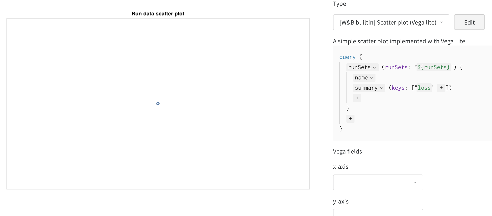
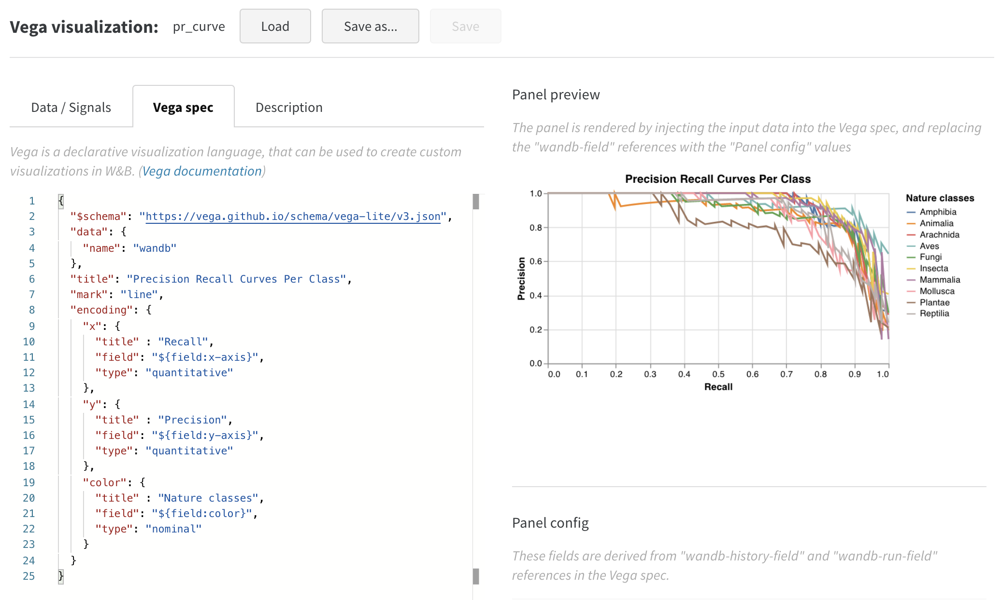
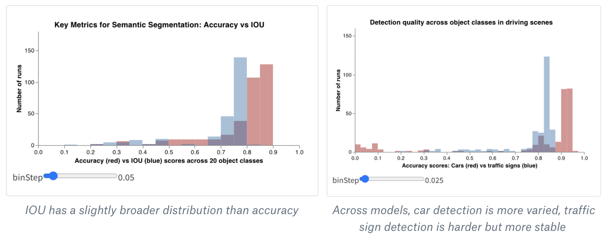

# Custom Charts Walkthrough

Weights & Biases의 빌트인 차트 이상을 이용하고 싶으신 경우, 새로운 **사용자 지정 차트** 기능을 사용하여 패널에 로드할 데이터의 세부 정보 및 데이터 시각화 방식을 제어합니다.

 **개요**

1. 데이터를 W&B에 로그합니다.
2. 쿼리를 생성합니다.
3. 차트를 사용자 설정합니다.

## 1.  **데이터를 W&B에 로그하기**

우선, 스크립트에 데이터를 로그합니다. 초매개변수와 같은 훈련의 시작 시에 설정된 단일 포인트의 경우 [wandb.config](https://docs.wandb.com/library/config)를 사용합니다. 시간 경과에 따른 여러 포인트의 경우 [wandb.log\(\)](https://docs.wandb.com/library/log)을 통해 사용자 지정 2차원 배열을 로그합니다. 로그된 키 당 최대 10,000 데이터 포인트를 로그하는 것을 권장합니다.

```python
# Logging a custom table of data
my_custom_data = [[x1, y1, z1], [x2, y2, z2]]
wandb.log({“custom_data_table”: wandb.Table(data=my_custom_data,
                                columns = ["x", "y", "z"])})
```

[간단한 예시 notebook을 사용하여](https://bit.ly/custom-charts-colab) 데이터 테이블을 로그하면, 다음 단계에서 사용자 지정 차트를 설정합니다. [라이브 리포트](https://app.wandb.ai/demo-team/custom-charts/reports/Custom-Charts--VmlldzoyMTk5MDc)에 결과 차트가 어떻게 표시되는지 확인합니다.

## 2. **쿼리 생성**

일단 시각화할 데이터를 로그 했으면, 프로젝트로 페이지로 이동하여 `+` 버튼을 클릭하여 새 패널을 추가합니다. 다음, **사용자 지정 차트**를 선택합니다. [이 작업 공간](https://app.wandb.ai/demo-team/custom-charts)에서 진행할 수 있습니다.



###  **쿼리 추가하기**

1. Click `summary` and select `historyTable` to set up a new query pulling data from the run history. 
2. Wandb.Table\(\)를 로그한 키를 입력하십시오. 위의 코드 스니펫\(Snippet\)에서는 `my_custom_table`이었습니다. [예제 notebook](https://bit.ly/custom-charts-colab)에서 키는 pr\_curve 및 roc\_curve입니다.

###  **Vega 필드 설정**

 이제 쿼리가 다음의 열에 로딩되고 있으므로, Vega 필드 드롭다운 메뉴에서 선택할 수 있는 옵션으로 쿼리를 사용할 수 있습니다


* **X 축:** runSets\_historyTable\_r \(리콜\)
* **Y 축:** runSets\_historyTable\_p \(정밀도\)
* **색:** runSets\_historyTable\_c \(클래스 라벨\)

## 3. **차트 사용자 설정**

 이제 꽤 괜찮아 보이긴 하지만, 산점도에서 라인 플롯으로 변경하려 합니다. **Edit\(편집\)**을 클릭하여 이 빌트인 차트에 대한 Vega spec을 변경합니다. [이 작업 공간](https://app.wandb.ai/demo-team/custom-charts)에서 진행할 수 있습니다


 시각화를 커스터마이즈 하기 위해 Vega spec을 업데이트했습니다.

* 플롯, 범례, x축 및 y축에 대한 제목을 추가합니다 \(각 필드에 대한 “title”을 설정합니다\)
* “mark”의 값을 “point”에서 “line”으로 변경합니다
* 사용하지 않는 “size” 필드를 제거합니다.



이를 이 프로젝트의 다른 곳에서 사용할 수 있는 프리셋으로 저장하려면, 페이지 상단의 **Save as\(다른 이름으로 저장\)**을 클릭합니다. 결과는 ROC 곡선과 함께 다음과 같습니다:


잘 따라와 주셔서 감사합니다! 질문 사항과 피드백을 Cary \(c@wandb.com\)에게 보내주시면 감사하겠습니다 [😊](https://emojipedia.org/smiling-face-with-smiling-eyes/)​

##  **보너스: 복합 히스토그램**

히스토그램은 수치상 분포\(numerical distributions\)를 시각화하여 더 큰 데이터세트의 이해를 돕습니다. 복합 히스토그램은 동일 빈\(bins\) 전반에 걸친 여러 분포를 나타내며, 이를 통해 다른 모델 또는 모델 내 다른 클래스에 걸쳐 둘 또는 그 이상의 메트릭을 비교할 수 있습니다. 운전 장면에서 오브젝트를 의미 분할 \(semantic segmentation\) 모델의 경우, 정확도 대비 IOU \(Intersection over Union\)에 대한 최적화의 효율성을 비교하거나, 모델들이 다양한 차량 \(데이터 내의 크고 일반적인 영역\) 대비 교통 표지판 \(훨씬 작고, 덜 일반적인 영역\)을 얼마나 잘 감지하는지 알고 싶을 수도 있습니다. [데모 Colab](https://bit.ly/custom-charts-colab)에서 10가지 생물 종류 중 2가지에 대한 신뢰 점수를 비교할 수 있습니다.



 여러분만의 독자적인 버전의 사용자 지정 복합 히스토그램을 생성하는 방법은 다음과 같습니다

1. 새 사용자 지정 차트를 작업 영역 또는 리포트 \(“Custom Chart” 시각화를 추가\)를 생성합니다. 우측 상단의 “Edit” 버튼을 클릭하여 빌트인 패널 유형에서 시작하는 Vega spec을 수정합니다.
2. 해당 빌트인 Vega spec을 저의 [Vega의 복합 히스토그램 MVP 코드](https://gist.github.com/staceysv/9bed36a2c0c2a427365991403611ce21)로 대체합니다. 주 제목, 축 제목, 입력 도메인 및 기타 세부 사항을 [Vega 신텍스](https://vega.github.io/)를 사용하는 이 Vega spec에서 직접 변경할 수 있습니다.
3. 우측의 쿼리를 변경하여 wandb 로그에서 올바른 데이터를 로드합니다. “summaryTable” 필트를 추가하고 대응되는 “tableKey”를 “class\_scores”로 설정하여 실행에 의해 로그된 wandb.Table을 가져\(fetch\)옵니다. 이를 통해 “class\_scores”로 로그된 wandb.Table의 열이 있는 드롭다운 메뉴를 통해 두 개의 히스토그램 빈\(bin\) 세트 \(“red\_bins” and “blue\_bins”\)를 덧붙일 수 있습니다.
4. 프리뷰 렌더링에 표시되는 플롯이 마음에 들 때까지 Vega spec 및 쿼리를 계속 변경할 수 있습니다. 작업을 마치면 상단의 “Save as”\(다른 이름으로 저장\)을 클릭하여 사용자 지정 차트에 이름을 지정하여 다음에 재사용할 수 있도록 합니다. 그다음, “Apply from panel library”\(패널 라이브러리로부터 적용\)을 클릭하여 플롯을 완료합니다.

   다음은 간단한 실험 결과입니다: 하나의 에포크에 대한 단 100가지 예를 훈련하는 것으로 대부분의 이미지가 식물이 아님을 확신하지만 어떤 동물인지에 대해 매우 불확실한 모델을 얻을 수 있습니다.  

 다음은 간단한 실험 결과입니다: 하나의 에포크에 대한 단 100가지 예를 훈련하는 것으로 대부분의 이미가 식물이 아님을 확신하지만 어떤 동물인지에 대해 매우 불확실한 모델을 얻을 수 있습니다.


