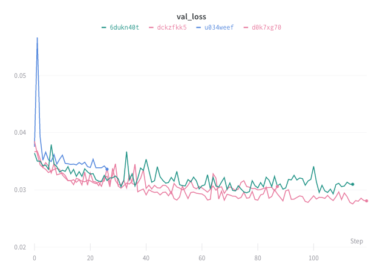
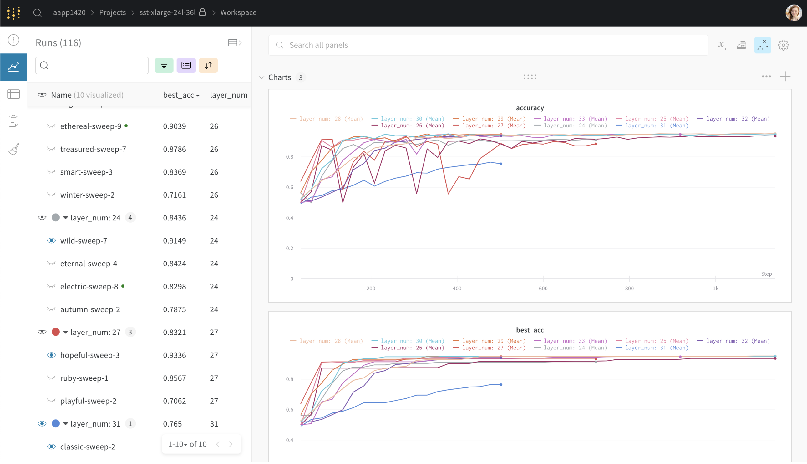
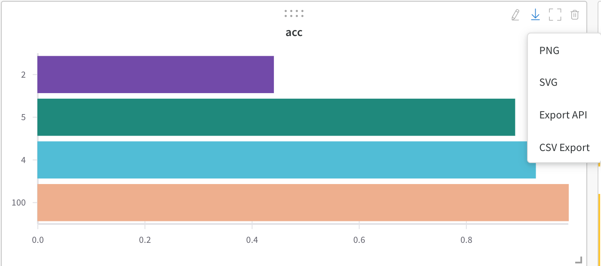

# Standard Panels

Use visualizations to explore your logged data, the relationships between hyperparameters and output metrics, and dataset examples.

## Line Plot

## Common Questions

### **I select dimensions on a parallel coordinates plot and it disappears**

This is likely because you have dots in your config parameter names. We flatten nested parameters using dots, and we only handle 3 levels of dots in the backend. I recommend using a different character as a separator.

\*\*\*\*

### Visualize max accuracy in groups

Turn on the "eye" icon next to the top run in each group to visualize the maximum accuracy on the charts

### Download charts

You can download charts by clicking the down arrow and select a format \(.png, .svg, export API or export by CSV\)

