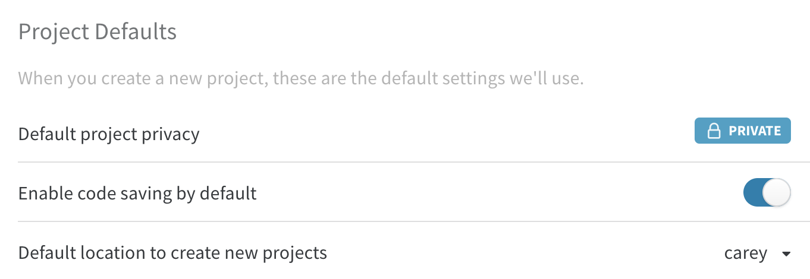
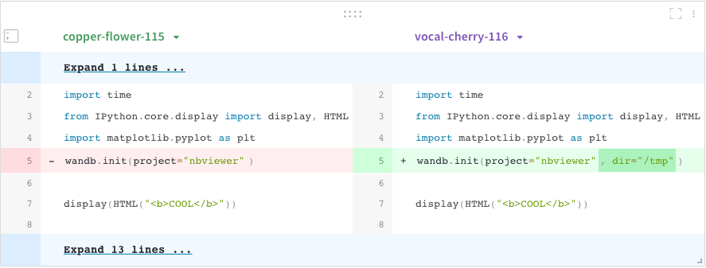

# Code Saving

By default, we only save the latest git commit hash. You can turn on more code features to compare the code between your experiments dynamically in the UI.

Starting with `wandb` version 0.8.28, we can save the code from your main training file where you call `wandb.init()`. This will get sync'd to the dashboard and show up in a tab on the run page, as well as the Code Comparer panel. Go to your [settings page](https://app.wandb.ai/settings) to enable code saving by default.

## Code Comparer

Click the **+** button in your workspace or report to add a new panel, and select the Code Comparer. Diff any two experiments in your project and see exactly which lines of code changed. Here’s an example:

## Jupyter Session History

Starting with **wandb** version 0.8.34, our library does Jupyter session saving. When you call **wandb.init\(\)** inside of Jupyter, we add a hook to automatically save a Jupyter notebook containing the history of code executed in your current session. You can find this session history in a runs file browser under the code directory:

Clicking on this file will display the cells that were executed in your session along with any outputs created by calling iPython’s display method. This enables you to see exactly what code was run within Jupyter in a given run. When possible we also save the most recent version of the notebook which you would find in the code directory as well.

## Jupyter diffing

One last bonus feature is the ability to diff notebooks. Instead of showing the raw JSON in our Code Comparer panel, we extract each cell and display any lines that changed. We have some exciting features planned for integrating Jupyter deeper in our platform.

