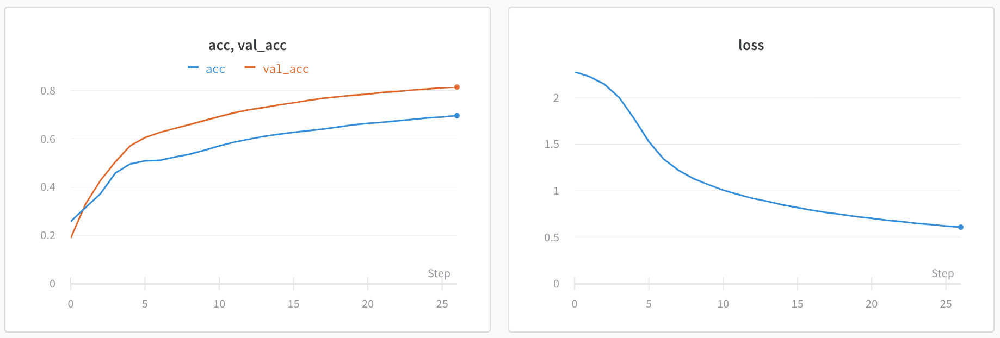
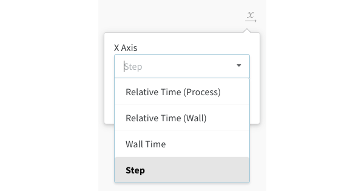
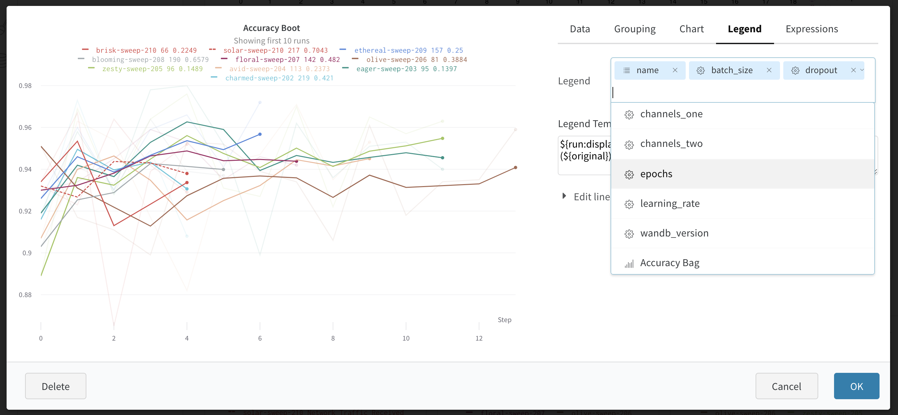
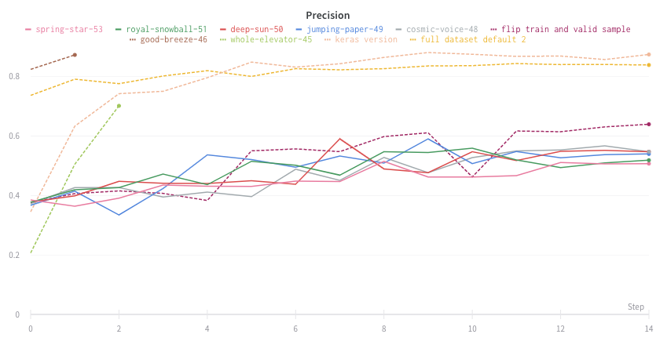
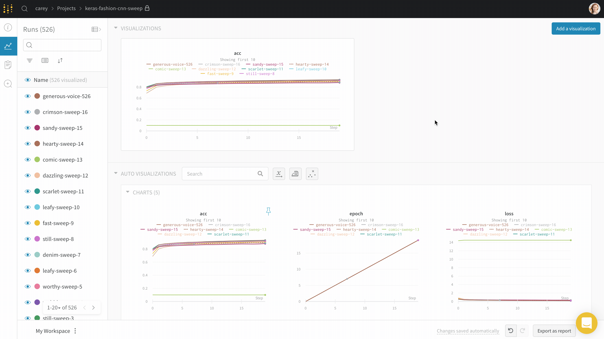
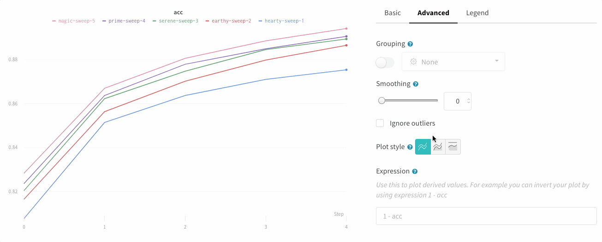
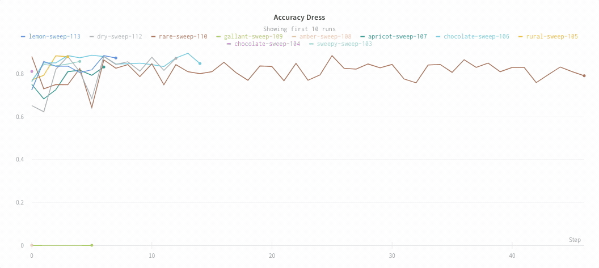
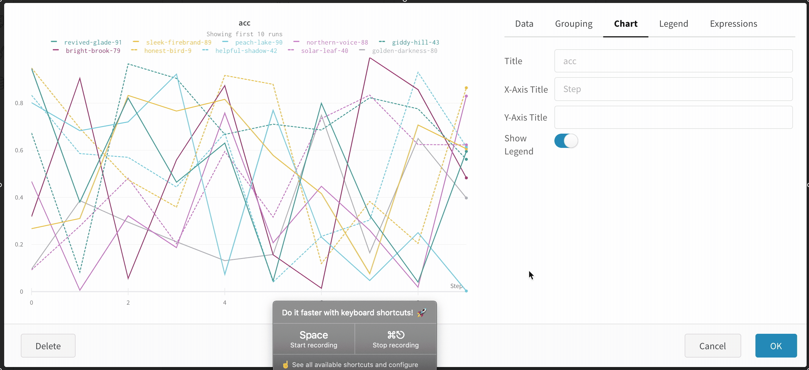

# Line Plot

 Los gráficos de líneas se muestran por defecto cuando diagramas métricas a lo largo del tiempo con **wandb.log\(\)**. Personalízalos con los ajustes de los gráficos para comparar múltiples líneas en el mismo gráfico, calcula los ejes personalizados y renombra las etiquetas.

## Ajustes

**Datos**

* **Eje X:** Selecciona ejes x predeterminados, incluyendo Paso y Tiempo Relativo, o selecciona un eje x personalizado. Si te gustaría usar un eje x personalizado, asegúrate de que sea registrado en la misma llamada a `wandb.log()` que utilizas para registrar el eje y.
  * **Tiempo Relativo \(Pared\)** es el tiempo de reloj desde que el se inició el proceso, así que si has comenzado una ejecución y la reanudaste un día después y registraste algo, eso trazaría unas 24 horas
  * **Tiempo Relativo \(Proceso\)** es el tiempo dentro del proceso en ejecución, así que si comenzaste una ejecución, y esta se ejecutó durante 10 segundos, y la reanudaste un día después, eso se trazaría como 10 segundos
  * **Tiempo de Pared** son los minutos transcurridos desde el comienzo de la primera ejecución en el gráfico
  * **El Paso** se incrementa por defecto cada vez que `wandb.log()` es llamado, y se asume que va a reflejar el número de los pasos de entrenamiento que has registrado desde tu modelo.
* **Eje Y**: Selecciona el eje Y a partir de los valores registrados, incluyendo métricas e hiperparámetros que cambian a través del tiempo..
* **Min, max, and log scale**: Minimum, maximum, and log scale settings for x axis and y axis in line plots
* **Mínimo, máximo y escala del registro**: Los ajustes de mínimo, máximo y la escala del registro para los ejes x e y en los gráficos de líneas.
* **Suavizado y exclusión de valores atípicos:** Cambia el suavizado en el gráfico de líneas o cambia la escala para excluir a los valores atípicos de la escala mínima y máxima del gráfico por defecto.
* **Tipo de gráfico:** Cambia entre un gráfico de líneas, un gráfico de área y un gráfico de área porcentual.

**Ajustes del Eje X**  
El eje x puede ser establecido a nivel de gráfico, así también como globalmente, para la página del proyecto o para la página del reporte. Aquí está cómo se ven los ajustes globales:


Selecciona **múltiples ejes y** en los ajustes del gráfico de líneas para comparar las diferentes métricas sobre el mismo gráfico, como la precisión y la precisión de la validación, por ejemplo.


**Agrupamiento**

* Activa el agrupamiento para ver los ajustes para visualizar los valores promediados.
* **Clave del grupo:** Selecciona una columna, y todas las ejecuciones con el mismo valor en esa columna se van a agrupar juntas.
* **Agg**: Aggregation— the value of the line on the graph. The options are mean, median, min, and max of the group.
* **Agg:** Agregación – el valor de la línea en el gráfico. Las opciones son media, mediana, mínimo y máximo del grupo.
* **Rango**: Intercambia el comportamiento para el área sombreada detrás de la curva agrupada. None significa que no hay un área sombreada. Min/Max muestra una región sombreada que cubre el rango completo de puntos en el grupo. Std Dev muestra la desviación estándar de los valores en el grupo. Std Err muestra el error estándar como el área sombreada.
* **Ejecuciones muestredas**: Si tienes cientos de ejecuciones seleccionadas, por defecto nosotros sólo vamos a muestrear las primeras 100. Puedes seleccionar para que todas tus ejecuciones estén incluidas en el cálculo del agrupamiento, pero esto podría ralentizar las cosas en la interfaz de usuario.

**Leyenda**

* Título: Agrega un título personalizado para el gráfico de líneas, que se muestra encima del gráfico..
* Título del eje x: Agrega un título personalizado para el eje x del gráfico de líneas, que se muestra en la esquina inferior derecha del gráfico.. 
* Título del eje y: Agrega un título personalizado para el eje y del gráfico de líneas, que se muestra en la esquina superior izquierda del gráfico.. 
* Leyenda: Selecciona el campo que quieras que se vea en la leyenda del gráfico por cada línea. 
* Por ejemplo, podrías mostrar el nombre de la ejecución y la tasa de aprendizaje.. 
* Plantilla de la leyenda: Completamente personalizable, esta poderosa plantilla te permite especificar exactamente qué texto y variables deseas mostrar en la plantilla, en la parte superior del gráfico de líneas, así también como la leyenda que aparece cuando pasas el cursor del mouse sobre el gráfico.

 **Expresiones**

* **Expresiones del Eje Y: Agrega métricas calculadas a tu gráfico. Puedes usar cualquier métrica registrada, así también como los valores de configuración, como los hiperparámetros, para calcular las líneas personalizadas..** 
* **Expresiones del Eje X:** Cambia la escala el eje x para usar valores calculados utilizando expresiones personalizadas. Las variables útiles incluyen \_step para el eje x por defecto, y la sintaxis para referenciar al valor de la síntesis es `${summary:value}`.

## Visualiza valores promedio en un gráfico

Si tienes varios experimentos diferentes y te gustaría ver el promedio de sus valores en un gráfico, puedes usar la característica Agrupamiento en la tabla. 

Haz click en “Grupo”, encima de la tabla de las ejecuciones, y selecciona “Todas” para mostrar los valores promediados en tus gráficos.Aquí está cómo se ve el gráfico antes de aplicar el promedio: 

Aquí he agrupado las líneas para ver el valor promedio de todas de las ejecuciones.

## Compara dos métricas en un gráfico

Haz click en una ejecución para ir a la página de la ejecución. Aquí hay una [ejecución de ejemplo](https://app.wandb.ai/stacey/estuary/runs/9qha4fuu?workspace=user-carey) del proyecto Estuary de Stacey. Los gráficos generados automáticamente muestran métricas simples.

  
Has click en **Agregar una visualización**, en la parte superior derecha de la página, y selecciona el **Gráfico de Líneas**.

En el campo **variables Y**, selecciona algunas métricas que te gustaría comparar. Se van a mostrar juntas en el gráfico de líneas.

## Visualiza en diferentes ejes x

Si te gustaría ver el tiempo absoluto que ha tomado un experimento, o ver qué día se corrió un experimento, puedes intercambiar el eje x. Aquí hay un ejemplo del intercambio de los pasos a tiempo relativo, y entonces a tiempo de pared.

## Gráficos de área

En los ajustes de los gráficos de líneas, en la pestaña avanzados, haz click en los diferentes estilos de gráficos para obtener un gráfico de área o un gráfico de área porcentual.

## Zoom

Haz click y arrastra un rectángulo para hacer zoom vertical y horizontal al mismo tiempo. Esto cambia el zoom en los ejes x e y.

## Oculta la leyenda del gráfico

  
Desactiva la leyenda en el gráfico de líneas con este interruptor simple:

