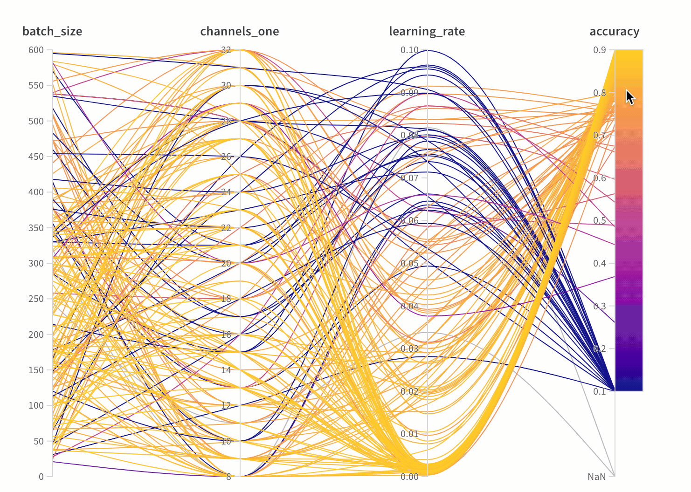

# Parallel Coordinates

Here's an example of a parallel coordinates plot. Each axis represents a different In this case I've chosen four vertical axes. In this case I'm visualizing the relationship between different hyperparameters and the final accuracy of my model.

* **Axes**: Different hyperparameters from [wandb.config](../../../library/config.md) and metrics from [wandb.log\(\)](../../../library/log.md)
* **Lines**: Each line represents a single run. Mouse over a line to see a tooltip with details about the run. All lines that match the current filters will be shown, but if you turn off the eye, lines will be grayed out.

**Panel Settings**

Configure these features in the panel settings— click the edit button in the upper right corner of the panel.

* **Tooltip**: On hover, a legend shows up with info on each run
* **Titles**: Edit the axis titles to be more readable
* **Gradient**: Customize the gradient to be any color range you like
* **Log scale**: Each axis can be set to view on a log scale independently
* **Flip axis**: Switch the axis direction— this is useful when you have both accuracy and loss as columns

  [See it live →](https://app.wandb.ai/example-team/sweep-demo/reports/Zoom-in-on-Parallel-Coordinates-Charts--Vmlldzo5MTQ4Nw)

