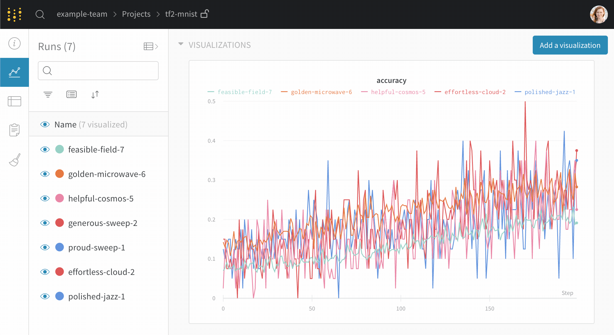
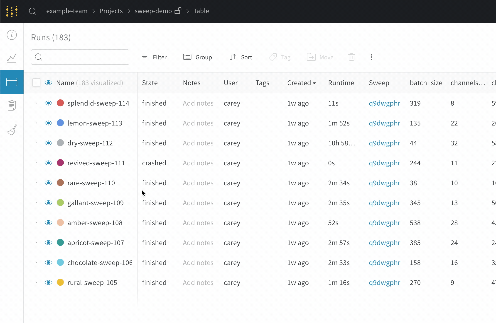
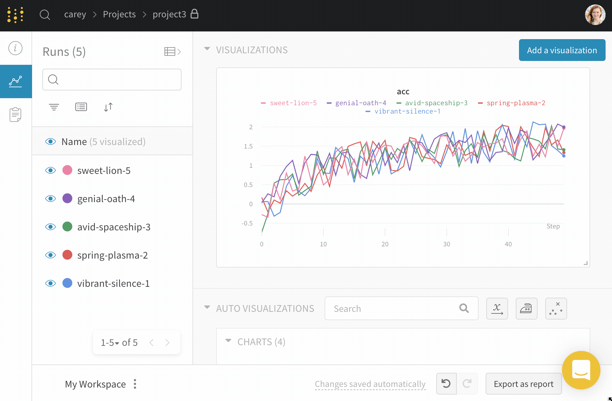
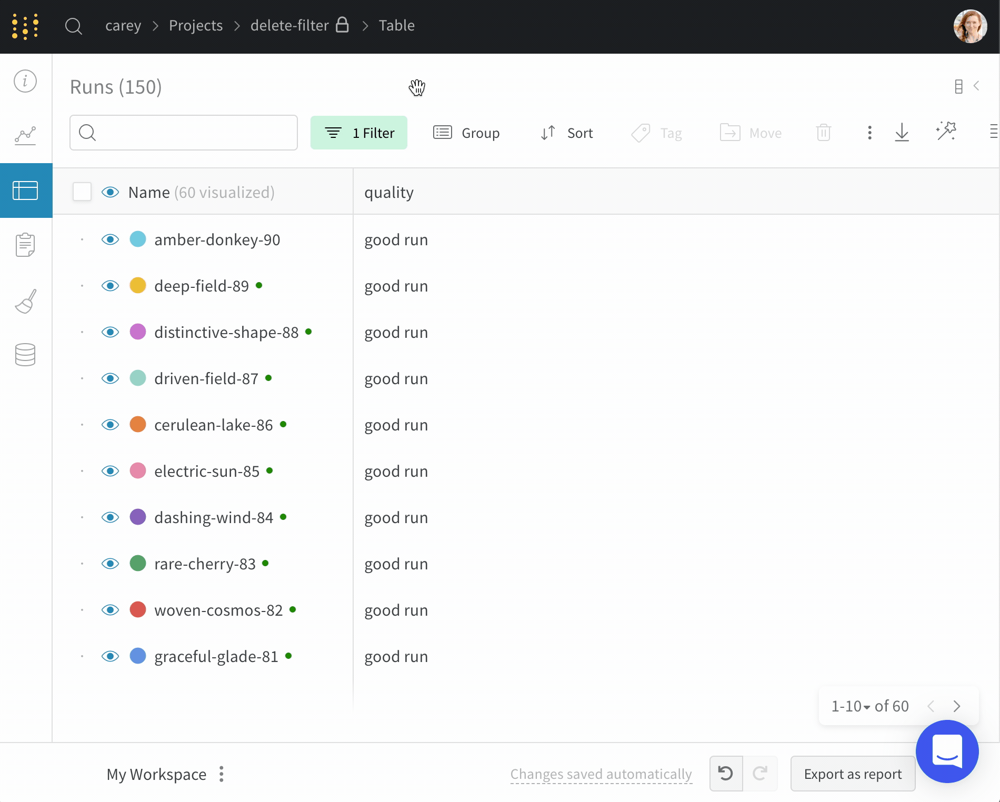
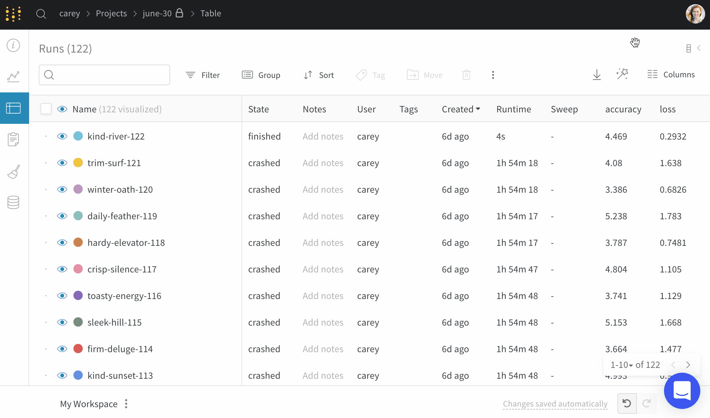

# Table

 프로젝트 페이지의 사이드 바에는 실행이 표시됩니다. 사이드 바를 확장하시면 여러 실행에 걸친 초매개변수 및 요약 메트릭 테이블을 확인하실 수 있습니다.

##  **실행 이름 검색하기**

 저희는 테이블의 실행이름에 대한 최대 [정규표현식\(regex\)](https://dev.mysql.com/doc/refman/8.0/en/regexp.html) 검색을 지원합니다. 검색 박스에 쿼리를 입력하시면, 작업공간의 그래프에 표시되는 실행 및 테이블의 행을 필터링 하실 수 있습니다.

## **사이드 바 사이즈 조정**

프로젝트 페이지의 그래프를 위한 공간을 더 만들고 싶으신가요? 열 머리글\(header\)를 클릭 및 드래그 하시면 사이드 바의 크기를 조절하실 수 있습니다. 또한, 눈 모양 아이콘\(eye icon\)을 클릭하셔서 그래프의 실행을 계속 켜거나 끄실 수 있습니다.

##  **사이드 바 열 추가하기**

 프로젝트 페이지의 사이드 바에는 실행이 표시됩니다. 더 많은 열을 표시하는 법은 다음과 같습니다:

1. 사이드 바의 우측상단의 버튼을 클릭해서 테이블을 확장합니다.
2. 열 머리글\(header\)에서, 드롭다운 메뉴를 클릭하여 열을 고정합니다.
3. 표를 축소할 때 고정된 열은 사이드 바에서 사용하실 수 있습니다.

다음은 화면 캡쳐입니다. 테이블을 확장하고, 2개의 열을 고정하고, 테이블을 축소한 다음, 사이드 바 크기를 조절하고 있습니다.

##  **실행 일괄 선택하기**

 한 번에 여러 개의 실행을 삭제하거나, 실행 그룹을 태그 하실 수 있습니다. 일괄 선택은 실행 테이블 정리를 보다 쉽고 간편하게 해드립니다.

##  **테이블의 모든 실행 선택하기**

 테이블 좌측 상단의 체크박스를 클릭하고, "Select all runs"\(모든 실행 선택\)을 클릭하여 현재 필터 세트와 일치하는 모든 실행을 선택합니다.

##  **프로젝트 사이에 실행 이동하기**

한 프로젝트에서 다른 프로젝트로 실행을 이동하는 방법은 다음과 같습니다:

1. 테이블을 확장합니다.
2. 옮기고 싶은 실행 옆의 체크박스를 클릭합니다
3. move\(이동\)을 클릭하고 대상 프로젝트를 선택합니다

## **활성 실행 확인하기**

실행 이름 옆의 녹색 점을 찾습니다. 이 점은 테이블 및 그래프 범례에서 활성화 상태임을 나타냅니다.

##  **관심 없는 실행 숨기기**

 깨진 실행을 감추고 싶으신가요? 짧은 실행이 테이블을 가득 채웠나요? 그룹 프로젝트에서만 여러분의 작업을 보고 싶으신가요? 필터를 사용해서 노이즈를 숨기실 수 있습니다. 다음은 저희가 추천하는 필터입니다:

* **Show only my work\(내 작업만 표시하기\)**는 여러분의 사용자 이름으로 실행되는 실행만 필터링합니다.
* **Hide crashed runs\(깨진 실행 감추기\)**는 테이블에서 crashed\(깨진\)으로 표시된 모든 실행을 필터링해 제외합니다.
*    **Duration\(기간\)**: 새로운 필터를 추가하고 “duration”을 선택해서 짧은 실행을 숨깁니다

##  **원하지 않는 실행 필터링 및 삭제하기**

 테이블을 여러분이 삭제하고 싶은 테이블로 필터링 하시는 경우, all\(전부\)를 선택하시고 delete\(삭제\)를 눌러 프로젝트에서 제거하실 수 있습니다. 실행을 삭제하는 것은 프로젝트 전역에 적용되므로, 리포트에서 실행을 삭제하신 경우, 이는 프로젝트 나머지 부분에 반영됩니다.

## **실행 테이블을 CSV로 내보내기**

download\(다운로드\) 버튼을 통해 모든 실행, 초매개변수, 요약 메트릭 테이블을 CSV로 내보냅니다.

