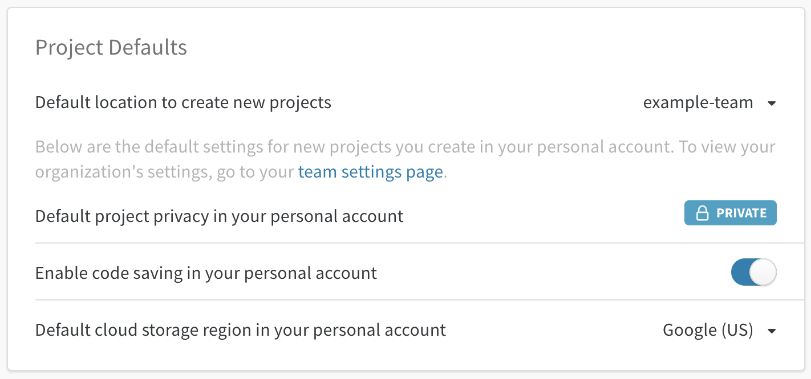

# Teams

Utilisez Weights & Biases comme répertoire central pour votre équipe d’apprentissage automatique.

* **Gardez une trace de toutes vos expériences** essayées par votre équipe pour ne jamais dupliquer du travail. Avec quelques lignes d’instrumentation, vous pouvez facilement retracer les mesures de performance de votre modèle, les prédictions, l’usage GPU, et la version de code utilisée pour entraîner le modèle.
*  **Sauvegardez, restaurez, et reproduisez** des modèles entraînés précédemment.
*   **Partagez vos progrès** et vos résultats avec votre patron et avec vos collaborateurs.
* **Attrapez les régressions** et soyez immédiatement alertés lorsque les performances baissent.
*  **Évaluez les performances de votre modèle et personnalisez les requêtes pour comparer les versions de votre modèle.**

## Questions fréquentes

### Accéder aux équipes privées

Si vous travaillez dans une société, nous avons des plans spécifiques aux entreprises. Consultez la [page des prix](https://www.wandb.com/pricing)pour obtenir plus de détails. Nous proposons des équipes privées gratuites pour les universitaires qui travaillent sur des projets open-source. Consultez la [page universitaire](https://www.wandb.com/academic) pour demander une mise à niveau.

###  Créer une nouvelle équipe

 Une fois que cette fonctionnalité est activée, créez une nouvelle équipe sur la page de [Paramètres](https://app.wandb.ai/settings) dans l’application. Le nom sera utilisé dans l’URL de tous les projets de votre équipe, alors assurez-vous de choisir quelque chose de court et de descriptif, puisque vous ne pourrez pas le changer plus tard.

### Déplacer des essais vers une équipe

Il est facile de déplacer des essais entre des projets auxquels vous avez accès. Sur la page de projet :

1. Cliquez sur l’onglet tableau pour agrandir le tableau des essais.

2. Cliquez sur la case à cocher pour sélectionner tous les essais.

3. Cliquez sur **Move** \(déplacer\) : le projet de destination peut être dans votre compte personnel ou dans n’importe quelle équipe dont vous êtes membre. 


###  Envoyer de nouveaux essais à une équipe

Dans votre script, réglez l’entité \(entity\) sur votre équipe. "Entity" signifie simplement votre nom d’utilisateur ou celui d’une équipe. Créez une entité \(compte personnel ou d’équipe\) dans l’application web avant d’y envoyer des essais.

```python
wandb.init(entity="example-team")
```

Votre **entité par défaut** est mise à jour lorsque vous rejoignez une équipe. Cela signifie que sur votre [page de paramètres](https://app.wandb.ai/settings), vous verrez que l’emplacement par défaut pour créer un nouveau projet est maintenant l’équipe que vous venez de rejoindre. Voici un exemple de ce à quoi la section de cette [page de paramètres](https://app.wandb.ai/settings) peut ressembler :



###  Inviter des membres d’équipe

 Vous pouvez inviter de nouveaux membres à votre équipe sur la page de paramètres d’équipe : app.wandb.ai/teams/

### Consulter les paramètres de confidentialité

Vous pouvez consulter les paramètres de confidentialité de tous les projets d’équipe sur la page de paramètres : app.wandb.ai/teams/&lt;your-team-here&gt;Voice ce à quoi ressemble une page de paramètre d’équipe. 

Sur cette capture d’écran, la confidentialité est activée, ce qui signifie que tous les projets dans cette équipe ne sont visibles que par les membres de l’équipe.


### Retirer des membres d’équipes

 Lorsqu’un membre de l’équipe s’en va, il est facile de le retirer. Les administrateurs d’équipes peuvent ouvrir la page de paramètres d’équipe et cliquez sur le bouton supprimer \(delete\) juste à côté du nom du membre qui s’en va. Tous les essais que ce membre aura enregistré dans l’équipe resteront, même après son retrait de l’équipe.

### Types de compte

Invitez des collègues à rejoindre votre équipe, et à choisir entre ces options :

*  **Membre :** Un membre classique de votre équipe, invité par email
* **Admin :** Un membre de l’équipe qui peut ajouter et retirer les autres admins et membres
* **Compte de service : Un worker de service, une clef API utile pour utiliser W&B avec vos outils d’automatisation d’essais. Si vous utilisez la clef API depuis un Compte de service pour votre équipe, assurez-vous de bien régler la variable d’environnement WANDB\_USERNAME pour attribuer les essais au bon utilisateur** 

