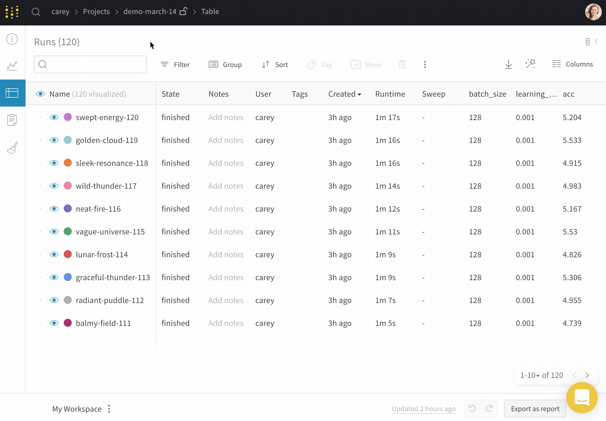
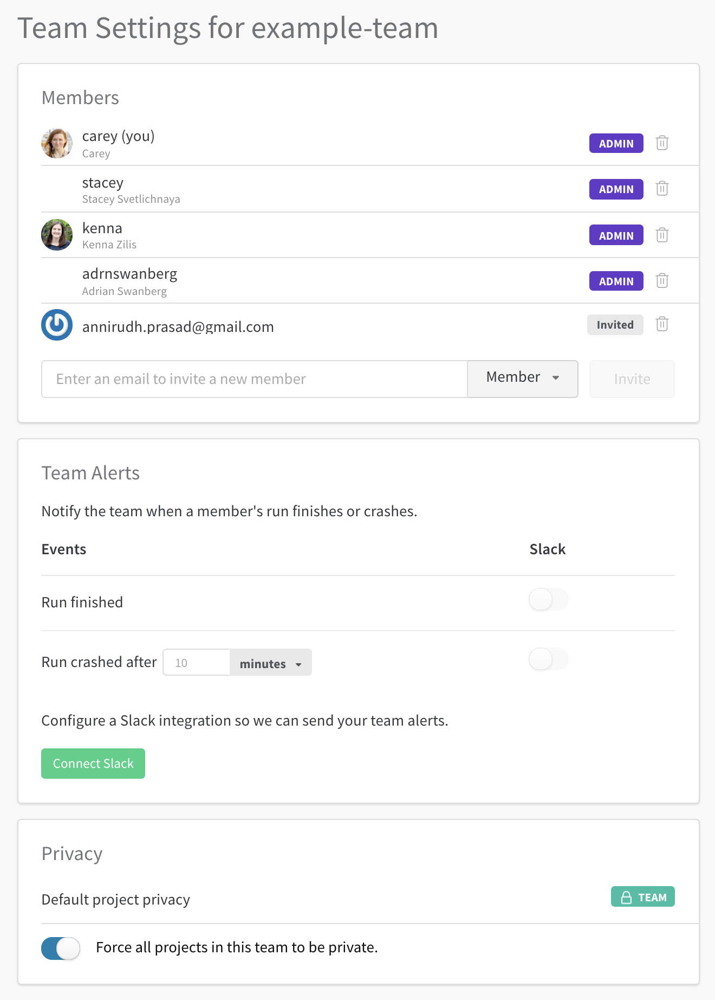

# Teams

Use Weights & Biases as a central repository for your machine learning team.

* **Track all the experiments** your team has tried so you never duplicate work. Just a few lines of instrumentation give you fast, reliable tracking of model performance metrics, predictions, GPU usage, and the version of the code that trained the model.
* **Save, restore and reproduce** previously trained models.
* **Share progress** and results with your boss and collaborators.
* **Catch regressions** and immediately get alerted when performance drops.
* **Benchmark model performance** and customize queries to compare your model versions.

## Common Questions

### Get access to private teams

If you're at a company, we have enterprise plans. Check the [pricing page](https://www.wandb.com/pricing) for more details. We offer free private teams for academics working on open source projects. Check the [academic page](https://www.wandb.com/academic) to apply for an upgrade.

### Create a new team

Once you have the feature enabled, create a new team on your [Settings](https://app.wandb.ai/settings) page in the app. The name will be used in the URL of all your team projects, so make sure you pick something short and descriptive, since you won't be able to change it later. 

### Move runs to a team

It's easy to move runs between projects you have access to. On the project page:

1. Click the table tab to expand the runs table
2. Click the checkbox to select all runs
3. Click **Move**: the destination project can be in your personal account or any team that you're a member of.



### Send new runs to a team

In your script, set the entity to your team. "Entity" just means your username or team name. Create an entity \(personal account or team account\) in the web app before sending runs there.

```python
wandb.init(entity="example-team")
```

### Invite team members

You can invite new members to your team on your team settings page:  
app.wandb.ai/teams/&lt;your-team-here&gt;

### See privacy settings

You can see the privacy settings of all team projects on the team settings page:  
app.wandb.ai/teams/&lt;your-team-here&gt;

Here's what the team settings page looks like. In this screenshot the privacy toggle is on, which means all projects in the team are only visible to the team.



### Removing members from teams

When a team member leaves, it's easy to remove them. Team admins can open the team settings page and click the delete button next to the departing member's name. just click the delete button next to their name in the team settings page. Any runs that they logged to your team 

