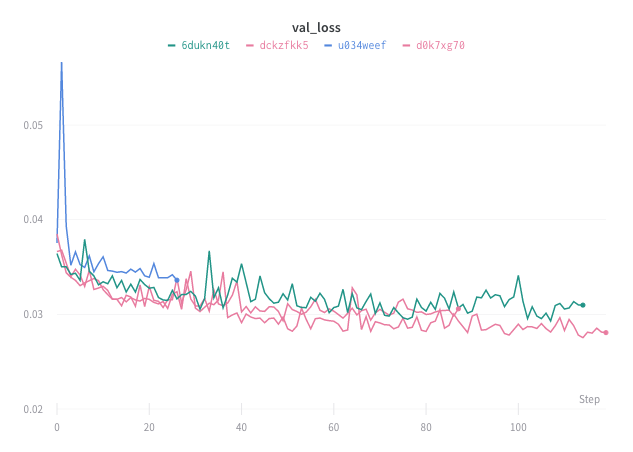

# Visualizations

Use visualizations to explore your logged data, the relationships between hyperparameters and output metrics, and dataset examples.

## Line Plot

## Parallel Coordinates Plot

Here's an example of a parallel coordinates plot. In this case I've chosen four vertical axes. In this case I'm visualizing the relationship between the learning rate, learning rate decay, and IOU on different categories of point clouds. [See it live →](https://app.wandb.ai/nbaryd/SparseConvNet-examples_3d_segmentation/reports?view=nbaryd%2FSemantic%20Segmentation%20of%203D%20Point%20Clouds)

## Common Questions

### **I select dimensions on a parallel coordinates plot and it disappears**

This is likely because you have dots in your config parameter names. We flatten nested parameters using dots, and we only handle 3 levels of dots in the backend. I recommend using a different character as a separator.

\*\*\*\*

