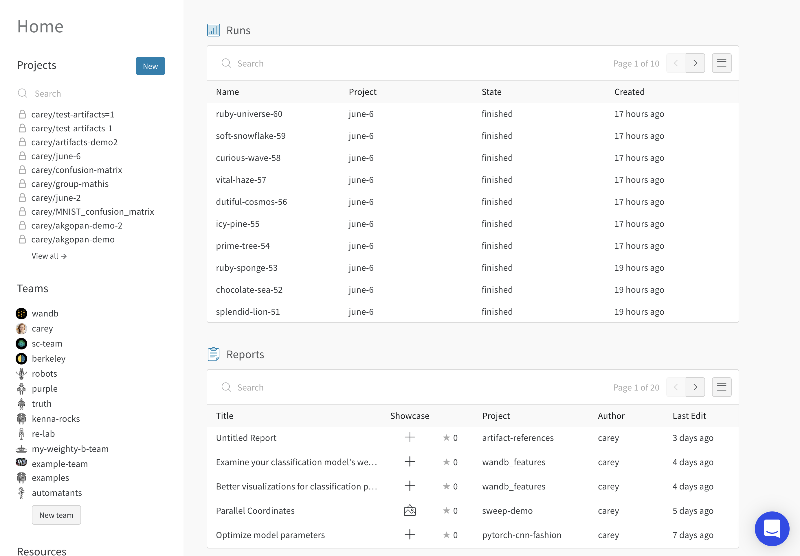
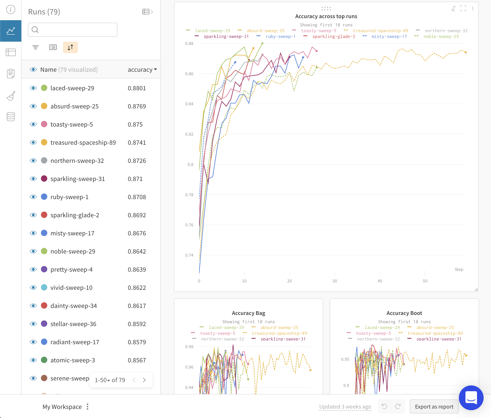
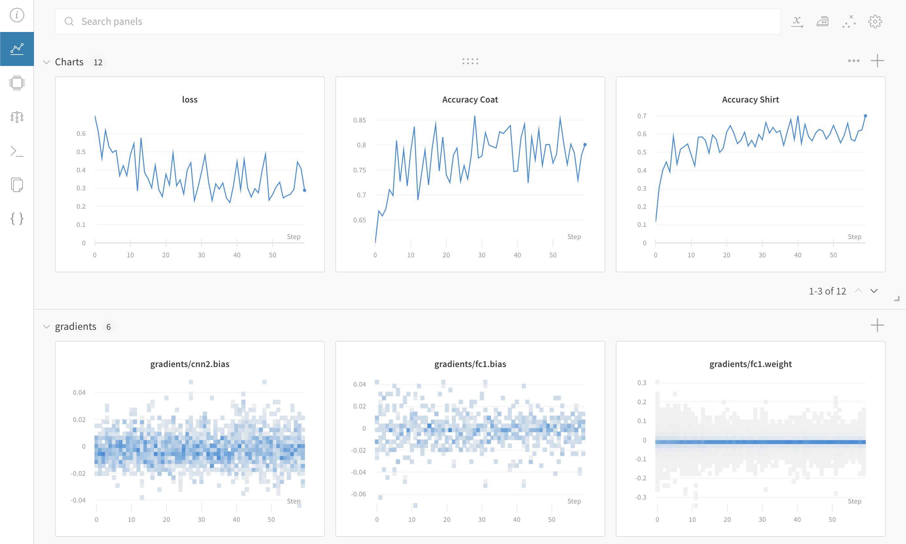
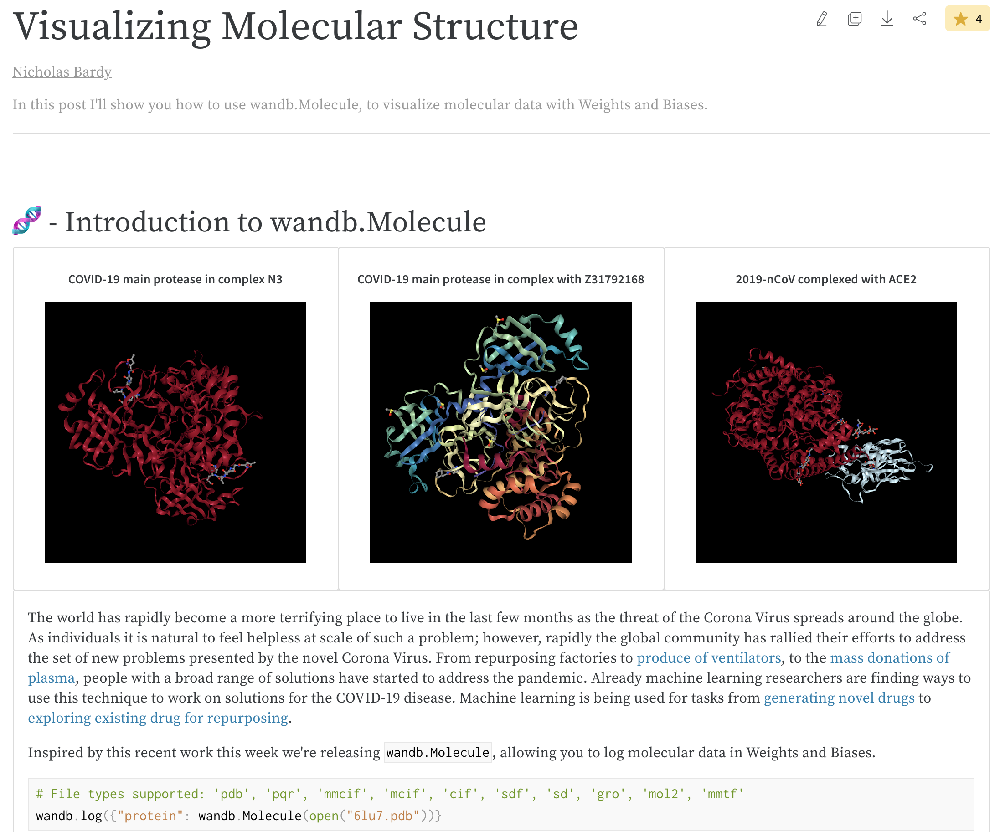
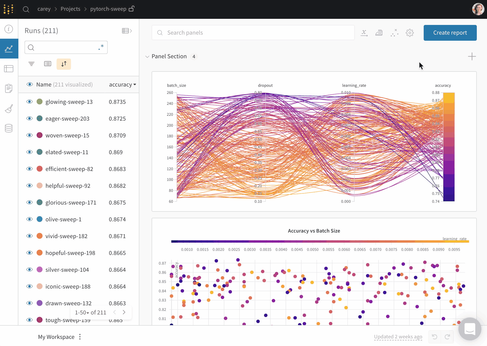

# Pages

## Home Page

Browse all your runs and projects. The home page pulls in projects from your personal account, as well as any projects you've contributed to in teams.

## Project Page

Compare models with different architectures and hyperparameters on the same set of metrics.

## Run Page

Visualize the metrics and dataset examples from a single run.

## Report Page

Compare results and describe your findings, then share links with colleagues.

## Common Questions

### I accidentally deleted a panel in W&B, how do I undo it?

To undo a change in your workspace, click the "undo" button at the bottom of the page.

