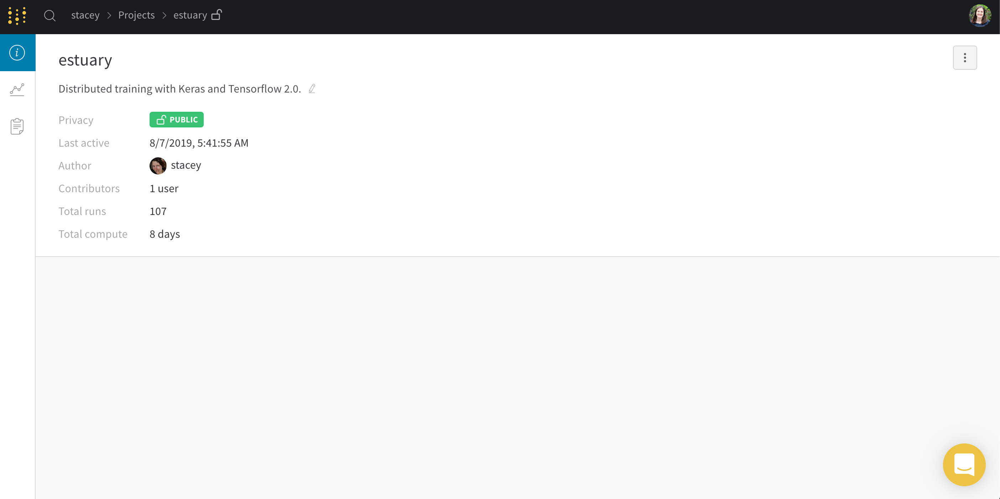
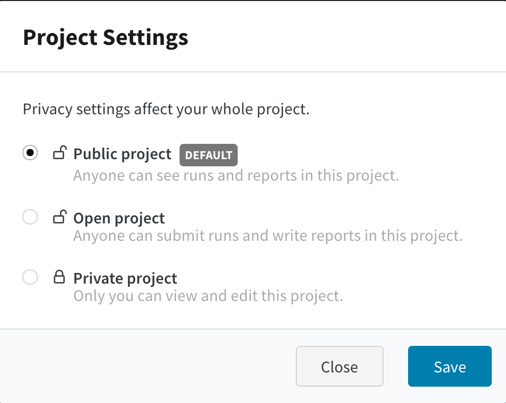

# Project Page

The project page gives you a place to compare experiments. Run different versions of your model and compare metrics. Use a parallel coordinates chart to visualize how changing hyperparameters can affect output metrics.

### Overview Tab

View the metadata of your project, and write a quick description of the goals of the project.

### Privacy settings

You can view and change your privacy settings in your projects.

### Delete Projects

You can delete your project by clicking the three dots on the right of the overview tab.

## Common Questions

### Reset workspace

If you see an error like the one below on your project page, here's how to reset your workspace.`"objconv: "100000000000" overflows the maximum values of a signed 64 bits integer"` 

Add **?workspace=clear** to the end of the URL and press enter. This should take you to a cleared version of your project page workspace.

