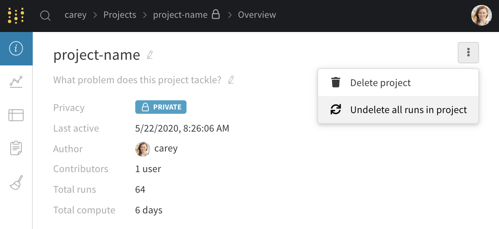
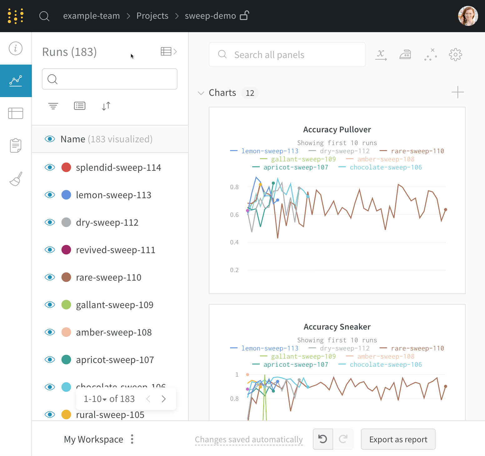
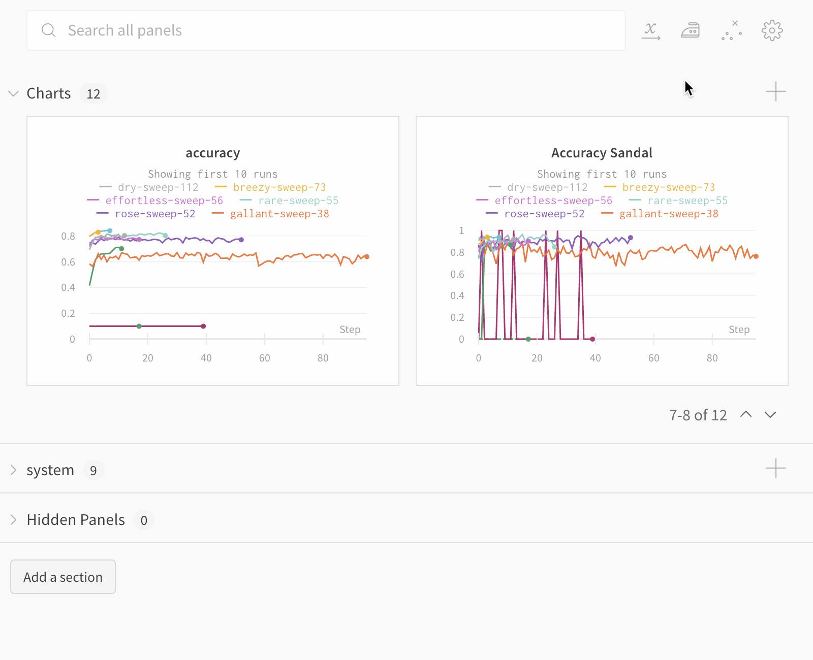
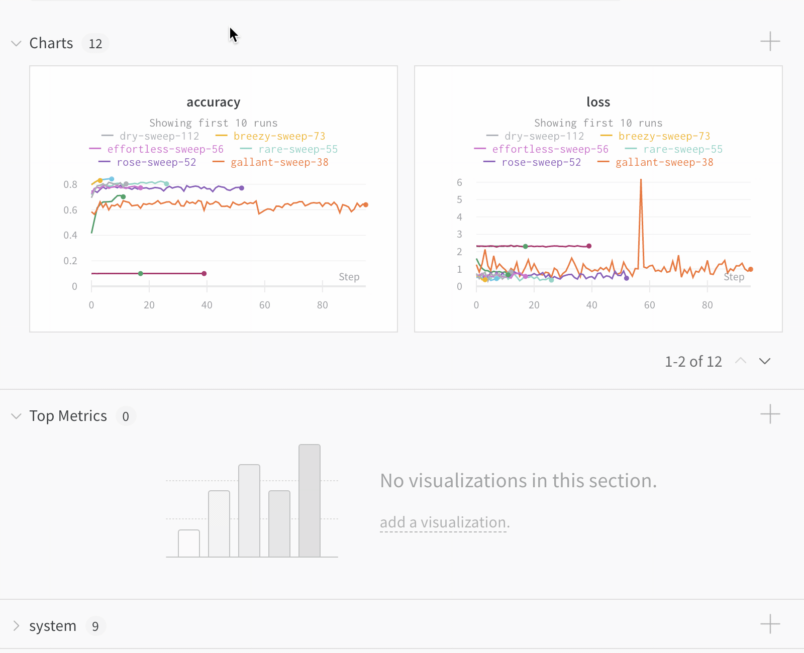
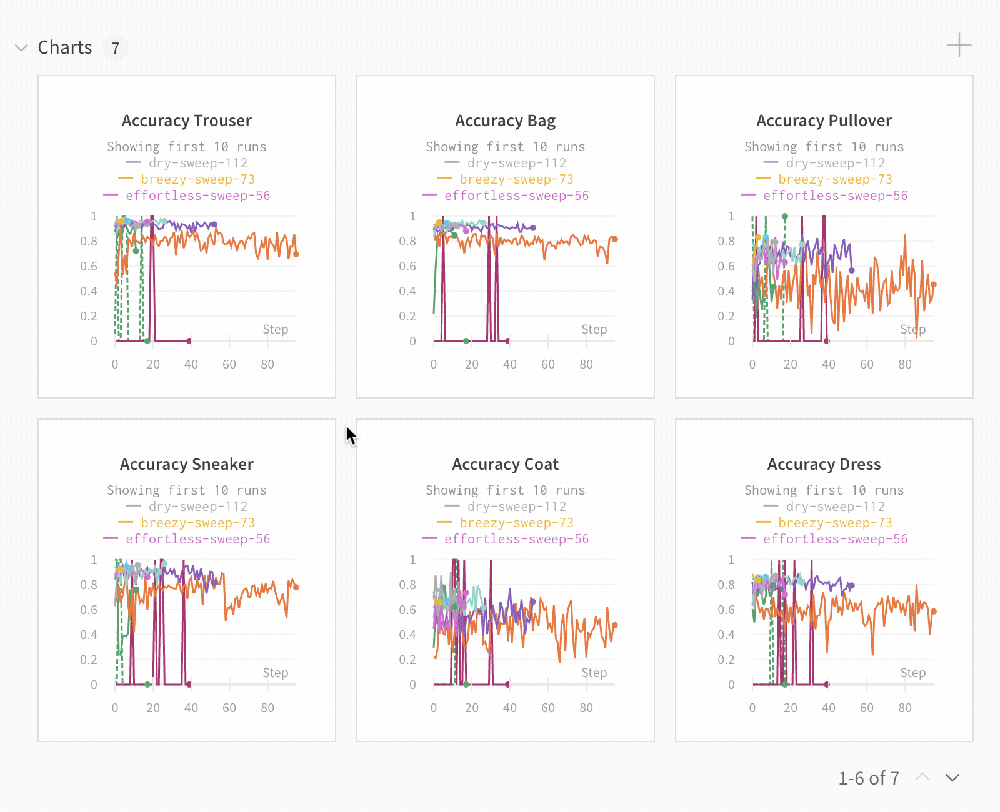
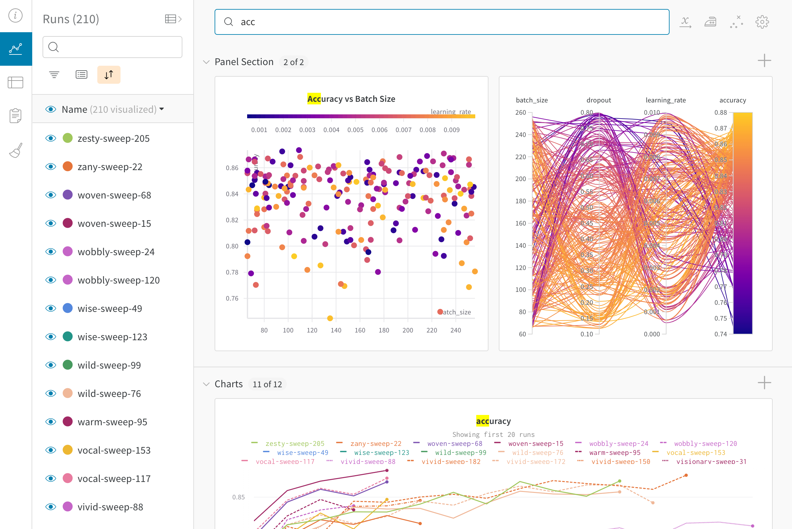
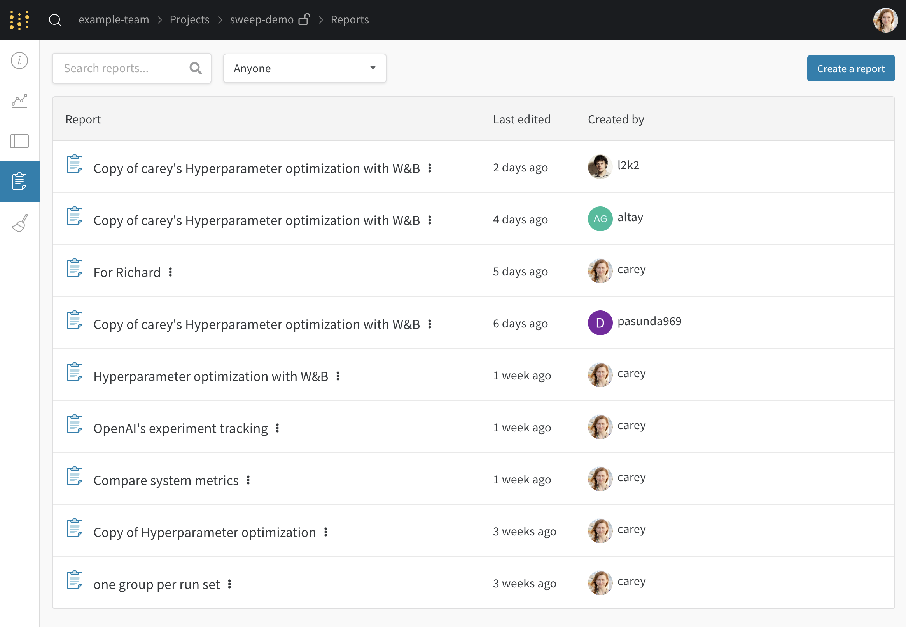
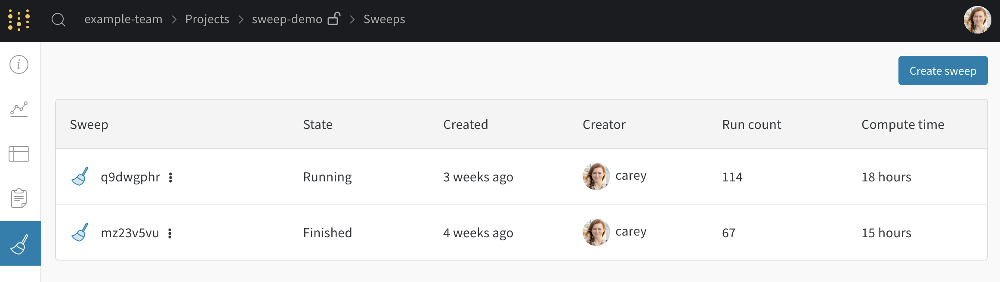
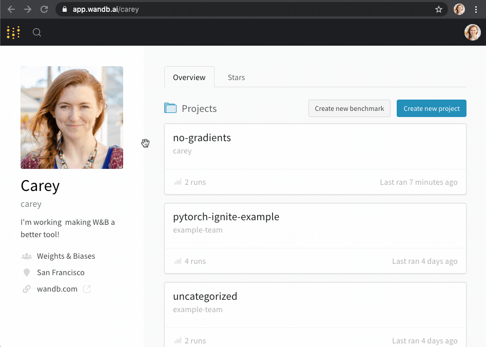

# Project Page

The project **Workspace** gives you a personal sandbox to compare experiments. Use projects to organize models that can be compared, working on the same problem with different architectures, hyperparameters, datasets, preprocessing etc.

Project page tabs:

1. \*\*\*\*[**Overview**](project-page.md#overview-tab): snapshot of your project
2. \*\*\*\*[**Workspace**](project-page.md#workspace-tab): personal visualization sandbox
3. \*\*\*\*[**Table**](project-page.md#table-tab): bird's eye view of all runs
4. \*\*\*\*[**Reports**](project-page.md#reports-tab): saved snapshots of notes, runs, and graphs
5. \*\*\*\*[**Sweeps**](project-page.md#sweeps-tab): automated exploration and optimization

## Overview Tab

* **Project name**: click to edit the project name
* **Project description**: click to edit the project description and add notes
* **Delete project**: click the dot menu in the right corner to delete a project
* **Project privacy**: edit who can view runs and reports— click the lock icon
* **Last active**: see when the most recent data was logged to this project
* **Total compute**: we add up all the run times in your project to get this total
* **Undelete runs**: Click the dropdown menu and click "Undelete all runs" to recover deleted runs in your project.

[View a live example →](https://app.wandb.ai/example-team/sweep-demo/overview)

## Workspace Tab

**Runs Sidebar**: list of all the runs in your project

* **Dot menu**: hover over a row in the sidebar to see the menu appear on the left side. Use this menu to rename a run, delete a run, or stop and active run.
* **Visibility icon**: click the eye to turn on and off runs on graphs
* **Color**: change the run color to another one of our presets or a custom color
* **Search**: search runs by name. This also filters visible runs in the plots.
* **Filter**: use the sidebar filter to narrow down the set of runs visible
* **Group**: select a config column to dynamically group your runs, for example by architecture. Grouping makes plots show up with a line along the mean value, and a shaded region for the variance of points on the graph.
* **Sort**: pick a value to sort your runs by, for example runs with the lowest loss or highest accuracy. Sorting will affect which runs show up on the graphs.
* **Expand button**: expand the sidebar into the full table
* **Run count**: the number in parentheses at the top is the total number of runs in the project. The number \(N visualized\) is the number of runs that have the eye turned on and are available to be visualized in each plot. In the example below, the graphs are only showing the first 10 of 183 runs. Edit a graph to increase the max number of runs visible.

**Panels layout**: use this scratch space to explore results, add and remove charts, and compare versions of your models based on different metrics

[View a live example →](https://app.wandb.ai/example-team/sweep-demo)

### Search for runs

Search for a run by name in the sidebar. You can use regex to filter down your visible runs. The search box affects which runs are shown on the graph. Here's an example:

### Add a section of panels

Click the section dropdown menu and click "Add section" to create a new section for panels. You can rename sections, drag them to reorganize them, and expand and collapse sections.

Each section has options in the upper right corner:

* **Switch to custom layout**: The custom layout allows you to resize panels individually.
* **Switch to standard layout**: The standard layout lets you resize all panels in the section at once, and gives you pagination.
* **Add section**: Add a section above or below from the dropdown menu, or click the button at the bottom of the page to add a new section.
* **Rename section**: Change the title for your section.
* **Export section to report**: Save this section of panels to a new report.
* **Delete section**: Remove the whole section and all the charts. This can be undone with the undo button at the bottom of the page in the workspace bar.
* **Add panel**: Click the plus button to add a panel to the section. 

### Move panels between sections

Drag and drop panels to reorder and organize into sections. You can also click the "Move" button in the upper right corner of a panel to select a section to move the panel to.

### Resize panels

* **Standard layout**: All panels maintain the same size, and there are pages of panels. You can resize the panels by clicking and dragging the lower right corner. Resize the section by clicking and dragging the lower right corner of the section. 
* **Custom layout**: All panels are sized individually, and there are no pages. 

### Search for metrics

Use the search box in the workspace to filter down the panels. This search matches the panel titles, which are by default the name of the metrics visualized.

## Table Tab

Use the table to filter, group, and sort your results.

[View a live example →](https://app.wandb.ai/example-team/sweep-demo/table?workspace=user-carey)

## Reports Tab

See all the snapshots of results in one place, and share findings with your team.

## Sweeps Tab

Start a new sweep from your project.

## Common Questions

### Reset workspace

If you see an error like the one below on your project page, here's how to reset your workspace.`"objconv: "100000000000" overflows the maximum values of a signed 64 bits integer"`

Add **?workspace=clear** to the end of the URL and press enter. This should take you to a cleared version of your project page workspace.

### Delete Projects

You can delete your project by clicking the three dots on the right of the overview tab.

### Privacy settings

Click the lock in the navigation bar at the top of the page to change project privacy settings. You can edit who can view or submit runs to your project. These settings include all runs and reports in the project. If you'd like to share your results with just a few people, you can create a [private team](../features/teams.md).

### Delete an empty project

Delete a project with no runs by clicking the dropdown menu and selecting "Delete project".

