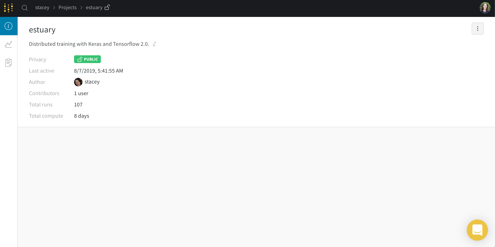

# Overview Tab

The overview tab shows you the metadata of your project.

## Privacy 

You can view and change your privacy settings in your projects.

## Delete Projects

You can delete your project by clicking the three dots on the right of the overview tab.

