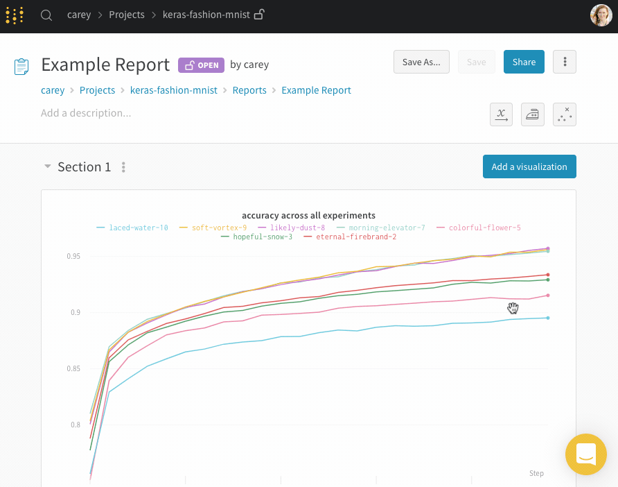
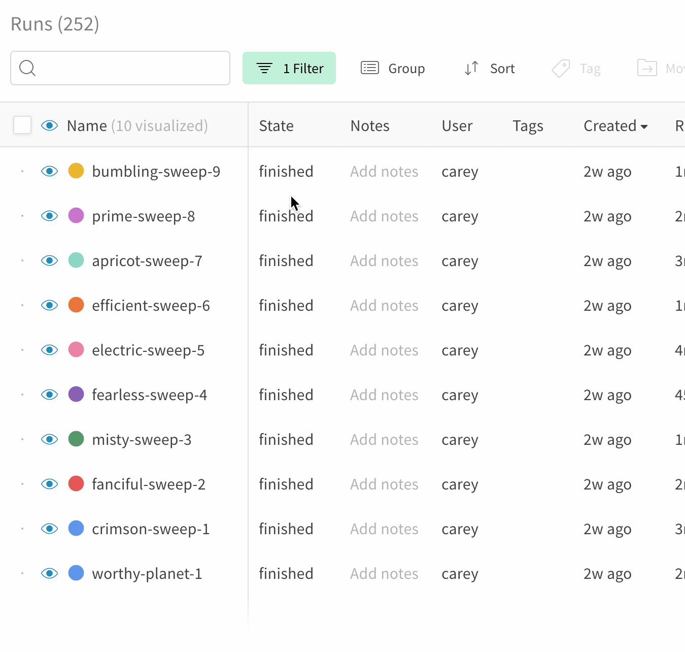

# Report Page

Use reports to describe your process developing models. Report sections each have their own run sets, so you can show comparisons of different runs from different projects in the same page. Panels in reports include visualizations, markdown, and images. Here's an [example report](https://app.wandb.ai/stacey/estuary/reports?view=stacey%2FDistributed%20Training) on distributed training.

## Add markdown

Click **Add a visualization** and select **Markdown** to add a text panel to a report.

## Add visualizations

Click the "Add a visualization" button to add a new graph.

Select what kind of visualization you'd like to use. We'll start with a line plot.

There are plenty of settings to customize your line plot. Select a metric to compare across runs.

## Sections

If you'd like to compare a different set of runs, create a new section. Each section's graphs are controlled by the table in that section.

Duplicate a section to copy the settings from your first section.

## Static and dynamic run sets

* **Dynamic run sets**: If you start from "Visualize all" and filter or deselect runs to visualize, the run set will automatically update to show any new runs that match the filters.
* **Static run sets**: If you start from "Visualize none" and select the runs you want to include in your run set, you will only ever get those runs in the run set. No new runs will be added.

Here's a gif of me clicking "Visualize none" and then selecting the runs I want to include in the run set. This run set will not update as I add more runs to my project.

