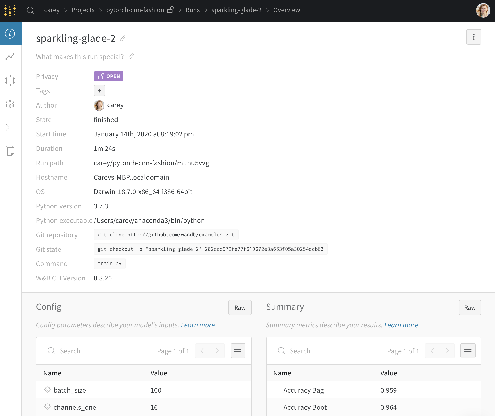
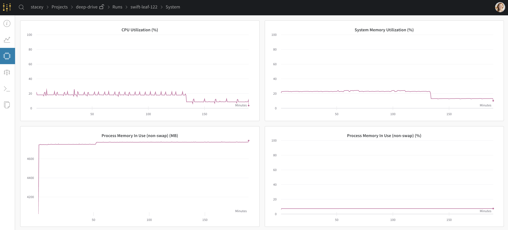
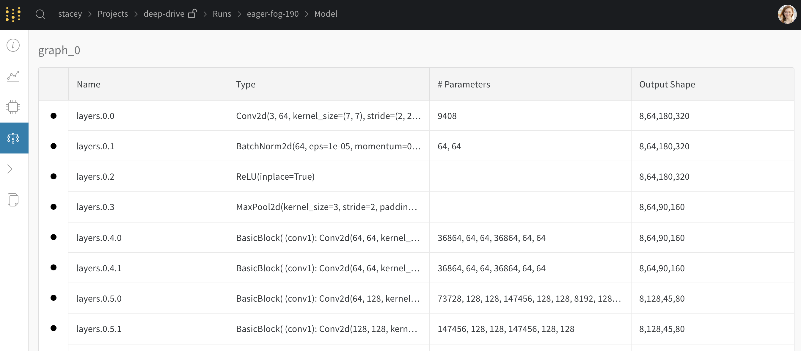
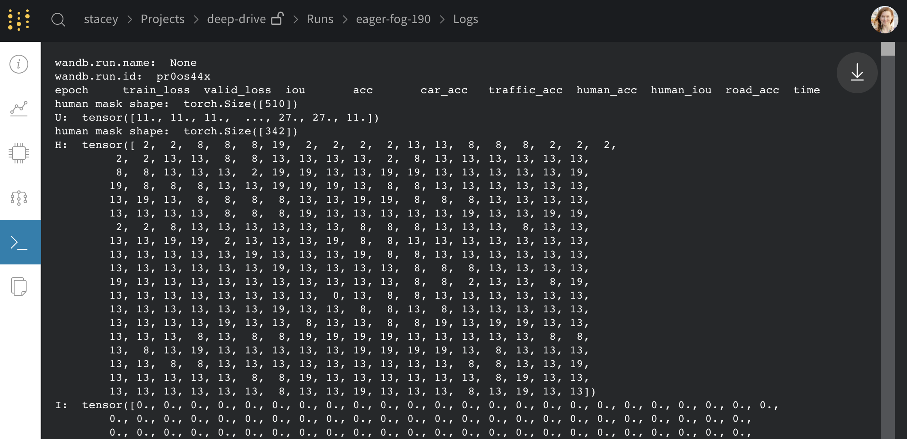
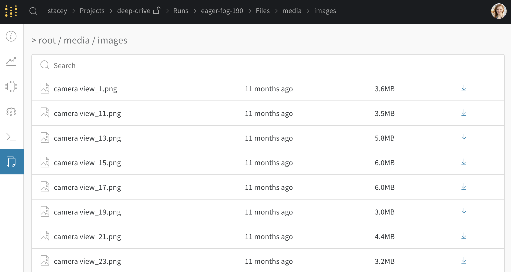

# Run Page

Utilisez la page d’essai pour explorer les informations détaillées d’une version unique de votre modèle.

## Onglet Vue d’ensemble

* Nom d’essai, description, et étiquettes
* Nom d’hôte, système d’exploitation, version Python, et commande qui a lancé l’essai
* Liste des paramètres de config sauvegardés avec [wandb.config](../../library/config.md)
* Liste des paramètres de sommaire sauvegardés avec [wandb.log\(\)](https://d.docs.live.net/library/log), par défaut réglé sur la dernière valeur enregistrée

 [Voir un exemple en direct →](https://app.wandb.ai/carey/pytorch-cnn-fashion/runs/munu5vvg/overview?workspace=user-carey)

Les détails Python sont privés, même si vous rendez la page en elle-même publique. Voici un exemple de ma page d’essai en navigation privée sur le côté, et mon compte sur la droite.

## Onglet de Graphiques

* Cherchez, regroupez, et arrangez vos visuels
* Cliquez sur l’icône de crayon ✏️ sur un graphique pour éditer :
  * changer l’axe x, les mesures, et les portées
  * éditer les légendes, les titres, et les couleurs de graphiques
* Voir des prédictions d’exemple de votre set de validation
*  Pour obtenir ces graphiques, enregistrez des données avec [wandb.log\(\)](https://docs.wandb.ai/library/log)

 [Voir un exemple en direct →](https://app.wandb.ai/wandb/examples-keras-cnn-fashion/runs/wec25l0q?workspace=user-carey)

##  Onglet Système

* Visualisez l’utilisation du CPU, la mémoire système, les IOPS de disque, le trafic réseau, l’utilisation GPU, la température GPU, le temps passé par le GPU en accès mémoire, la mémoire allouée par le GPU, et l’utilisation de puissance GPU
*  Lambda Labs a mis en avant comment utiliser les mesures de système W&B dans un [article de blog →](https://lambdalabs.com/blog/weights-and-bias-gpu-cpu-utilization/)

[Voir un exemple en direct →](https://wandb.ai/stacey/deep-drive/runs/ki2biuqy/system?workspace=user-carey)

##  Onglet Modèle

* Voir les couches de votre modèle, le nombre de paramètres, et la forme output de chaque couche.

 [Voir un exemple en direct →](https://app.wandb.ai/stacey/deep-drive/runs/pr0os44x/model)

## Onglet Enregistrements

* Output imprimé sur la ligne de commande, le stdout et le stderr de la machine qui entraîne le modèle
* Nous montrons les 1 000 dernières lignes. Après la fin d’un essai, si vous préférez télécharger le fichier complet d’enregistrements, cliquez sur le bouton télécharger en haut à droite.

 [Voir un exemple en direct →](https://app.wandb.ai/stacey/deep-drive/runs/pr0os44x/logs)

## Onglet Fichiers

* Sauvegarde les fichiers à synchroniser avec l’essai en utilisant [wandb.save\(\)](../../library/save.md)
* Conserve les checkpoints de modèles, les exemples de set de validation, et plus
* Utilise le diff.patch pour [restaurer](https://docs.wandb.ai/library/restore) une version exacte de votre code.

🌟Nouvelle recommandation : Essayez les [Artefacts](https://docs.wandb.ai/artifacts) pour garder une trace de vos inputs et de vos outputs

 [Voir un exemple en direct →](https://app.wandb.ai/stacey/deep-drive/runs/pr0os44x/files/media/images) 

