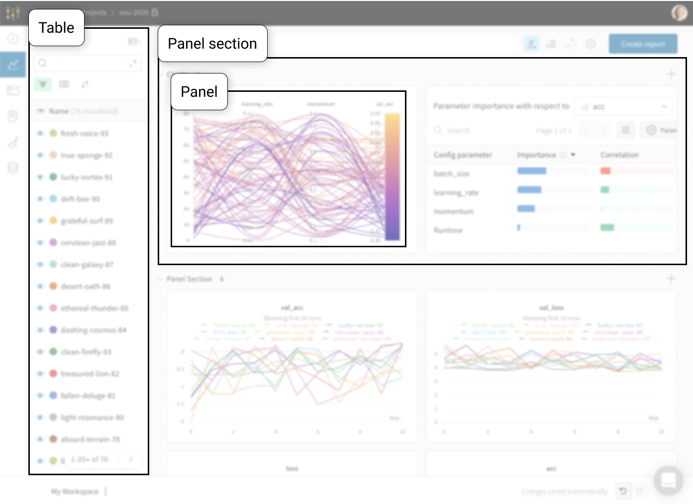
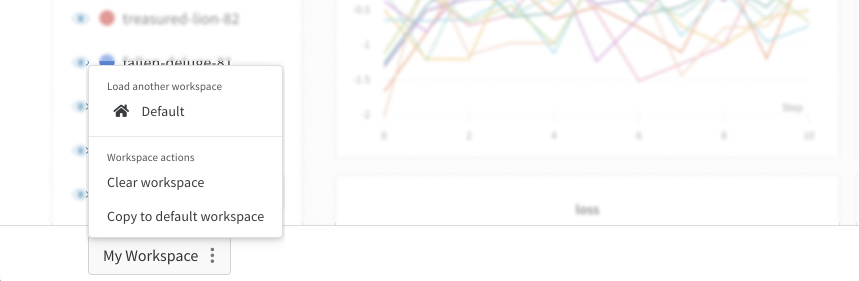

# Workspaces

Your workspace is your personal sandbox to customize charts and explore model results.

1. **Table**: All the runs in your project are listed in the table. ****Turn on and off runs, change colors, and expand the table to see notes, config, and summary metrics for each run. 
2. **Panels**: Panels are organized into sections. Create new panels, organize them, and export to reports to save snapshots of your workspace.

At the bottom of the page is a workspace control bar:

* **Workspace**: Each user has one workspace. Only you can edit your own workspace.
* **Undo/redo**: Quickly undo changes you made to your workspace.
* **Sharing**: Create a report to share results with colleagues. Click **Create report** in the upper right and select what charts you'd like to save a snapshot of. 
  * Reports can be **static snapshots** or **dynamic dashboards** of your project progress.
  * You can create multiple different saved views of your project with reports.
  * Reports let you add text annotations, create multiple different panel sections with different visible runs in each, and even share view-only links from inside private projects.
  * If you do end up sharing a link to your workspace with a collaborator, they can't overwrite your original layout but they can play with the charts in a temporary view, explore the results, and save over their own workspace if they prefer your layout.
* **Default workspace**: This is the default layout for any newcomers who land on this project for the first time. This lets you set up a nice landing page for your public project, or help your team members get started.

