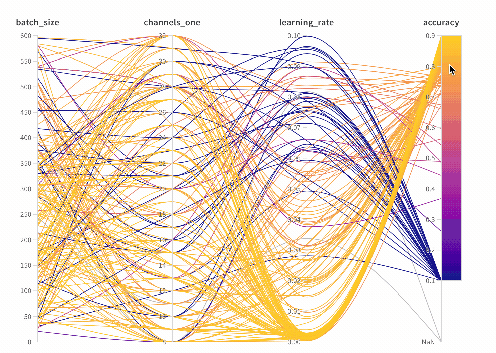

# Parallel Coordinates

Here's an example of a parallel coordinates plot. Each axis represents a different  In this case I've chosen four vertical axes. In this case I'm visualizing the relationship between different hyperparameters and the final accuracy of my model.

* **Axes**: different hyperparameters from [wandb.config](../../library/config.md) and metrics from [wandb.log\(\)](../../library/log.md)
* **Lines**: each line represents a single run of my model

 [See it live →](https://app.wandb.ai/example-team/sweep-demo/reports/Zoom-in-on-Parallel-Coordinates-Charts--Vmlldzo5MTQ4Nw)

