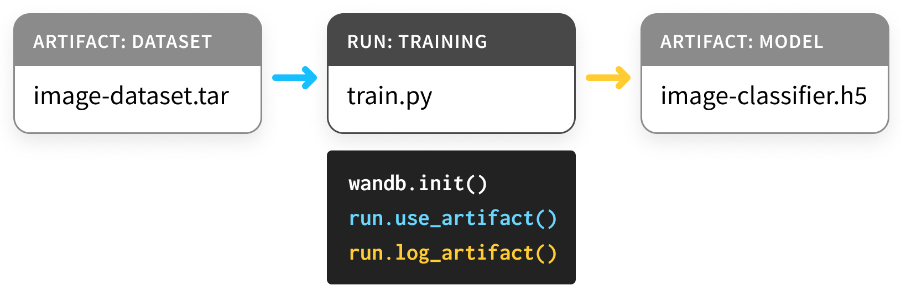

# Artifacts

Artifacts is the latest addition to the Weights & Biases toolkit, focusing on dataset versioning, pipeline tracking, and model management. We're iteratively building this new product with feedback from our users. Reach out in the [W&B Forum](http://bit.ly/wandb-forum) with questions or suggestions.

Use Artifacts to keep track of all the dataset versions, models, and evaluation results used and generated in machine learning projects. You can think of a W&B artifact as an immutable folder of data. An artifact’s contents are carefully checksummed and verified to ensure reproducibility.  
  
Artifacts are general and flexible: you can store data directly in them, or store references to data in other systems. Using our Artifacts API, you can log artifacts as outputs of W&B runs, or use artifacts as input to runs.

Since a run can use another run’s output artifact as input, artifacts and runs together form a directed graph. You don’t need to define pipelines ahead of time. Just use and log artifacts, and we’ll stitch everything together.

