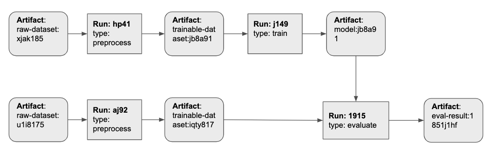

# Artifacts

### Overview

Use W&B Artifacts to store and keep track of datasets, models, and evaluation results across machine learning pipelines. Think of an artifact as a versioned folder of data. You can store entire datasets directly in artifacts, or use artifact references to point to data in other systems.

### Pricing

We're developing a storage-based pricing model for Artifacts. As of today, all plans include up to 200GB of free storage. Reach out to us at support@wandb.com to learn about pricing, ask questions or share suggestions.

### How it works

 Using our Artifacts API, you can log artifacts as outputs of W&B runs, or use artifacts as input to runs.

Since a run can use another run’s output artifact as input, artifacts and runs together form a directed graph. You don’t need to define pipelines ahead of time. Just use and log artifacts, and we’ll stitch everything together.

