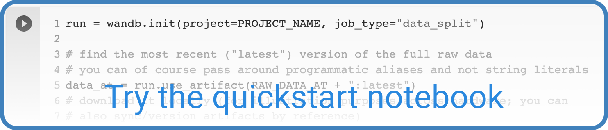

# Artifacts

Use W&B Artifacts to store and keep track of datasets, models, and evaluation results across machine learning pipelines. Think of an artifact as a versioned folder of data. You can store entire datasets directly in artifacts, or use artifact references to point to data in other systems.

### Quickstart

Explore the basics of Artifacts for dataset versioning and model management with a quick, interactive notebook hosted in Google Colab.

## How it works

Using our Artifacts API, you can log artifacts as outputs of W&B runs, or use artifacts as input to runs.

Since a run can use another run’s output artifact as input, artifacts and runs together form a directed graph. You don’t need to define pipelines ahead of time. Just use and log artifacts, and we’ll stitch everything together.

Here's an [example artifact](https://app.wandb.ai/shawn/detectron2-11/artifacts/model/run-1cxg5qfx-model/4a0e3a7c5bff65ff4f91/graph) where you can see the summary view of the DAG, as well as the zoomed-out view of every execution of each step and every artifact version.

To learn how to use Artifacts, check out the [Artifacts API Docs →](https://docs.wandb.com/artifacts/api)

## Video Tutorial for W&B Artifacts

Follow along with our interactive [tutorial](https://www.youtube.com/watch?v=Hd94gatGMic) and learn how to track your machine learning pipeline with W&B Artifacts.

