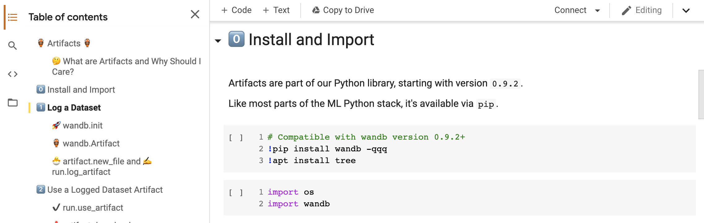

# Artifacts Examples

在现场笔记本中浏览工件示例。

​[**试试笔记本 →**](https://colab.research.google.com/github/wandb/examples/blob/master/colabs/wandb-artifacts/Pipeline_Versioning_with_W&B_Artifacts.ipynb)**​**

可以试试我们的两个GitHub demo项目查看更深入的示例：

1. **​**[**数据集版本控制**](https://github.com/wandb/artifacts-examples/tree/master/dataset-versioning)**​：**如何使用W&B工件对数据集进行版本控制的端到端示例。
2. **​**[**Detectron 2**](https://github.com/wandb/artifacts-examples/tree/master/detectron2):图像分割和边界框预测——实时可视化训练度量和预测、存储和组织训练模

\*\*\*\*

