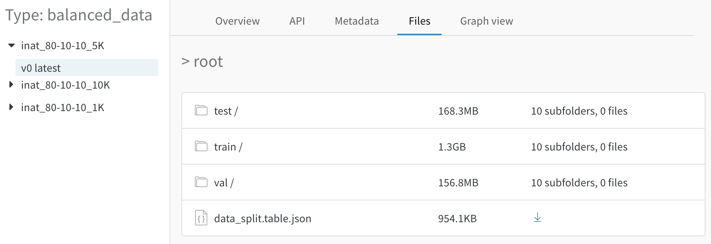

# Dataset Versioning

W&B 아티팩트는 프로젝트의 라이프사이클 전반에 걸쳐 머신 러닝 데이터세트 저장 및 구성을 도와드립니다.

### **일반 사용 사례**

1. 워크플로 중단 없이 [데이터를 원활하게 버저닝합니다](https://docs.wandb.ai/v/ko/artifacts/dataset-versioning#25c79f05-174e-4d35-abda-e5c238b8d6d6).
2. 훈련, 검증, 테스트 세트와 같은 [데이터 분할을 프리패키징합니다](https://docs.wandb.ai/v/ko/artifacts/dataset-versioning#7ccfb650-1f87-458c-a4e2-538138660292).
3. 팀 비동기화 없이 [데이터세트를 반복적으로 개선합니다](https://docs.wandb.ai/v/ko/artifacts/dataset-versioning#cee1428d-3b7a-4e1b-956b-e83170e7038f).
4. 미세 조정 및 도메인 적응\(domain adaptation\)에서와 같이 [여러 데이터세트를 저글링합니다](https://docs.wandb.ai/v/ko/artifacts/dataset-versioning#4ba93c33-dd39-468b-8b3e-96c938bbd024).
5. [데이터 워크플로를 시각화 및 공유하여](https://docs.wandb.ai/v/ko/artifacts/dataset-versioning#57023a52-2c00-4b24-8e17-b193b40e216b) 모든 작업을 한곳에 둡니다.

### **유연한 추적 및 호스팅**

이러한 일반적인 경우 이외에도, 핵심 아티팩트 기능을 사용하여 데이터를 업로드, 버전, 별칭 붙이기\(alias\), 비교 및 다운로드할 수 있으며, S3, GCP, https를 통해 로컬 및 원격 파일 시스템에서 사용자 지정 데이터세트 워크플로를 지원합니다.

## **핵심 아티팩트 기능** <a id="403224a6-95d9-4095-9161-076362f8fc5f"></a>

 W&B 아티팩트는 다음의 기본 기능을 통해 데이터세트 버저닝을 지원합니다:

1. **업로드:** `run.log_artifact()`을 통해 모든 데이터 \(파일 또는 디렉토리\) 추적 및 버저닝을 시작합니다. 또한 원시 콘텐츠\(raw contents\)대신 링크 또는 URI를 사용하여 [참조로 ](https://docs.wandb.ai/v/ko/artifacts/artifacts-walkthrough#adding-references)원격 파일시스템\(예: S3 또는 GCP의 클라우드 저장소\)에서 데이터세트를 추적할 수도 있습니다.
2.  **버전**: 아티팩트에 유형\(`"raw_data"`, `"preprocessed_data"`, `"balanced_data`"\) 및 이름\(`"imagenet_cats_10K`"\)을 지정하여 아티팩트를 정의합니다. 동일한 이름을 다시 로그하는 경우, W&B는 최신 콘텐츠를 포함한 새 버전의 아티팩트를 자동 생성합니다.
3. **별칭\(alias\):** `"best"` 또는 `"production"`와 같은 별칭을 설정하여 아티팩트의 계통\(lineage\)에서 중요한 버전\(version\)을 강조 표시합니다.
4. **비교:** 임의의 두 버전을 선택하여 콘텐츠를 나란히 탐색합니다. 또한, 저희는 데이터세트 시각화를 위한 툴도 개발 중입니다. [자세한 내용은 이곳을 참조하시기 바랍니다 →](https://docs.wandb.ai/v/ko/datasets-and-predictions)**​**
5.  **다운로드:** 아티팩트의 로컬 복사본을 가져오거나 참조로 콘텐츠를 확인합니다.

 이 기능에 대한 자세한 내용은 [아티팩트 핵심 개념](https://docs.wandb.ai/v/ko/artifacts/artifacts-core-concepts)을 참조하시기 바랍니다.

##  **원활한 데이터 버저닝** <a id="25c79f05-174e-4d35-abda-e5c238b8d6d6"></a>

W&B 아티팩트의 즉각적인 가치는 자동으로 데이터를 버저닝하는 것입니다. 즉, 개별 파일 및 디렉토리의 콘텐츠를 추적하는 것으로, 여기서 항목\(items\)을 추가, 제거, 교체, 편집할 수 있습니다. 이러한 모든 작업은 추적할 수 있으며, 되돌릴 수 있으므로, 정확한 데이터 처리의 인지 부하\(cognitive load\)를 줄입니다. 일단 아티팩트를 생성하여 업로드하면, 새 파일의 추가 및 로깅을 통해 해당 아티팩트의 새 버전이 생성됩니다. 이 이면에서, \([git](https://www.atlassian.com/git/tutorials/what-is-git)와 같은\) 변경 내용만 업로드 되도록, 콘텐츠를 디핑\(diff\)합니다. \(체크섬\(checksum\)을 통하여\) 여러분께서는 브라우저에서 모든 버전 및 개별 파일을 확인하실 수 있으며, 여러 버전 간의 콘텐츠를 디핑하고, 인덱스 또는 별칭\(alias\)별로 \(기본값으로, “latest”는 가장 최근 버전의 별칭임\) 특정 버전을 다운로드할 수 있습니다. 데이터 전송을 간편하고 빠르게 유지하기 위해 wandb는 파일을 캐시합니다.

샘플 코드:

```python
run = wandb.init(project="my_project")
my_data = wandb.Artifact("new_dataset", type="raw_data")
my_data.add_dir("path/to/my/data")
run.log_artifact(my_data)
```

 [이 예시](https://wandb.ai/stacey/mendeleev/artifacts/balanced_data/inat_80-10-10_5K/ab79f01e007113280018)에서, 저희는 1K, 5K, 10K 항목의 데이터세트 세 개를 갖고 있으며, 하위 폴더의 파일명에 걸쳐 비교 및 확인할 수 있습니다. \(데이터 분할별 또는 클래스 레이블별\)


## **데이터 분할 프리패키징\(prepackage\)** <a id="7ccfb650-1f87-458c-a4e2-538138660292"></a>

모델 및 훈련 계획을 반복할 때, 다양한 데이터 조각을 원하실 수 있으며, 이는 다음에 따라 달라질 수 있습니다.

* **항목 수:** 개념 검증\(proof of concept\)으로써 시작하는 또는 빠른 반복을 위한 작은 데이터세트나 더 많은 데이터에서 모델이 얼마나 많은 이익을 얻는지 확인하기 위한 크기가 증가하는 여러 데이터세트
* **train/val/test 과제 및 비율:** 다양한 항목 비율을 통한 train/test 분할 또는 train/val/test 분할
* **per-class balance\(클래스당 균형\):** 레이블 표현을 \(각 K개 이미지에 대한 N개 이미지\) 균등화하거나 데이터의 기존 불균등 분포를 따릅니다.

또는 특정 작업에 해당하는 다른 요인이 있습니다.

 이 모든 사항을 아티팩트로 저장하고 독립적으로 버저닝하여 다양한 머신, 환경, 팀 구성원 간에 이름별로 안정적으로 다운로드할 수 있습니다. 어디에 마지막으로 어디에 마지막으로 어떤 버전을 저장했는지 기억하거나 메모할 필요가 없습니다.

아티팩트 시스템은 가능한 어디에서든 파일 복제를 방지하기 때문에, 여러 버전에서 사용되는 파일은 오직 한 번만 저장됩니다!

샘플 코드:

```python
run = wandb.init(project="my_project")
my_data = wandb.Artifact("new_dataset", type="raw_data")

for dir in ["train", "val", "test"]:
	my_data.add_dir(dir)`

run.log_artifact(my_data)
```

 [파일 콘텐츠](https://wandb.ai/stacey/mendeleev/artifacts/balanced_data/inat_80-10-10_5K/ab79f01e007113280018/files)​ 보기 →



## **데이터세트 반복 개선** <a id="cee1428d-3b7a-4e1b-956b-e83170e7038f"></a>

훈련데이터 탐색 또는 새로운 예시 배치\(batch\)를 추가할 때, 다음과 같은 문제를 확인하실 수 있습니다.

* 부정확한 ground truth 레이블
* 하드 네거티브\(hard negatives\) 또는 빈번하게 잘못 분류된 예시
* 문제가 있는 클래스 불균형

데이터를 정리하고 개선하기 위해, 부정확한 레이블을 수정하거나, 불균형 해소를 위해 파일 추가 및 제거 또는 하드 네거티브를 특별 테스트 분할로 그룹화할 수 있습니다. 변경 사항 배치를 완료한 후 아티팩트를 통해 `run.log_artifact()`를 호출하여 새 버전을 클라우드에 푸시\(push\)할 수 있습니다. 이것은 이전 변경사항의 계통\(lineage\) 및 이전 변경 사항의 히스토리는 보존하면서 변경사항을 반영하도록 새 버전을 통해 아티팩트를 자동으로 업데이트합니다.

아티팩트 버전에 맞춤형 별칭을 통해 태그를 지정할 수 있으며, 변경 사항을 기록하고, 각 버전을 따라 메타데이터를 저장하고, 어떤 실험 실행이 특정 버전을 사용하는지 확인할 수 있습니다. 이를 통해, 팀 전체가 최신 또는 안정적인 데이터 버전으로 작업하고 있는지 알 수 있습니다.

또한 개선 프로세스를 보다 쉽고 시각적으로 만들기 위해 저희는 최선을 다하고 있습니다. [여기서](https://docs.wandb.ai/datasets-and-predictions) 데이터세트 및 예측 베타버전을 확인하시기 바랍니다 →

###  **자동 버저닝** <a id="4d22c630-6fed-4fab-a802-1c7ae0f2d8db"></a>

아티팩트가 변경된 경우, 동일 아티팩트 생성 스크립트를 다시 실행하십시오. 이 경우, 자연-데이터 디렉토리가 사진 id 두 개의 리스트, `animal-ids.txt`와 `plant-ids.txt`를 포함하고 있다고 가정해봅시다. 저희는 잘못 레이블된 예시를 제거하기 위해 animals-ids.txt를 편집합니다. 이 스크립트는 새 버전을 깔끔하게 포착합니다. 즉, 아티팩트를 체크섬\(checksum\)하고, 변경 사항을 확인하고, 새 버전을 추적합니다. 변경 사항이 없는 경우, 저희는 어떠한 데이터도 \(예: 이 경우, `plant-ids.txt`를 재업로드 하지 않음\) 재업로드 하지 않으며 또는 새 버전을 생성하지 않습니다.

```python
run = wandb.init(job_type="dataset-creation")
artifact = wandb.Artifact('nature-dataset', type='dataset')
artifact.add_dir("nature-data")

# Edit the list of ids in one of the file to remove the mislabeled examples
# Let's say nature-photos contains "animal-ids.txt", which changes
# and "plant-ids", which does not

# Log that artifact, and we identify the changed file
run.log_artifact(artifact)
# Now you have a new version of the artifact, tracked in W&B
```

데이터세트에 사용자 지정 이름을 부여하고 노트 또는 키-값 쌍 메타데이터와 함께 데이터세트에 주석을 달 수 있습니다.


## **다양한 데이터세트 저글링하기\(juggle\)** <a id="4ba93c33-dd39-468b-8b3e-96c938bbd024"></a>

 여러분의 작업에 보다 복잡한 커리큘럼이 필요할 수 있습니다. 아마도, [ImageNet](http://www.image-net.org/)에서의 클래스 부분집합에 대한 사전 훈련 또는 [iNaturalist](https://github.com/visipedia/inat_comp/tree/master/2021) 또는 여러분의 사진 모음과 같은 사용자 지정 데이터세트에 대한 세부 조정과 같은 것들 말입니다. 도메인 적응\(domain adaptation\), 전이 학습\(transfer learning\), 메타러닝\(metalearning\) 및 관련 작업에서, 여러분께서는 각 데이터 또는 소스에 대한 다양한 아티팩트를 저장하여 실험을 체계적으로 유지하고 보다 쉽게 재현할 수 있도록 유지할 수 있습니다.

[양방향으로 그래프를 탐색하세요 →](https://wandb.ai/stacey/mendeleev/artifacts/balanced_data/inat_80-10-10_5K/ab79f01e007113280018/graph)


 크기가 다양한 균형 데이터세트의 다양한 버전 \(1K, 5K 및 10K\) 및 해당 아티팩트 그래프이며, 이것은 해당 데이터에 대한 훈련 및 추론 실행\(inference runs\)을 나타냅니다.


총 50개 및 500개의 항목을 포함한 원시 파일의 다양한 버전이며, 여기서 data\_split 작업은 “train” 및 “val” 데이터에 대한 두 개의 개별 아티팩트를 생성합니다.

##  **데이터 워크플로 시각화 및 간편한 공유** <a id="57023a52-2c00-4b24-8e17-b193b40e216b"></a>

아티팩트를 통해 사전처리, 훈련, 테스트, 분석 및 기타 작업 유형에 상관없이 모델 개발 스크립트를 통해 데이터 흐름을 확인하고 공식화할 수 있습니다.

* 아티팩트 및 작업에 대한 의미 있는 조직 유형 선택: 데이터의 경우 이것은 `train`, `val` 또는 `test`일 수 있으며, 스크립트의 경우, `preprocess`, `train`, `evaluate` 등일 수 있습니다. 또한, 고정 검증 데이터에 대한 예측, 생성된 출력의 샘플, 평가 메트릭과 같은 다른 데이터를 아티팩트로 기록할 수 있습니다. 
* **아티팩트 그래프 탐색:** 코드 및 데이터 사이의 모든 연결과 상호작용합니다 \(입력 아티팩트 → 스크립트 또는 작업 → 출력 아티팩트\). 계산 그래프의 “explode”를 클릭하여 각 아티팩트 또는 작업 유형별 각 스크립트의 모든 실행에 대한 모든 버전을 확인하실 수 있습니다. 개별 노드\(node\)를 클릭하여 보다 세부적인 사항을 확인하실 수 있습니다. \(파일 콘텐츠 또는 코드, 주석/메타데이터, 구성\(config\), 타임스탬프, 부모/자식 노드 등\)
* **확실한 반복:** 모든 실험 스크립트 실행 및 데이터는 자동으로 저장 및 버저닝 되므로 핵심 모델링 작업에 집중하실 수 있으며, 언제 어디서 데이터세트 또는 코드의 어떤 버전이 저장되었는지에 대해 신경 쓰지 않으셔도 됩니다.
* **간편한 공유 및 복제:** 아티팩트를 통합한 후, 여러분과 팀 동료는 매끄럽게 동일한 워크플로를 재실행하고 동일 데이터세트를 가져오기할 수 있습니다 \(기본값은 최신/최상 버전\(latest/best version\)\). 심지어 다른 컨텍스트/다른 하드웨어에서 훈련할 수 있습니다.

 [양방향 예시 →](https://wandb.ai/wandb/arttest/artifacts/model/iv3_trained/5334ab69740f9dda4fed/graph)**​**

단순 계산 그래프 예시


아티팩트로 로그된 예측 및 평가 결과를 포함하고 있는 보다 복잡한 계산 그래프


계산 그래프의 단순화 버전, 아티팩트/작업 유형별로 그룹화된 노드 \(“Explode” 꺼짐\)


각 노드의 전체 세부 사항: 아티팩트 유형별 버전 및 작업 유형별 스크립트 실행 \(“Explode” 켜짐\)


resnet18의 특정 버전 세부 사항: 어떤 훈련 실행이 resnet18을 생성했고 추론을 위해 어떤 추가 실행이 resnet18을 로드했는지를 나타냅니다. 각 프로젝트에 깊이 링크되어 있으므로 전체 그래프를 탐색할 수 있습니다.


