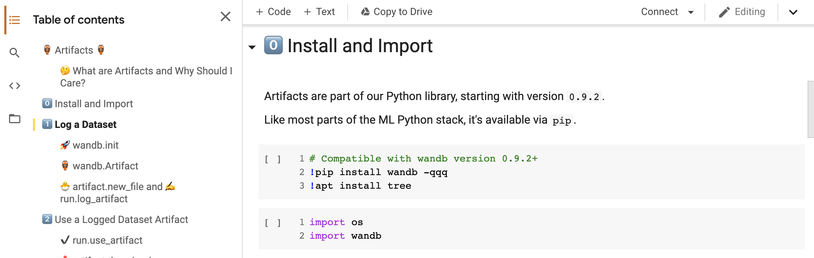

# Artifacts Examples

Walk through an example of Artifacts in a live notebook.

[**Try the notebook →**](https://colab.research.google.com/github/wandb/examples/blob/master/colabs/wandb-artifacts/Pipeline_Versioning_with_W%26B_Artifacts.ipynb)\*\*\*\*

For a more in-depth example, try our two GitHub demo projects:

1. \*\*\*\*[**Dataset versioning**](https://github.com/wandb/artifacts-examples/tree/master/dataset-versioning)**:** An end-to-end example of how to version datasets with W&B artifacts.
2. \*\*\*\*[**Detectron 2**](https://github.com/wandb/artifacts-examples/tree/master/detectron2): Image segmentation and bounding box prediction— visualize training metrics and predictions in real time, store and organize trained models, automatically track model fine-tuning, and save results

\*\*\*\*

