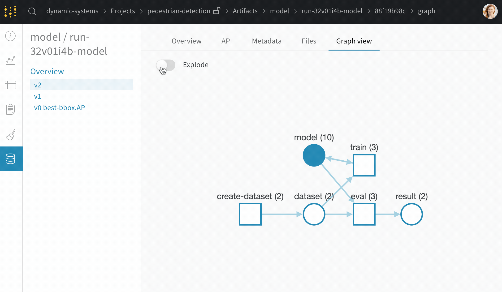

# Artifacts

## **总览**

使用W＆B Artifacts在整个机器学习管道\(pipeline\)中存储和跟踪数据集，模型和评估结果。 将工件模块artifact视为数据的版本文件夹。 您可以将整个数据集直接存储在artifact中，或使用artifact来指向其他系统中的数据。

**运行原理**

使用我们的artifact API，您可以将artifact记录为W＆B运行的输出，也可以将artifact用作运行的输入。

由于一次运行的输出artifact可以作为另一次运行的输入，因此artifact和运行一起形成有向图。 您无需提前定义管道。 只需使用并记录artifact即可，我们将所有内容拼接在一起。

Here's an [example artifact](https://app.wandb.ai/shawn/detectron2-11/artifacts/model/run-1cxg5qfx-model/4a0e3a7c5bff65ff4f91/graph) where you can see the summary view of the DAG, as well as the zoomed-out view of every execution of each step and every artifact version. 这是一个示例工件模块artifact，您可以在其中看到DAG的摘要视图，以及每个步骤的每次执行和每个工件版本的缩小视图。

To learn how to use Artifacts, check out the [Artifacts API Docs →](https://docs.wandb.com/artifacts/api)

