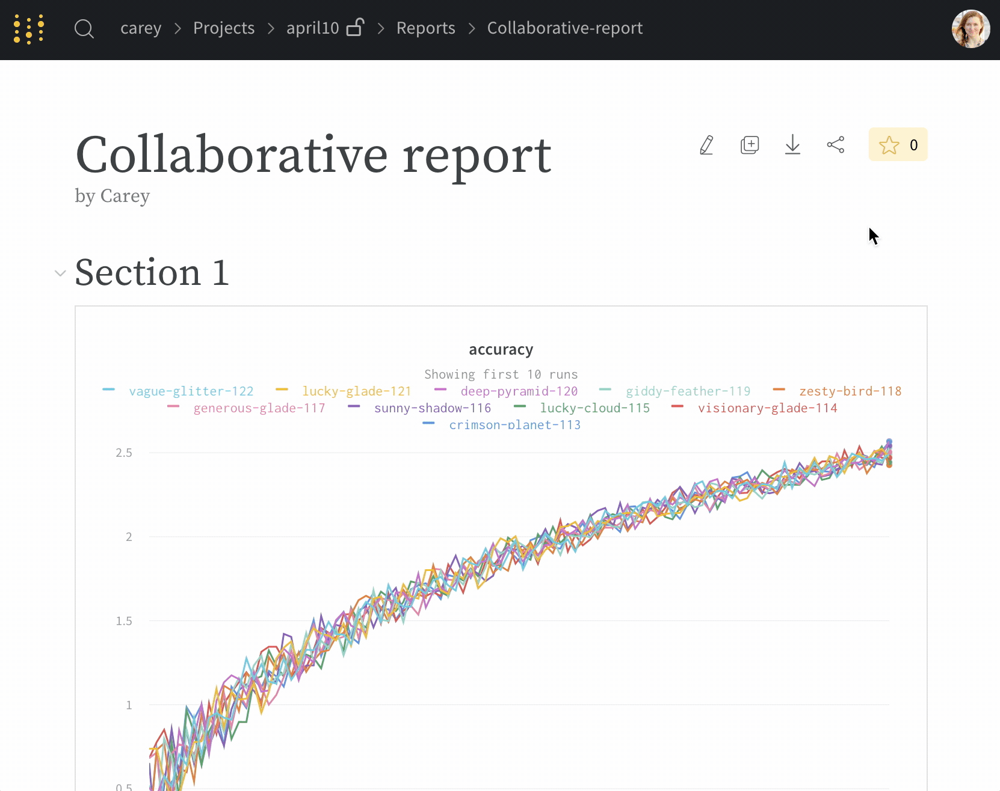
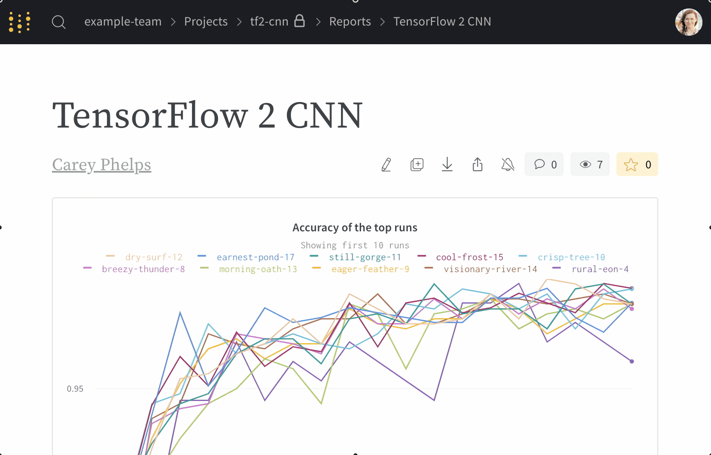

# Reports

报告使您可以组织可视化，描述您的发现并与协作者共享更新。

**用例**

1. 注释：添加带有快速注释的图形。
2. 协作：与您的同事分享发现。
3. 工作日志：跟踪您尝试过的内容，并计划下一步。

## [请参阅OpenAI案例研究→](https://wandb.ai/openai/published-work/Learning-Dexterity-End-to-End--VmlldzoxMTUyMDQ)

[在W＆B](https://app.gitbook.com/@weights-and-biases/s/docs/~/drafts/-MKaPhwzNIegNuInaekR/quickstart)中进行实验后，可以轻松地在报告中可视化结果。 这是一个快速的概述视频。



## **利用报告进行协作**

保存报告后，可以单击“共享”按钮进行协作。 确保项目上的可见性设置允许您的协作者访问报告——您将需要一个开放项目或团队项目来共享可以一起编辑的报告。

当您按下\[编辑\]时，您将编辑报告的草稿副本。 该草稿会自动保存，当您按“保存”报告时，您将所做的更改发布到共享报告中。

如果您的协作者之一同时编辑了该报告，则会收到警告，以帮助您解决潜在的编辑冲突。

**上传CSV文件到报告中**

## **增加面板**

点击增加面板按钮，将新的可视化加到报告中

## **面板网格**

如果要比较一组不同的运行，请创建一个新的面板网格。 每个部分的图形均由该部分底部的运行集控制。

## **静态和动态运行集**

* **动态运行集**：如果您从“全部可视化”开始，然后过滤或取消选择某些运行的可视化，则运行集将自动更新以显示与过滤器匹配的所有新运行。
* **静态运行集：**如果从“不可视化”开始，然后选择要包含在运行集中的运行，则运行集中只会包含这些运行。 没有新的运行将被添加。

## **导出报告**

单击下载按钮将报告导出为LaTeX zip文件。 检查下载文件夹中的README.md，以查找有关如何将此文件转换为PDF的说明。 您可以很容易将zip文件上传到 [Overleaf](https://www.overleaf.com/) 来编辑LaTeX。

## **跨项目报告**

将来自两个不同项目的运行与跨项目报告进行比较。 使用运行集表中的项目选择器选择一个项目。

该部分中的可视化对象从第一个活动运行集中取出列数据。 如果在线图中没有找到所需的指标，请确保在该部分中选中的第一个运行集具有该列数据。 此功能支持时间序列上的历史数据，但是我们不支持从不同项目中提取不同的指标——因此，散点图不适用于仅记录在另一个项目中的列数据。

如果您确实需要比较两个项目的运行并且列数据不起作用，请在一个项目的运行中添加标签，然后将这些运行移至另一个项目。 您仍然可以过滤单个项目的运行，但是报表中将提供两组运行的所有列。

**报告的‘只读’权限链接**

共享仅查看链接到私有项目或团队项目中的报告。

**将图形发送到报告**

将图形从工作区发送到报告以跟踪进度。 点击要复制到报告中的图表或面板上的下拉菜单，然后点击添加到报告以选择目标报告。

## **报告常见问题\(FAQ\)**

**将CSV上传到报告**

如果当前要上传CSV到报告中，则可以通过`wandb.Table`格式来完成。 在您的Python脚本中加载CSV并将其记录为`wandb.Table`对象将使您能够将数据呈现为报表中的表格。

## **刷新数据**

重新加载页面以刷新报告中的数据，并从运行中获得最新结果。 如果您启用了“自动刷新”选项（在页面右上角的下拉菜单中可找到），则工作区将自动加载新数据。 自动刷新不适用于报表，因此在您重新加载页面之前，该数据不会刷新。

