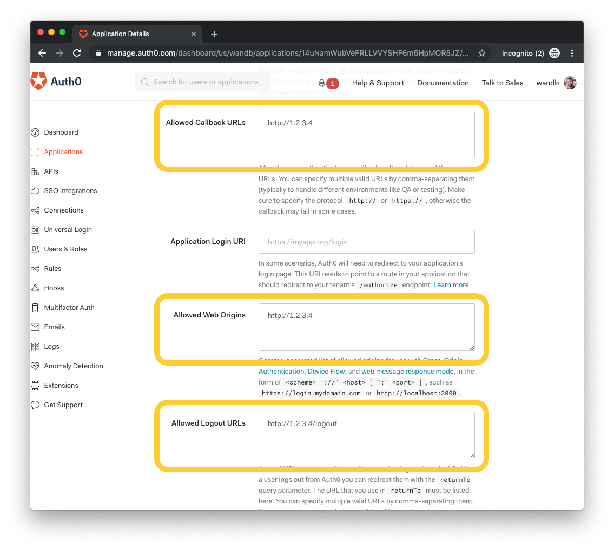
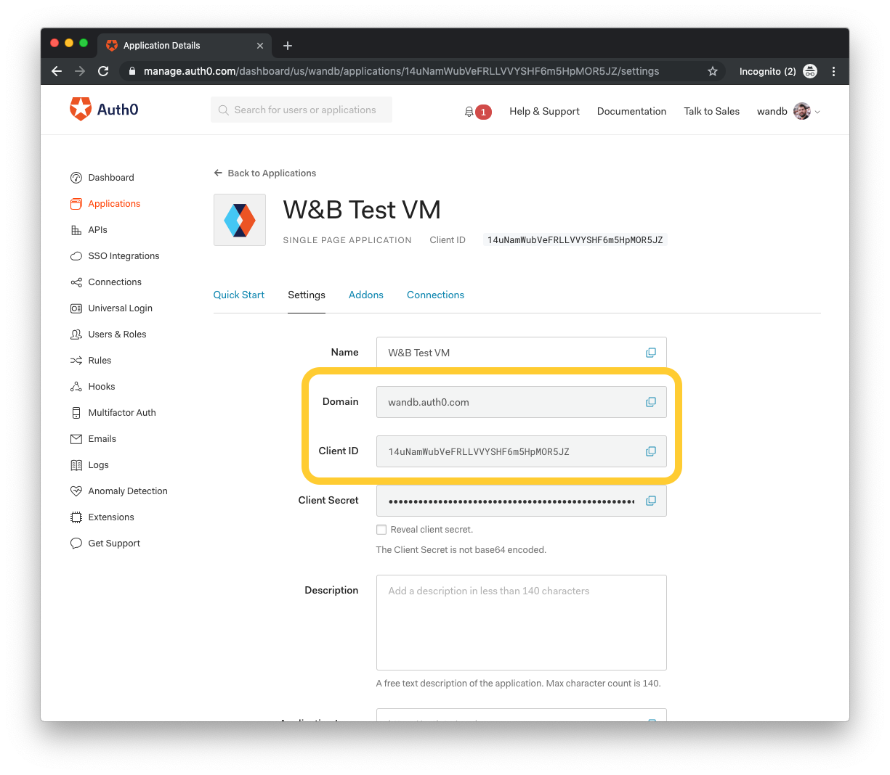
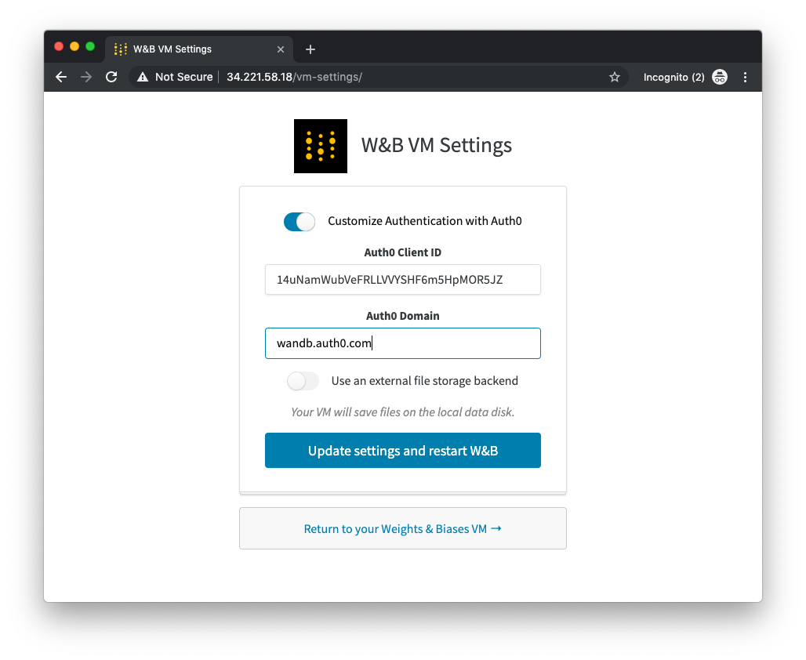
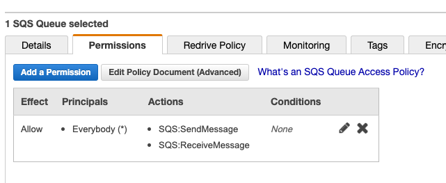
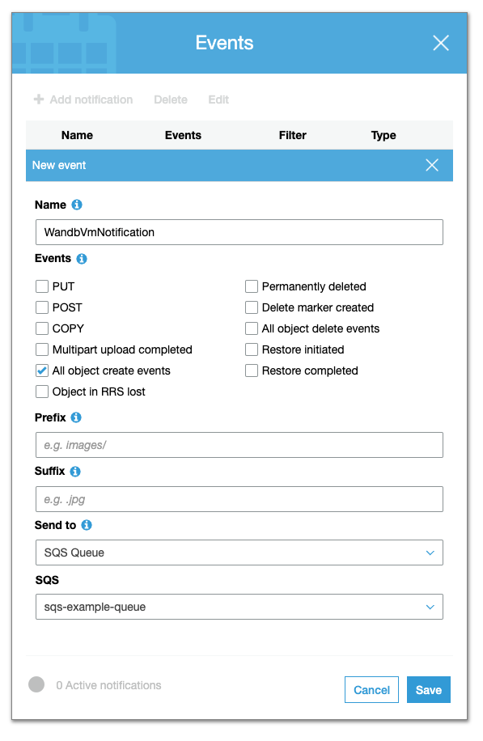
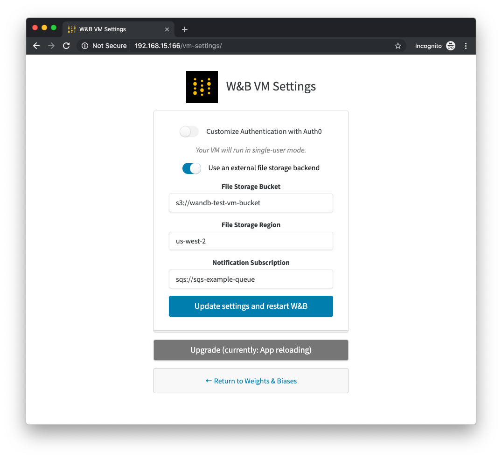
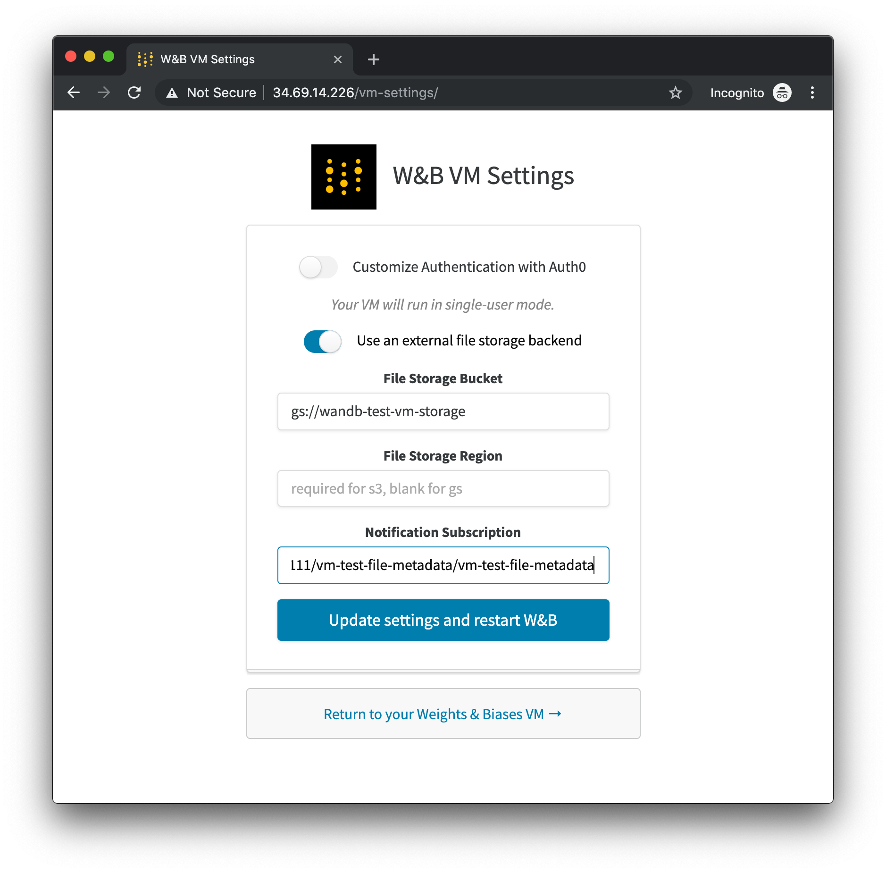

# Advanced Configuration

您的W＆B本地服务器在启动时即可使用。 但是，一旦服务器启动并运行，就可以在其`/ system-admin`页面上使用几个高级配置选项。 您可以发送电子邮件至[contact@wandb.com](mailto:contact@wandb.com) 申请试用许可证，以启用更多的用户和团队。

## **使用代码设置**

可以通过UI设置所有配置设置，但是，如果要通过代码管理这些配置选项，则可以设置以下环境变量：

**ICENSE** – 您的wandb/local 许可证

**MYSQL** - MySQL 连接字符

**BUCKET** – 用于储存数据的 S3 / GCS bucket

**BUCKET\_QUEUE** – 用于对象创造的 SQS / Google PubSub 事件队列

**NOTIFICATIONS\_QUEUE** – 公布运行事件的 SQS 队列

**AWS\_REGION** – 您的bucket的 AWS 位置

**HOST** – 您的实例的 FQD, i.e. [https://my.domain.net](https://my.domain.net)

**AUTH0\_DOMAIN** - 您的tenant的Auth0域名

**AUTH0\_CLIENT\_ID** – 您的应用的Client ID

## **认证方式**

默认情况下，W＆B本地服务器运行时具有用户手动管理功能，最多可支持4个用户。 wandb / local的许可版本还可以使用Auth0解锁SSO。

您的服务器会支持Auth0支持的任何身份验证提供程序。 您应该设置自己的[Auth0](https://auth0.com/)域和应用程序，该域和应用程序应该在团队的控制之下。

创建Auth0应用后，您需要将Auth0 回调\(callbacks\)配置为W＆B服务器的主机。 默认情况下，服务器支持主机提供的公共或私有IP地址中的http。 您也可以选择配置DNS主机名和SSL证书。

* 将Callback URL设置为`http（s// YOUR-W＆B-SERVER-HOST`
* 允许的网络来源Allowed Web Origin”设置为`http(s)://YOUR-W&B-SERVER-HOST`
* 将Logout URL设置为`http（s// YOUR-W＆B-SERVER-HOST`



从您的Auth0应用中保存客户端ID和域。



然后，导航至位于`http(s)://YOUR-W&B-SERVER-HOST/admin-settings`的W＆B设置页面。 启用“Customize Authentication with Auth0”选项，然后从Auth0应用中填写客户端ID和域。



最后，按“Update settings and restart W&B”。

## **文件储存**

默认情况下，W＆B Enterprise Server将文件配置到本地数据磁盘上，该磁盘具有您在设置实例时设置的容量。 为了支持无限的文件存储，您可以将服务器配置为使用具有S3兼容API的外部云文件存储桶。

### **亚马逊网络服务**

要将AWS S3存储桶用作W＆B的文件存储后端，您需要创建一个存储桶，以及一个配置为从该存储桶接收对象创建通知的SQS队列。 您的实例将需要权限才能读取此队列。

**创建一个SQS队列**

首先，创建一个SQS标准队列。 为`SendMessage`和`ReceiveMessage`操作以及`GetQueueUr`l的所有主体添加权限。 （如果您愿意，可以使用高级策略文档进一步对此进行锁定。）



**创建S3存储桶和存储桶通知**

然后，创建一个S3存储桶。 在控制台的存储桶属性页面下，在“高级设置Advanced Settings”的“事件Events”部分中，单击“添加通知Add notification”，并将所有对象创建事件配置为发送到先前配置的SQS队列。



启用CORS访问权限：您的CORS配置应如下所示：

```markup
<?xml version="1.0" encoding="UTF-8"?>
<CORSConfiguration xmlns="http://s3.amazonaws.com/doc/2006-03-01/">
<CORSRule>
    <AllowedOrigin>http://YOUR-W&B-SERVER-IP</AllowedOrigin>
    <AllowedMethod>GET</AllowedMethod>
    <AllowedMethod>PUT</AllowedMethod>
    <AllowedHeader>*</AllowedHeader>
</CORSRule>
</CORSConfiguration>
```

**配置W＆B服务器**

最后，导航至W＆B设置页面，网址为`http(s)://YOUR-W&B-SERVER-HOST/admin-settings`。 启用“使用外部文件存储后端Use an external file storage backend”选项，并以以下格式填写s3存储桶，区域和SQS队列：

* **文件存储桶**: `s3://<bucket-name>`
* **文件存储区域**: `<region>`
* **通知订阅**: `sqs://<queue-name>`



按“更新设置并重新启动W＆B\(update settings and restart W&B\)”以应用新设置。

**谷歌云平台**

要将GCP存储桶用作W＆B的文件存储后端，您需要创建一个存储桶，以及配置为从该存储桶接收对象创建消息的pubsub主题和订阅。

**创建Pubsub主题和订阅**

在GCP控制台中导航至Pub/Sub &gt;主题Topics，然后单击“创建主题Create topic”。选择一个名称并创建一个主题。

然后在页面底部的订阅表中单击“创建订阅Create subscription”。选择一个名称，并确保“传递类型Delivery Type”设置为“拉Pull”。点击“创建Create”。

确保您的实例所运行的服务帐户或该帐户具有对此预订的访问权限。

**创建存储桶**

在GCP控制台中导航至“存储Storage”&gt;“浏览器Browser”，然后单击“创建存储桶Create bucket”。确保选择“标准Standard”存储类别。

确保实例正在运行的服务帐户或该帐户具有对此存储桶的访问权限。

**创建Pubsub通知**

请注意，只能在控制台中创建从存储桶到Pubsub主题的通知流。请确保已安装`gsutil`，并登录到正确的GCP项目，然后运行以下命令：

```bash
gcloud pubsub topics list  # list names of topics for reference
gsutil ls                  # list names of buckets for reference

# create bucket notification
gsutil notification create -t <TOPIC-NAME> -f json gs://<BUCKET-NAME>
```

[ 可以在Cloud Storage网站上找到更多参考。](https://cloud.google.com/storage/docs/reporting-changes)

**添加签名权限**

要创建签名的文件URL，您的W＆B实例还需要GCP中的`iam.serviceAccounts.signBlob`权限。 您可以通过将`Service Account Token Creator`添加到服务帐户或您的实例运行的IAM成员。

**配置W＆B服务器**

最后，导航至W＆B设置页面，网址为`http(s)://YOUR-W&B-SERVER-HOST/admin-settings`。 启用“使用外部文件存储后端Use an external file storage backend”选项，并以以下格式填写s3存储桶，区域和SQS队列：

* **文件存储桶**: `gs://<bucket-name>`
* **文件存储区域**: blank
* **通知订阅**: `pubsub:/<project-name>/<topic-name>/<subscription-name>`



更新设置并重新启动W＆B \(update settings and restart W&B\)”以应用新设置。

