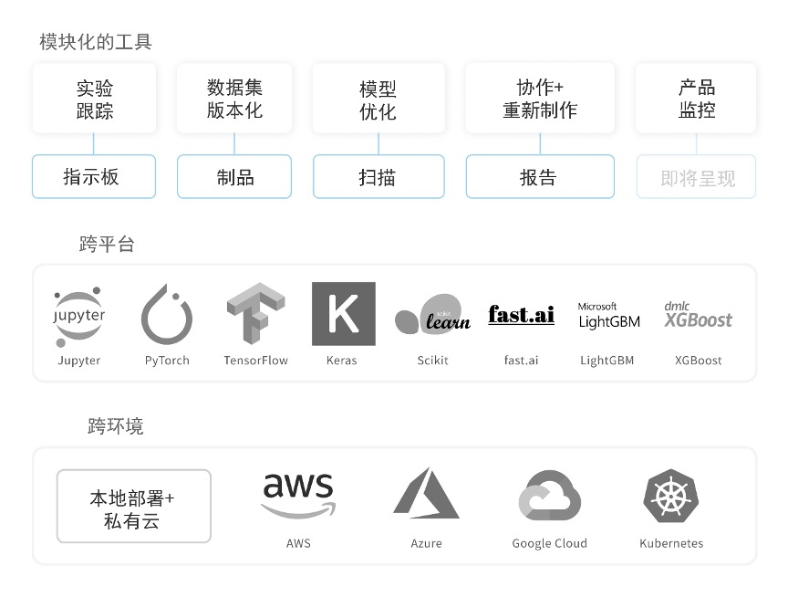
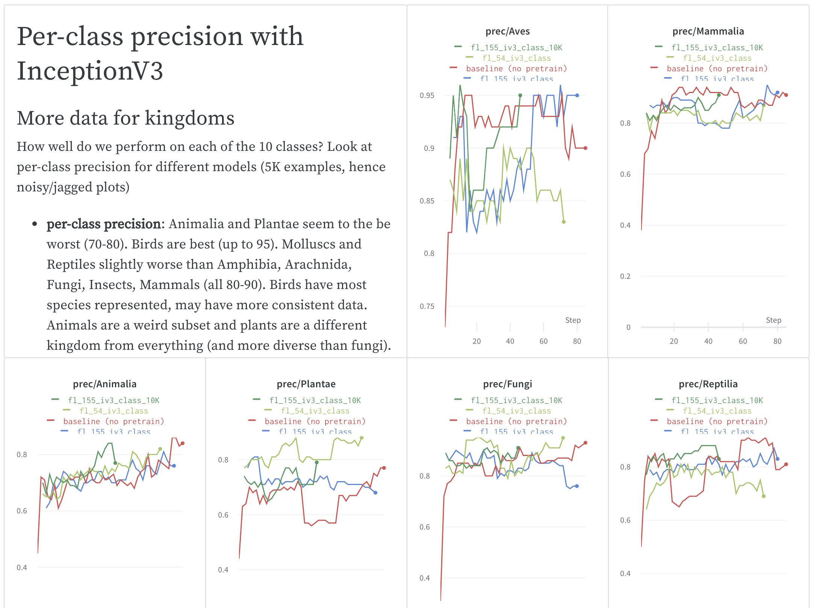

# Weights & Biases

权阈帮助你记录机器学习项目的过程。利用我们的工具记录运行过程中的超参数和输出指标，然后将结果可视化并做比较，便捷地与同事分享结果。

我们的工具兼容各种机器学习平台：亚马逊AWS、谷歌云、Kubernetes、微软Azure和预置机器。

**工具**

1. \*\*\*\*[**面板**](https://docs.wandb.com/app)：记录实验过程、将结果可视化；
2. \*\*\*\*[**报告**](https://docs.wandb.com/reports)：保存和分享可复制的成果/结论；
3. \*\*\*\*[**扫描**](https://docs.wandb.com/sweeps)：通过调谐超参数来优化模型；
4. \*\*\*\*[**制品**](https://docs.wandb.com/artifacts)：数据集、模型的版本化，跟踪流水线进展。



**入门指南**

将我们的Python库`wandb`添加到机器学习脚本，很简单。

* [快速上手](https://app.gitbook.com/@weights-and-biases/s/docs/~/drafts/-MKaPhwzNIegNuInaekR/quickstart)
* [集成Keras](https://app.gitbook.com/@weights-and-biases/s/docs/~/drafts/-MKaPhwzNIegNuInaekR/library/integrations/keras)
* [集成PyTorch ](https://github.com/wandb/gitbook/tree/f7ad30c988fe522f738e058e2d25dabfd045dd0e/@weights-and-biases/s/docs/~/drafts/-MKaPhwzNIegNuInaekR/library/integrations/pytorch/README.md)   
* [集成TensorFlow](https://app.gitbook.com/@weights-and-biases/s/docs/~/drafts/-MKaPhwzNIegNuInaekR/library/integrations/tensorflow)
* [集成 Jupyter Notebook ](https://github.com/wandb/gitbook/tree/f7ad30c988fe522f738e058e2d25dabfd045dd0e/@weights-and-biases/s/docs/~/drafts/-MKaPhwzNIegNuInaekR/library/integrations/jupyter/README.md)

  下面的截图样本是权阈中的一个[物种鉴别项目](https://wandb.ai/stacey/curr_learn/reports?view=stacey%2FSpecies%20Identification)。

**案例**

如果你对案例项目感兴趣，我们有些资源：

* [应用库](https://wandb.ai/gallery)：该库包含了我们的网络应用精选报告
* [项目案例](https://github.com/wandb/gitbook/tree/f7ad30c988fe522f738e058e2d25dabfd045dd0e/@weights-and-biases/s/docs/~/drafts/-MKaPhwzNIegNuInaekR/examples/README.md)：我们的网络应用Python脚本和成果结论。

