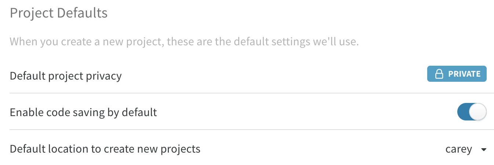

# Data and Privacy

## You own your data

Everything you log to Weights & Biases is yours, including your training data, code, configuration and hyperparameters, output metrics, analysis, and saved model files. You can choose to log, export, publish, or delete any of these. We collect aggregate statistics across our users to improve our product— we might do a database query to count how many users have uploaded a requirements.txt that includes a specific library to help decide if we want to do a first class integration with that library. We treat your private data, source code, or trade secrets as confidential and private, as consistent with our [Terms of Service](https://www.wandb.com/terms) and [Privacy Policy](https://www.wandb.com/privacy).‌

## Data logging

Our tool provides the ability to log 4 primary classes of data:

1. **Metrics and Parameters**: \_\*\*\_This is the core functionality of the tool— keeping track of the scalars and histograms you log with a run. You specify these directly in `wandb.log()` or set up an integration with one of the supported frameworks.
2. **Code**: We support saving the latest git SHA and a diff patch, or saving the main file from your run for easy code comparison. This is off by default and needs to be manually enabled on your [settings page](https://app.wandb.ai/settings).
3. **Media**: Users can log video, images, text, or custom plots to visualize how your model is doing on examples during training. This is entirely opt-in, and you must explicitly configure your script to log this class of data.
4. **Artifacts**: Manually set up artifact logging to save and version datasets and model files. You explicitly specify which files you want to include in artifacts.

All data is stored encrypted at rest and is encrypted in transit in our cloud offering. We respect all data takedown requests in a timely manner and can ensure it's been wiped from the system.

## Self hosted and private cloud

We follow industry best practices for security and encryption in our cloud-hosted service. We also offer [private cloud and self hosted installations](../self-hosted/) for enterprise customers. [Contact us](getting-help.md) to learn about options for your business.

For personal use, we have a [local Docker installation](../self-hosted/local.md) that you can run on your own machine.‌

## Project privacy and teams

By default Weights & Biases projects are private, which means other users won’t be able to view your work. You can edit this default on your [settings page](https://app.wandb.ai/settings). You can choose to share your results with others by making your project public or creating a team to share private projects with specific collaborators. Teams are a premium feature for companies. Learn more on our [pricing page](https://www.wandb.com/pricing).‌

To support the ML ecosystem, we offer free private teams to academics and open source projects. Sign up for an account and then contact us via [this form](https://www.wandb.com/academic) to request a free private team.

## Code saving

By default, we only pick up the latest git SHA for your code. You can optionally turn on code saving features— this will enable a code comparison panel and tab in the UI to see the version of the code that ran your run. You can turn on code saving in your [settings page](https://app.wandb.ai/settings).

## Exporting data

You can download data saved with Weights & Biases using our [export API](../ref/export-api/). We want to make it easy to do custom analysis in notebooks, back up your data if you'd like to have a local copy, or plug your saved logs into other tools in your ML workflow.

## Linked accounts

If you use Google or GitHub OAuth to create and log in to a Weights & Biases account, we don't read or sync data from your repositories or folders. These connections are purely for authentication purposes. You can log files and code to associate with your runs using W&B [Artifacts](../artifacts/).

