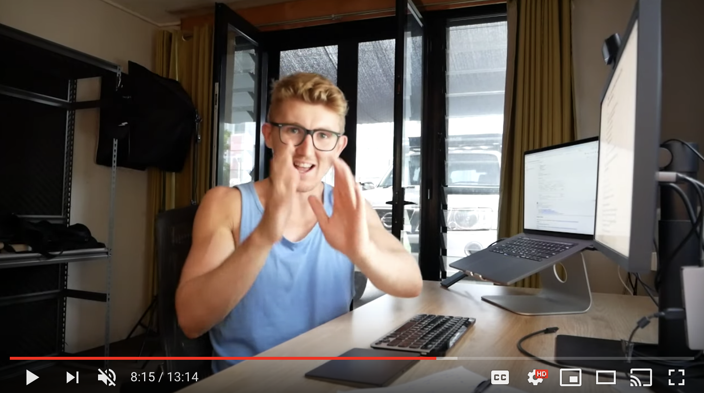

# Testimonials

## Jeffrey Wardman, Applied AI Scientist at [Harrison.ai](https://www.harrison.ai/)

WandB is absolute heaven.

With next to no modification of my code, I'm able to visualize metrics in real time when training my models on multiple systems and can look at their performance relative to each other, and previous runs, anytime on any device. Sweeps also allows me to train my models with different parameter settings on multiple systems in unison via a Bayesian approach to optimally test a range of input arguments and find the best solution.

I can't imagine going back to how I did things before.

## **Ian Thompson,** [**Latent Space**](https://www.latentspace.co/)

WandB has become the critical tool for us in bringing together the work of remote researchers across several continents. On a recent paper, we started using a wandb report as the central hub for collaboration, where everyone could see the most recent experimental results and essentially the latest draft of the paper. The flexibility and clarity of wand reports have enabled us to collaborate in ways that used to only be possible in person.

## Daniel Bourke, ML engineer

Since machine learning is a very experimental process, meaning you try something, see if it works and if not you try something else. I plan on building a number of different models to see which one works best. To track the results of each different model, I set up Weights & Biases, a tool for tracking deep learning experiments.

[Watch the video here →](https://www.youtube.com/watch?v=83s-OEFMgVY)

## Ken Tsui, VP of Machine Learning at [Apoidea AI](https://apoidea.ai/)

My team enjoys using this helpful tool. ML is always experimental in nature, in industry and in research and wandb is like a diary to record the whole ML development journey from the baseline to the SOTA. And the best thing is that you can share the journey with others.

## Michael Oblak, COO at SmartLunch

10/10. It's really great software. Helps me a ton with my work. Also, sweeps handle a lot of my work.

## André Aquilina, Computer Vision Engineer at [Dysis Medical](https://dysismedical.com/)

Between architecture, hyper parameters and general problem approach, I always found myself going in circles trying to keep track of results, configs and the code version I was using in an experiment. After looking around for a tool/dashboard to help with experiment management I landed on WandB. With one init line I could track many of the metrics I was interested in. Wandb one of the few tools that makes it so easy that it’s a no brainer to try for yourself.

## Samuel Boulanger, Machine Learning Engineer at [Intel AI](https://www.intel.com/content/www/us/en/artificial-intelligence/overview.html)

Helpful. Easy to use. Integrates cleanly.

## Francisco J. Peña, [Postdoc](https://www.linkedin.com/in/franciscojp) at University College Dublin

I went from storing all of my experiment results in JSON files and plotting them with matplotlib and seaborn, to have all the work taken care by W&B. Viewing the results so fast has helped me to identify bugs in my code at an early stage, it's a game changer. Thank you!

## Mohamed Raga, PhD Candidate at NTU, Singapore

I am impressed daily by wandb and the amazing visualization tools. Now I present all my works and experiments through wandb— no more slides. I also, send progress report to my supervisor using wandb. The synchronization with TensorBoard helps me to further use embedding projector. So far, I have explored all the wandb tools, but I can't wait to explore more.

## Abhi Gupta, Researcher at Columbia University

TensorBoard can be a nightmare when training on multiple machines. I have to run TensorBoard locally on a master machine and sync logs between computers to visualize real-time results. With wandb, this is so easy. Wandb is going to change everything for me.

## Henry Howard, Researcher at [iBRAIN research laboratory ](https://www.monash.edu/medicine/ccs/neuroscience/research/law-group)at Alfred Hospital

Great interface. Does what I want it to do without much effort.

## [Matthew Clapp](https://itsayellow.com/), PhD Candidate at Johns Hopkins University

Effortless python usage, and excellent visualization of my experiments. Minimal hassle, maximum benefit.

## Ivan Oršolić, [Ori Codes](https://ori.codes/)

Your tool is very easy to set up \(well documented!\) and works great.

## Dongwhan Jang, Researcher at Seoul National University

Awesome UI for logging. Cross-platform\(library\) support. Excellent customer service. Free for an academic use. Easy for beginners etc.

## Bowei Hou, PhD candidate at Waseda University

It helps me a lot to collaborate with my co-workers in different countries. They can easily find the running experiments and the logs. It's so cool that we can get rid of the tedious terminal loss.

## **Rajesh, Engineer at  Nokia**

10/10. It is purely awesome!

## Taufiquzzaman Peyash, Researcher at [North South University](http://www.northsouth.edu/)

I really like the visualizations and it's very easy to integrate with the pipeline.

## Tiago Manual,  PhD student at [Cambridge](https://www.cl.cam.ac.uk/research/ai/)

Great tool! Still a lot to improve but looks like you have an entire team fully working on that!

## **Seonil Simon Son,** [NLP lover](https://dramaqa.snu.ac.kr/) at Seoul National University

-Dumb-easy api really helped. Developing with tensorboardx which I had experience before was more trickier than learning this from the scratch.

-Summarizing all the loggings on the cloud helps me keep focused on important things.

-Sweep: plug-n-play version of hyperparam tuning methodologies

## Michael, a wonderful user

It's just amazing, you guys are doing an amazing job over there! I'm telling about it to all my friends, everyone should use wandb!

## [Shivam Kaushik](https://www.kaggle.com/mythrex/competitions), Kaggle User

I just love how we can make reports and share our work. I use this for kaggle mainly and I know how difficult was it for me to compile my results for the team.

## Dinis Rodrigues, [INESC](https://www.inesc-id.pt/), student at [Técnico Lisboa](https://tecnico.ulisboa.pt/pt/)

Awesome, easy to use and intuitive!

## Khel Kim, software engineer

I love you guys. Your system is awesome! Please, keep your service. Thank you guys.

## Rohit P N, Student at Ramaiah Institute of Technology, Bangalore

This platform is absolutely amazing, makes life so much easier. Thank you so much to the developers of this platform!

