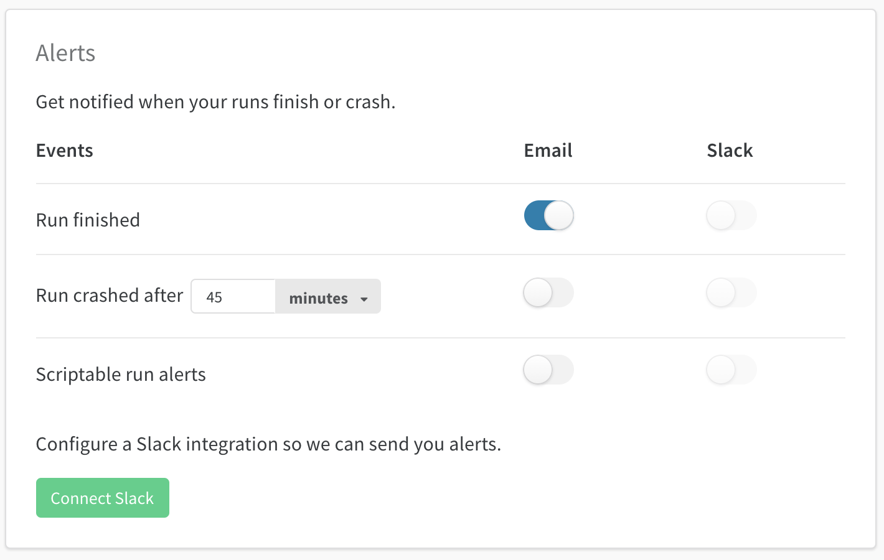

# Alerts

每当你的运行崩溃、完成或调用[wandb.alert\(\)](https://docs.wandb.ai/v/zh-hans/library/wandb.alert)时，W&B可以将通知推送到电子邮件或Slack。


在Jupyter Notebook环境中，对已完成运行的警报是被禁用的，以防止在每个单元格执行时发出警报通知。在Jupyter Notebook环境中使用wandb.alert\(\)代替。


### **用户警报**

设置运行完成、崩溃或调用 `wandb.alert()` 时的通知。这些通知应用于您启动运行的所有项目，包括个人和团队项目。

在您的[用户设置](https://wandb.ai/settings)中。

* 向下滚动到**警报（Alerts）**部分
* 点击**连接Slack**来选择一个频道来发布警报。我们推荐使用**Slackbot**频道，因为它能保持警报的私密性。
* **电子邮件**将发送到您注册W&B时使用的电子邮件地址。我们建议在您的电子邮件中设置一个过滤器，以便所有这些警报进入一个文件夹，而不是填满您的收件箱。

### **团队警报**

 团队管理员可以在团队设置页面：`wandb.ai/teams/your-team`为团队设置警报。这些警报应用于你团队中的每个人。我们建议使用**Slackbot**频道，因为它能保持警报的私密性。

### **更改Slack频道**

要更改你要发布的频道，点击**断开Slack连接**，然后重新连接，选择一个不同的目标频道。

