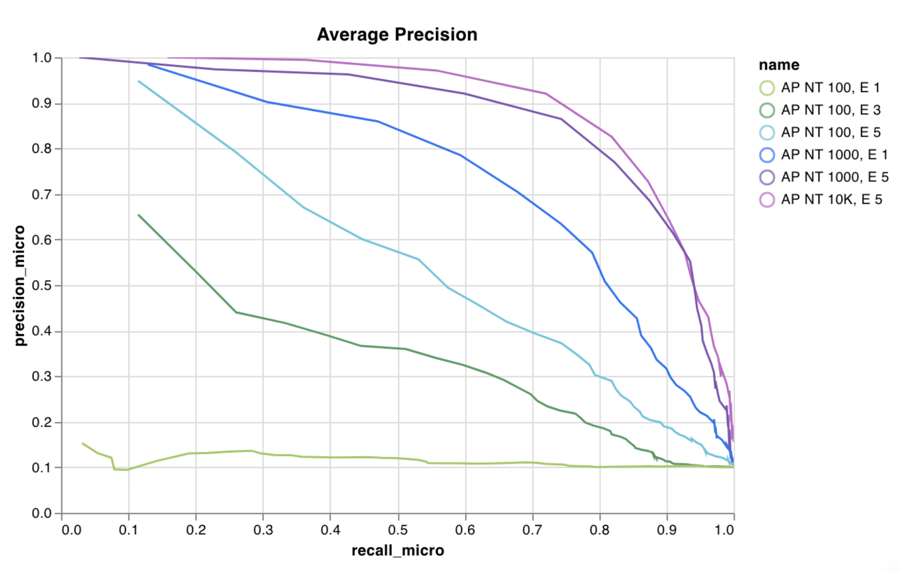

# Custom Charts

 目前在默认UI中使用**自定义图表**创建图表还无法实现。记录任何数据表格，并按照你的需要将其可视化。利用[Vega](https://vega.github.io/vega/)的强大功能控制字体、颜色和工具提示的细节。

* **可以做些什么**: 阅读[发布公告 →](https://wandb.ai/wandb/posts/reports/Announcing-the-W-B-Machine-Learning-Visualization-IDE--VmlldzoyNjk3Nzg)​
* **代码**: 试试[托管在笔记本](https://tiny.cc/custom-charts)上的一个实战示例
* **视频**: 观看一个快速[演练视频](https://www.youtube.com/watch?v=3-N9OV6bkSM)​
* **示例:** 快速Keras和Sklearn[演示笔记本](https://colab.research.google.com/drive/1g-gNGokPWM2Qbc8p1Gofud0_5AoZdoSD?usp=sharing)

如果有任何问题和建议，请联系Carey \(c@wandb.com\)


### **它是如何工作的**

1.  **记录数据**: 从你的脚本中，像使用W&B运行时一样记录配置和总结（Summary）数据。要可视化一个特定时间记录的包含多个值的一个列表，请使用自定义`wandb.Table`
2.   **自定义图表**: 使用[GraphQL](https://graphql.org/)查询获取这些记录的数据。使用[Vega](https://vega.github.io/vega/)（一个强大的可视化语法）可视化你的查询结果
3. **记录图表**: 使用`wandb.plot_table()` 从你的脚本中调用你自己的预设，或者使用我们的内置预设。


##  **从一个脚本中记录图表**

###  **内置预设**

 这些预设有内置的`wandb.plot` 方法，可以直接从你的脚本中快速记录图表，并在UI中看到你正在寻找的指定可视化。



`wandb.plot.line()`

 记录自定义线图—在任意轴x和y上连接有序的点（x,y）列表。

```python
data = [[x, y] for (x, y) in zip(x_values, y_values)]
table = wandb.Table(data=data, columns = ["x", "y"])
wandb.log({"my_custom_plot_id" : wandb.plot.line(table, "x", "y", title="Custom Y vs X Line Plot")})
```

你可以使用该方法记录任何二维曲线。请注意，如果你要绘制相对应的两个值列表，列表中值的数量必须完全匹配（即，每个点必须有一个x和一个y）



 [在应用程序中查看→](https://wandb.ai/wandb/plots/reports/Custom-Line-Plots--VmlldzoyNjk5NTA)​

 [运行代码→](https://tiny.cc/custom-charts)​



`wandb.plot.scatter()`

Log a custom scatter plot—a list of points \(x, y\) on a pair of arbitrary axes x and y.

```python
data = [[x, y] for (x, y) in zip(class_x_prediction_scores, class_y_prediction_scores)]
table = wandb.Table(data=data, columns = ["class_x", "class_y"])
wandb.log({"my_custom_id" : wandb.plot.scatter(table, "class_x", "class_y")})
```

You can use this to log scatter points on any two dimensions. Note that if you're plotting two lists of values against each other, the number of values in the lists must match exactly \(i.e. each point must have an x and a y\).


[See in the app →](https://wandb.ai/wandb/plots/reports/Custom-Scatter-Plots--VmlldzoyNjk5NDQ)

[Run the code →](https://tiny.cc/custom-charts)



`wandb.plot.bar()`

Log a custom bar chart—a list of labeled values as bars—natively in a few lines:

```python
data = [[label, val] for (label, val) in zip(labels, values)]
table = wandb.Table(data=data, columns = ["label", "value"])
wandb.log({"my_bar_chart_id" : wandb.plot.bar(table, "label", "value", title="Custom Bar Chart")
```

You can use this to log arbitrary bar charts. Note that the number of labels and values in the lists must match exactly \(i.e. each data point must have both\).


[See in the app →](https://wandb.ai/wandb/plots/reports/Custom-Bar-Charts--VmlldzoyNzExNzk)

[Run the code →](https://tiny.cc/custom-charts)



`wandb.plot.histogram()`

Log a custom histogram—sort list of values into bins by count/frequency of occurrence—natively in a few lines. Let's say I have a list of prediction confidence scores \(`scores`\) and want to visualize their distribution:

```python
data = [[s] for s in scores]
table = wandb.Table(data=data, columns=["scores"])
wandb.log({'my_histogram': wandb.plot.histogram(table, "scores", title=None)})
```

You can use this to log arbitrary histograms. Note that `data` is a list of lists, intended to support a 2D array of rows and columns.


[See in the app →](https://wandb.ai/wandb/plots/reports/Custom-Histograms--VmlldzoyNzE0NzM)

[Run the code →](https://tiny.cc/custom-charts)



`wandb.plot.pr_curve()`

Log a [Precision-Recall curve](https://scikit-learn.org/stable/modules/generated/sklearn.metrics.precision_recall_curve.html#sklearn.metrics.precision_recall_curve) in one line:

```python
wandb.log({"pr" : wandb.plot.pr_curve(ground_truth, predictions,
                     labels=None, classes_to_plot=None)})
```

You can log this whenever your code has access to:

* a model's predicted scores \(`predictions`\) on a set of examples
* the corresponding ground truth labels \(`ground_truth`\) for those examples
* \(optionally\) a list of the labels/class names \(`labels=["cat", "dog", "bird"...]` if label index 0 means cat, 1 = dog, 2 = bird, etc.\)
* \(optionally\) a subset \(still in list format\) of the labels to visualize in the plot


[See in the app →](https://wandb.ai/wandb/plots/reports/Plot-Precision-Recall-Curves--VmlldzoyNjk1ODY)

[Run the code →](https://colab.research.google.com/drive/1mS8ogA3LcZWOXchfJoMrboW3opY1A8BY?usp=sharing)



`wandb.plot.roc_curve()`

Log an [ROC curve](https://scikit-learn.org/stable/modules/generated/sklearn.metrics.roc_curve.html#sklearn.metrics.roc_curve) in one line:

```text
wandb.log({"roc" : wandb.plot.roc_curve( ground_truth, predictions, \
                        labels=None, classes_to_plot=None)})
```

You can log this whenever your code has access to:

* a model's predicted scores \(`predictions`\) on a set of examples
* the corresponding ground truth labels \(`ground_truth`\) for those examples
* \(optionally\) a list of the labels/ class names \(`labels=["cat", "dog", "bird"...]` if label index 0 means cat, 1 = dog, 2 = bird, etc.\)
* \(optionally\) a subset \(still in list format\) of these labels to visualize on the plot


[See in the app →](https://wandb.ai/wandb/plots/reports/Plot-ROC-Curves--VmlldzoyNjk3MDE)

[Run the code →](https://colab.research.google.com/drive/1_RMppCqsA8XInV_jhJz32NCZG6Z5t1RO?usp=sharing)



### **散点图**

记录自定义散点图—在一对任意轴x和y上的点points \(x, y\) 列表data = \[\[x, y\] for \(x, y\) in zip\(class\_x\_prediction\_scores, class\_y\_prediction\_scores\)\]table = wandb.Table\(data=data, columns = \["class\_x", "class\_y"\]\)wandb.log\({"my\_custom\_id" : wandb.plot.scatter\(table, "class\_x", "class\_y"\)}\)你可以使用该方法记录任意二维散点图。请注意，如果要绘制值相对应的两个值列表，列表中值的数量必须完全匹配\(即，每个点必须有一个x和一个y\)。

```python
# Create a table with the columns to plot
table = wandb.Table(data=data, columns=["step", "height"])

# Map from the table's columns to the chart's fields
fields = {"x": "step",
          "value": "height"}

# Use the table to populate the new custom chart preset
# To use your own saved chart preset, change the vega_spec_name
my_custom_chart = wandb.plot_table(vega_spec_name="carey/new_chart",
              data_table=table,
              fields=fields,
              )
```

[Run the code →](https://tiny.cc/custom-charts)


## **记录数据**

以下是你可以从脚本中记录并在自定义图表中使用的数据类型：

* **Config**: 实验的初始设置\(你的独立变量\)。这包括你的训练开始时作为键记录在`wandb.config`中的任何命名字段\(例如 `wandb.config.learning_rate = 0.0001)`
* **Summary**: 训练过程中记录的单个值\(你的结果或因变量\), 例如 `wandb.log({"val_acc" : 0.8})`。如果你在训练过程中通过`wandb.log()`多次写入这个键，总结（summary）会被设置为该键的最后一个值。
* **History**: 记录的标量的完整时间序列可通过`history`字段查询
* **SummaryTable**: 如果你需要记录多个值组成的一个列表，使用`wandb.Table()`来保存这些数据，然后在你的自定义面板中查询。

###  **如何记录自定义表格**

使用`wandb.Table()` 将数据记录为二维数组。通常该表格的每行代表一个数据点，每一列表示你要绘制的每个数据点的相关字段/维度。当你配置一个自定义面板时，整个表将通过传递命名键给`wandb.log()` \(下面是"custom\_data\_table" \)来访问, 各个字段通过列名\("x", "y", and "z"\)来访问。在整个实验过程中，你可以在多个时间步（Step）记录表格。每个表格的最大大小是10,000行。

 在[Google Colab中尝试 →](https://tiny.cc/custom-charts)​

```python
# Logging a custom table of data
my_custom_data = [[x1, y1, z1], [x2, y2, z2]]
wandb.log({“custom_data_table”: wandb.Table(data=my_custom_data,
                                columns = ["x", "y", "z"])})
```

## **自定义图表**

开始时添加一个新的自定义图表，然后编辑查询以从你的可见运行中选择数据。该查询使用[GraphQL](https://graphql.org/) 从你的运行中的config, summary, 和history 字段中获取数据。


###  **自定义可视化**

在右上角选择一个**图表**，以默认预设开始。接下来，选择**图表字段**，将你从查询中获取的数据映射到图表中的相应字段。下面是一个示例，从查询中选取指标，然后将其映射到下面的条形图字段中。


###  **如何编辑Vega**

点击面板顶部的**编辑**，进入[Vega](https://vega.github.io/vega/)编辑模式。在这里你可以定义一个[Vega规](https://vega.github.io/vega/docs/specification/)范 ,在UI中创建一个交互式图表。你可以更改图表的任何方面，从视觉风格\(例如更改标题，选择不同的配色方案，将曲线显示为一系列点而不是连接线\) 到数据本身\(使用Vega 转换将值数组归入直方图等\)。面板预览会交互式更新，因此你可以在编辑Vega 规范或查询时看到你的更改效果。[Vega文档和教程](https://vega.github.io/vega/)是一个很好的灵感来源。

**字段引用**

要从W&B将数据拉取到你的图表中，请在你的Vega 规范中的任何地方添加`"${field:<field-name>}"`形式的模板字符串。这将在右侧的**图表字段**区域创建一个下拉菜单，用户可以用它来选择映射到Vega的查询结果列。

要为一个字段设置默认值，请使用此语法: `"${field:<field-name>:<placeholder text>}"`

### **保存图表预设**

使用模式底部的按钮将任何更改应用到特定的可视化面板。另外，你也可以保存Vega规范，以便在项目的其他地方使用。要保存可重复使用的图表定义，请单击Vega 编辑器顶部的**另存为**，并给你的预设命名。

## **文章和指南**

1.  [W&B机器学习可视化IDE](https://wandb.ai/wandb/posts/reports/The-W-B-Machine-Learning-Visualization-IDE--VmlldzoyNjk3Nzg)​
2. [可视化基于NLP Attention的模型](https://wandb.ai/kylegoyette/gradientsandtranslation2/reports/Visualizing-NLP-Attention-Based-Models-Using-Custom-Charts--VmlldzoyNjg2MjM)​
3. [可视化Attention对梯度流（Gradient Flow）的影响](https://wandb.ai/kylegoyette/gradientsandtranslation/reports/Visualizing-The-Effect-of-Attention-on-Gradient-Flow-Using-Custom-Charts--VmlldzoyNjg1NDg)
4. [记录任意曲线​](https://wandb.ai/stacey/deep-drive/reports/Logging-arbitrary-curves--VmlldzoyMzczMjM)

## **常见问题**

###  **即将推出**

*  **轮询**: 自动刷新图表中的数据
* **采样**: 动态调整加载到面板上的总点数以提高效率

### **陷阱**

* 当你编辑图表时，在查询中没有看到你所期望的数据？这可能是因为在你选择的运行中没有记录你要找的列。保存你的图表，然后返回到运行表，并选择你想要用**眼睛**图标可视化的运行。

###  **常见用例**

* 自定义带误差条的条形图
* 显示需要自定义x-y坐标的模型验证指标\(如精确率-召回率曲线\)
* 将两个不同模型/实验的数据分布叠加为直方图
* 在训练过程中，通过多点快照显示指标的变化
* 创建一个W&B中还没有的唯一可视化\(并希望与世界分享\)

