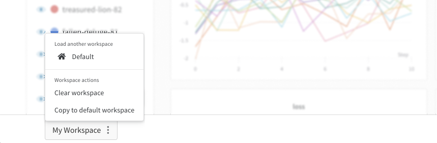

# Workspaces

你的工作空间是你的个人沙盒，用于自定义图表和探究模型结果。

1. **表格**: 你项目中的所有运行都列在表格中。可以打开和关闭运行、改变颜色以及展开表格以查看每个运行的注解、配置和总结指标（summary metric）。
2.      **面板**: 面板组织成分段（section）。创建新的面板、组织它们，并将其导出到报告中，以保存你的工作空间的快照。

在页面底部是一个工作空间控制栏：

* **工作空间**: 每个用户有一个工作空间。只有你可以编辑你自己的工作空间。
* **撤销/重做**: 快速撤销你对工作空间的更改。
* **分享**: 创建报告，与同事分享结果。点击右上角的**创建报告**，然后选择你想要保存快照的图表。
  * 报告可以是**静态快照**，也可以是项目进度的**动态仪表盘**。
  * 你可以用报告创建项目的多个不同的保存视图
  * 报告让你可以添加文本注解，创建多个不同的面板分段，每个分段都有不同的可视化运行，甚至可以分享来自私有项目的只可查看的链接。
  * 如果最后你与合作者分享你的工作空间的链接，他们不能覆盖你的原始布局，但他们可以在一个临时视图中操作图表、探究结果，如果他们喜欢你的布局还可以保存在他们自己的工作空间。
* **默认工作空间**: 这是所有第一次登录这个项目的新人的默认布局。这让你可以为你的公共项目设置一个漂亮的登陆页面，或者帮助你的团队成员入门。

