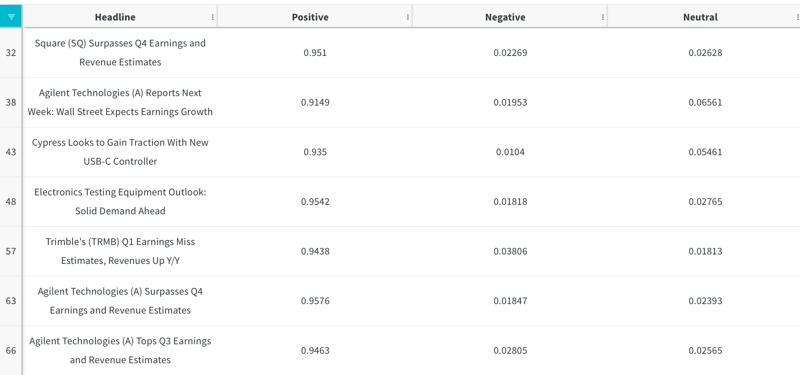

# Examples

Get an overview of what's possible with Weights & Biases via the three sections below:

1. [**Examples by Data Type**](https://docs.wandb.ai/examples#examples-by-data-type)
2. [**Examples by ML Library**](https://docs.wandb.ai/examples#examples-by-ml-library)
3. [**Examples by Application**](examples.md#examples-by-application)

## Examples by Data Type



**Computer Vision ❤️ W\&B**

Track your experiments, log your Images or Video, analyze your models predictions and optimize your hyperparameters.

**Easily track hyperparameters and log metrics**

Everytime you run your code, it's captured and visualized in W\&B.

```python
wandb.init(project='my-resnet', config={'lr': 0.01, ...})
wandb.log({'loss': loss, ...})
```

**Log Images**

Look at individual images and predictions to better understand your models.

```python
image = wandb.Image(array_or_path, caption="Input image")
wandb.log({"examples": image})
```

**Log Videos**

```python
# axes are (time, channel, height, width)
frames = np.random.randint(low=0, high=256, size=(10, 3, 100, 100), dtype=np.uint8)
wandb.log({"video": wandb.Video(frames, fps=4)})
```

**Log Segmentation Masks**

```python
mask_data = np.array([[1, 2, 2, ... , 2, 2, 1], ...])
class_labels = {
  1: "tree",
  2: "car",
  3: "road"
}
mask_img = wandb.Image(image, masks={
  "predictions": {
    "mask_data": mask_data,
    "class_labels": class_labels
  }
})
```


**Log Bounding Boxes**

```python
class_id_to_label = {
    1: "car",
    2: "road",
    3: "building"
}
img = wandb.Image(image, boxes={
    "predictions": {
        "box_data": [{
            "position": {
                "minX": 0.1,
                "maxX": 0.2,
                "minY": 0.3,
                "maxY": 0.4
            },
            "class_id" : 2,
            "box_caption": class_id_to_label[2],
            "scores" : {
                "acc": 0.1,
                "loss": 1.2
            },
        }
        ],
        "class_labels": class_id_to_label
    }
})
wandb.log({"driving_scene": img})
```


Read more: [Log Media & Objects](guides/track/create-a-new-artifact-version/media.md)

**Log Tables of predictions**

Use [W\&B Tables](guides/data-vis/tables-quickstart.md) to interact with your model predictions. Dynamically show your models incorrect predictions, most confusing classes or difficult corner cases.


```python
# Define the names of the columns in your Table
column_names = ["image_id", "image", "label", "prediction"]

# Prepare your data, row-wise
# You can log filepaths or image tensors with wandb.Image
my_data = [
  ['img_0.jpg', wandb.Image("data/images/img_0.jpg"), 0, 0],
  ['img_1.jpg', wandb.Image("data/images/img_1.jpg"), 8, 0],
  ['img_2.jpg', wandb.Image("data/images/img_2.jpg"), 7, 1],
  ['img_3.jpg', wandb.Image("data/images/img_3.jpg"), 1, 1]
]

# Create your W&B Table
val_table = wandb.Table(data=my_data, columns=column_names)

# Log the Table to W&B
wandb.log({'my_val_table': val_table})
```

Read more: [Data Visualization using Tables](guides/data-vis/)

**Integrations**

* [**YOLOv5**](https://docs.wandb.ai/guides/integrations/yolov5)\*\*\*\*
* [**PyTorch Lightning**](https://docs.wandb.ai/guides/integrations/lightning)\*\*\*\*

***

**Whats Next?**

* Try HyperParameter Optimization with [W\&B Sweeps](https://docs.wandb.ai/guides/sweeps)
* Save and version your models and datasets with [W\&B Artifacts](https://docs.wandb.ai/guides/artifacts)



**NLP ❤️ W\&B**

It's easy to integrate W\&B into your NLP projects. Make your work more reproducible, visible and debuggable.

**Track your experiments metrics and hyperparameters**

Everytime you run your code, it's captured and visualized in W\&B.

```python
wandb.init(project='my-transformer', config={'lr': 0.01, ...})
wandb.log({'accuracy': accuracy, ...})
```

**Log text, custom HTML and displacy visualizations**

Log text, custom HTML or even [displacy visualizations](https://wandb.ai/wandb/wandb\_spacy\_integration/reports/Reproducible-spaCy-NLP-Experiments-with-Weights-Biases--Vmlldzo4NjM2MDk?galleryTag=NLP) within [W\&B Tables](guides/data-vis/tables-quickstart.md) . Combine your text data with prediction outputs of your model for model evaluation. You can then dynamically filter, sort or group using the UI to **drill down into your model performance**.

```python
# Your data
headlines = ['Square(SQ) Surpasses Q4...', ...]

# 1️⃣ Create the W&B Table
text_table = wandb.Table(columns=["Headline", "Positive", "Negative", "Neutral"])
for headline in headlines:
       pos_score, neg_score, neutral_score = model(headline)
       # 2️⃣ Add the data
       text_table.add_data(headline, pos_score, neg_score, neutral_score) 

# 3️⃣ Log the Table to wandb
wandb.log({"validation_samples" : text_table})
```



**Integrations**

* [**Hugging Face**](https://docs.wandb.ai/guides/integrations/huggingface)
* [**SpaCy**](https://docs.wandb.ai/guides/integrations/spacy)\*\*\*\*
* [**SimpleTranformers**](https://docs.wandb.ai/guides/integrations/other/simpletransformers)

***

**Whats Next?**

* Try HyperParameter Optimization with [W\&B Sweeps](https://docs.wandb.ai/guides/sweeps)
* Save and version your models and datasets with [W\&B Artifacts](https://docs.wandb.ai/guides/artifacts)



**Tabular ❤️ W\&B**

Weights & Biases supports logging pandas dataframes, iterative modelling with traditional ML and has integrations with Scikit-Learn, XGBoost, LightGBM, CatBoost and PyCaret.

**Track your experiments**

Everytime you run your code, it's captured and visualized in W\&B.

```python
wandb.init(project='my-xgb', config={'lr': 0.01, ...})
wandb.log({'loss': loss, ...})
```

**Log and explore your data**

Log a Pandas Dataframe to associate it with a particular experiment, or to interactively explore it in W\&B Tables in the workspace.

```python
# Create a W&B Table with your pandas dataframe
table = wandb.Table(my_df)

# Log the Table to your W&B workspace
wandb.log({'dataframe_in_table': table})
```


**Integrations**

* [**Scikit-learn**](https://docs.wandb.ai/guides/integrations/scikit)
* \*\*\*\*[**XGBoost and LIghtGBM**](https://docs.wandb.ai/guides/integrations/boosting)
* Catboost (docs coming soon)
* PyCaret (docs coming soon)

**Whats Next?**

* Try HyperParameter Optimization with [W\&B Sweeps](https://docs.wandb.ai/guides/sweeps)
* Save and version your models and datasets with [W\&B Artifacts](https://docs.wandb.ai/guides/artifacts)



**Audio ❤️ W\&B**

Weights & Biases supports logging audio data arrays or file that can be played back in W\&B

**Track your experiments**

Everytime you run your code, it's captured and visualized in W\&B.

```python
wandb.init(project='my-bird-calls', config={'lr': 0.01, ...})
wandb.log({'loss': loss, ...})
```

**Log audio files or arrays**

You can log audio files and data arrays with [wandb.Audio()](https://docs.wandb.ai/ref/python/data-types/audio)

```python
# Log an audio array or file
wandb.log({"my whale song": wandb.Audio(
    array_or_path, caption="montery whale 0034", sample_rate=32)})

# OR  

# Log your audio as part of a W&B Table
my_table = wandb.Table(columns=["audio", "spectrogram", "bird_class", "prediction"])
for (audio_arr, spec, label) in my_data:
       pred = model(audio)
       
       # Add the data to a W&B Table
       audio = wandb.Audio(audio_arr, sample_rate=32)
       img = wandb.Image(spec)
       my_table.add_data(audio, img, label, pred) 

# Log the Table to wandb
 wandb.log({"validation_samples" : my_table})
```

.png>)

**Integrations**

* Try the [WandBLogger](https://speechbrain.readthedocs.io/en/latest/\_modules/speechbrain/utils/train\_logger.html#WandBLogger) in the SpeechBrain library.

**Whats Next?**

* See this [whale song Report](https://wandb.ai/stacey/cshanty/reports/Tables-Tutorial-Recreating-Whale-Melodies-on-Orchestral-Instruments--Vmlldzo4NDI3NzM) for more inspiration on how to log audio with W\&B.
* Try HyperParameter Optimization with [W\&B Sweeps](https://docs.wandb.ai/guides/sweeps)
* Save and version your models and datasets with [W\&B Artifacts](https://docs.wandb.ai/guides/artifacts)



## Examples by ML Library

Weights & Biases works natively with PyTorch, Tensorflow and Jax and also has logging integrations in all of the popular open source machine learning libraries, including the ones below as well as SpaCy, XGBoost, LightGBM, SciKit-Learn, YOLOv5, Fastai and more.

[**You can find all of our integrations guides here ->**](https://docs.wandb.ai/guides/integrations) \*\*\*\*



W\&B supports TensorBoard to automatically log all the metrics from your script into our dashboards with just 2 lines:

```python
import wandb
# Add `sync_tensorboard=True` when you start a W&B run
wandb.init(project='my-project', sync_tensorboard=True)

# Your Keras, TensorFlow or PyTorch code using TensorBoard
...

# Call wandb.finish() to upload your TensorBoard logs to W&B
wandb.finish()
```

[**Full Tensorboard and W\&B integration guide ->**](https://docs.wandb.ai/guides/integrations/tensorboard)



With the `WandbLogger` in PyTorch Lightning you can log your metrics, model checkpoints, media and more!

```python
from pytorch_lightning.loggers import WandbLogger
from pytorch_lightning import Trainer

# Add the WandbLogger to your PyTorch Lightning Trainer
trainer = Trainer(logger=WandbLogger())
```

[**Full PyTorch Lightning and W\&B integration guide ->**](https://docs.wandb.ai/guides/integrations/lightning)



With our Keras `WandbCallback` you can log your metrics, model checkpoints, media and more!

```python
import wandb
from wandb.keras import WandbCallback

# Initialise a W&B run
wandb.init(config={"hyper": "parameter"})

...

# Add the WandbCallback to your Keras callbacks
model.fit(X_train, y_train,  validation_data=(X_test, y_test),
          callbacks=[WandbCallback()])
```

[**Full Keras and W\&B integration guide ->**](https://docs.wandb.ai/guides/integrations/keras)



With the W\&B integration in Hugging Face Transformers' `Trainer` you can log your metrics, model checkpoints, run sweeps and more!

```python
from transformers import TrainingArguments, Trainer

# Add `report_to="wandb"` in your TrainingArguments to start logging to W&B
args = TrainingArguments(... , report_to="wandb")
trainer = Trainer(... , args=args)
```

[**Full Hugging Face Transformers and W\&B integration guide ->**](https://docs.wandb.ai/guides/integrations/huggingface)



## Examples by Application



See [LIDAR point cloud visualizations](https://wandb.ai/stacey/lyft/reports/LIDAR-Point-Clouds-of-Driving-Scenes--Vmlldzo2MzA5Mg) from the Lyft dataset. These are interactive and have bounding box annotations. Click the full screen button in the corner of an image, then zoom, rotate, and pan around the 3D scene.

.png>)



[This report ](https://wandb.ai/stacey/deep-drive/reports/Image-Masks-for-Semantic-Segmentation--Vmlldzo4MTUwMw)describes how to log and interact with image masks for semantic segmentation.

.png>)



[Examples & walkthrough](https://wandb.ai/stacey/yolo-drive/reports/Bounding-Boxes-for-Object-Detection--Vmlldzo4Nzg4MQ) of how to annotate driving scenes for object detection

.png>)



[Infer depth perception](https://wandb.ai/stacey/sfmlearner/reports/Video-to-3D-Depth-Perception-for-Self-Driving-Cars--Vmlldzo2Nzg2Nw) from dashboard camera videos. This example contains lots of sample images from road scenes, and shows how to use the media panel for visualizing data in W\&B.

.png>)



[This report](https://wandb.ai/stacey/deep-drive/reports/The-View-from-the-Driver-s-Seat--Vmlldzo1MTg5NQ) compares models for detecting humans in scenes from roads, with lots of charts, images, and notes. [The project page](https://wandb.ai/demo-team/deep-drive?workspace=user-stacey) workspace is also available.

.png>)



### Biomedical

[This report ](https://wandb.ai/stacey/deepchem\_molsol/reports/DeepChem-Molecular-Solubility--VmlldzoxMjQxMjM)explores training models to predict [how soluble a molecule](https://wandb.ai/stacey/deepchem\_molsol/reports/DeepChem-Molecular-Solubility--VmlldzoxMjQxMjM) is in water based on its chemical formula. This example features scikit learn and sweeps.

.png>)

[This report](https://wandb.ai/stacey/deepchem\_interact/reports/DeepChem-Molecular-Interaction--VmlldzoxMzMxNDE) explores molecular binding and shows interactive 3D protein visualizations.

.png>)

[This report ](https://wandb.ai/stacey/xray/reports/X-Ray-Illumination--Vmlldzo4MzA5MQ)explores chest x-ray data and strategies for handling real world long-tailed data.

.png>)

[This report](https://wandb.ai/anmolmann/rdkit\_molecules/reports/Logging-RDKit-Molecular-Data--VmlldzoxMjk1MjQ1) explores `rdkit` feature for logging molecular data.

[Click here](https://wandb.ai/anmolmann/rdkit\_molecules) to view and interact with a live W\&B Dashboard built with this [notebook](http://wandb.me/rdkit).



### Finance



Track experiments, generate credit scorecard for loan defaults and run a hyperparameter sweep to find the best hyperparameters. [Click here](https://wandb.ai/morgan/credit\_scorecard) to view and interact with a live W\&B Dashboard built with [this](http://wandb.me/xgboost) notebook.

 (1).png>)


