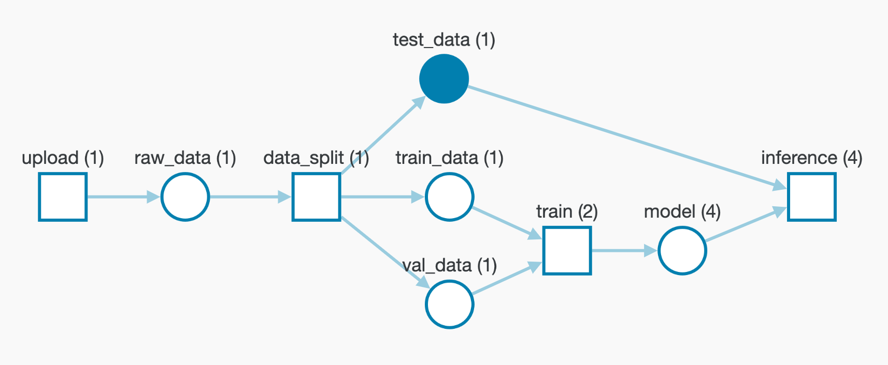

# Data + Model Versioning

Use W&B Artifacts for dataset versioning, model versioning, and tracking dependencies and results across machine learning pipelines. Think of an artifact as a versioned folder of data. You can store entire datasets directly in artifacts, or use artifact references to point to data in other systems like S3, GCP, or your own system.

[Try the Guide to W&B Artifacts ](https://wandb.ai/wandb/arttest/reports/Artifacts-Quickstart--VmlldzozNTAzMDM)for an end-to-end example of using Artifacts for dataset and model versioning.



## Quickstart

[](http://wandb.me/artifacts-quickstart)

### 1. Log an artifact

Initialize a run and log an artifact, for example a dataset version that you're using to train a model.

```python
run = wandb.init(job_type="dataset-creation")
artifact = wandb.Artifact('my-dataset', type='dataset')
artifact.add_file('my-dataset.txt')
run.log_artifact(artifact)
```

### 2. Use the artifact

Start a new run and pull down that saved artifact, for example to use the dataset to train a model.

```python
run = wandb.init(job_type="model-training")
artifact = run.use_artifact('my-dataset:latest')
artifact_dir = artifact.download()
```

### 3. Log a new version

If an artifact changes, re-run the same artifact creation script. In this case, imagine the data in the my-dataset.txt file changes. This same script will capture the new version neatly — we'll checksum the artifact, identify that something changed, and track the new version. If nothing changes, we don't reupload any data or create a new version.

```python
run = wandb.init(job_type="dataset-creation")
artifact = wandb.Artifact('my-dataset', type='dataset')
# Imagine more lines of text were added to this text file:
artifact.add_file('my-dataset.txt')
# Log that artifact, and we identify the changed file
run.log_artifact(artifact)
# Now you have a new version of the artifact, tracked in W&B

```

Looking for a longer example with real model training? Try our [Guide to W&B Artifacts](https://wandb.ai/wandb/arttest/reports/Guide-to-W-B-Artifacts--VmlldzozNTAzMDM).

## How it works

Using our Artifacts API, you can log artifacts as outputs of W&B runs, or use artifacts as input to runs.


Since a run can use another run’s output artifact as input, artifacts and runs together form a directed graph. You don’t need to define pipelines ahead of time. Just use and log artifacts, and we’ll stitch everything together.

Here's an [example artifact](https://app.wandb.ai/shawn/detectron2-11/artifacts/model/run-1cxg5qfx-model/4a0e3a7c5bff65ff4f91/graph) where you can see the summary view of the DAG, as well as the zoomed-out view of every execution of each step and every artifact version.


## Artifacts resources

Learn more about using artifacts for data and model versioning:

1. [Artifacts Core Concepts](artifacts-core-concepts.md)
2. [Artifacts Walkthrough](api.md)
3. [Dataset Versioning](dataset-versioning.md)
4. [Model Versioning](model-versioning.md)
5. [Artifacts FAQs](artifacts-faqs.md)
6. [Artifacts Examples](examples.md)
7. [Artifact]() reference docs

## Video Tutorial for W&B Artifacts

Follow along with our interactive [tutorial](https://www.youtube.com/watch?v=Hd94gatGMic) and learn how to track your machine learning pipeline with W&B Artifacts.


