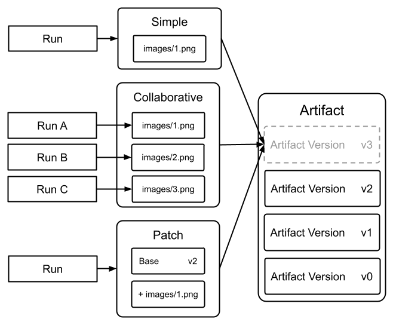

# Artifact Creation Modes

New versions of an Artifact can be created in one of three ways:

* **Simple**: A single run provides all the data for a new version. This is the most common case and is best suited for when the run fully recreates the needed data. For example: outputting saved models or model predictions in a table for analysis.
* **Collaborative**: A set of runs collectively provides all the data for a new version. This is best suited for distributed jobs which have multiple runs generating data, often in parallel. For example: evaluating a model in a distributed manner, and outputting the predictions.
* **Patch:** (coming soon) A single run provides a patch of the differences to be applied. This is best suited when a run wants to add data to an artifact without needing to recreate all the already existing data. For example: you have a golden dataset which is created by running a daily web scraper - in this case, you want the run to append new data to the dataset.



### Simple Mode

To log a new version of an Artifact with a single run which produces all the files in the artifact, use the Simple Mode:

```python
with wandb.init() as run:
	artifact = wandb.Artifact("artifact_name", "artifact_type")
	# Add Files and Assets to the artifact using 
	# `.add`, `.add_file`, `.add_dir`, and `.add_reference`
	artifact.add_file("image1.png")
	run.log_artifact(artifact)
```

This pattern is so common, that we provide a method of creating the version without explicitly starting a run using `Artifact.save()`:

```python
artifact = wandb.Artifact("artifact_name", "artifact_type")
# Add Files and Assets to the artifact using 
# `.add`, `.add_file`, `.add_dir`, and `.add_reference`
artifact.add_file("image1.png")
artifact.save()
```

### Collaborative Mode

To allow a collection of runs to collaborate on a version before committing it, use the Collaborative Mode. There are two key ideas to keep in mind when using Collaborative Mode:

1. Each Run in the collection needs to be aware of the same, unique ID (called `distributed_id`) in order to collaborate on the same version. As a default, if present, we will use the run's `group` as set by `wandb.init(group=GROUP)` as the `distributed_id`.
2. There must be a final run which "commits" the version, permanently locking its state.

Consider the following example. Take note that rather than using `log_artifact` we use `upsert_artifact` to add the the collaborative artifact and `finish_artifact` to finalize the commit.:

**Run 1:**

```python
with wandb.init() as run:
	artifact = wandb.Artifact("artifact_name", "artifact_type")
	# Add Files and Assets to the artifact using 
	# `.add`, `.add_file`, `.add_dir`, and `.add_reference`
	artifact.add_file("image1.png")
	run.upsert_artifact(artifact, distributed_id="my_dist_artifact")
```

**Run 2:**

```python
with wandb.init() as run:
	artifact = wandb.Artifact("artifact_name", "artifact_type")
	# Add Files and Assets to the artifact using 
	# `.add`, `.add_file`, `.add_dir`, and `.add_reference`
	artifact.add_file("image2.png")
	run.upsert_artifact(artifact, distributed_id="my_dist_artifact")
```

**Run 3:** Must run after Run 1 and Run 2 complete. The Run which calls `finish_artifact` is welcome to include files in the artifact, but does not need to.

```python
with wandb.init() as run:
	artifact = wandb.Artifact("artifact_name", "artifact_type")
	# Add Files and Assets to the artifact using 
	# `.add`, `.add_file`, `.add_dir`, and `.add_reference`
	artifact.add_file("image3.png")
	run.finish_artifact(artifact, distributed_id="my_dist_artifact")
```

### Patch Mode (Coming Soon)

To create a new version of an Artifact by modifying a previous version, use Patch Mode. A code snippet for Patch Mode will be provided once available for use.

## FAQ

### How do I log a Table in Collaborative Mode?

For large datasets multiple parallel runs might need to contribute to a single Table. You can use the following pattern to construct such parallel artifacts. The key idea is that each worker puts their own Table in a directory in the artifact. Then, the final worker adds a `PartitionTable` to the artifact which points to the folder of "parts".

```python
import wandb
import time

# We will use ray to launch our runs in parallel
# for demonstration purposes. You can orchestrate
# your parallel runs however you want.
import ray

ray.init()

artifact_type = "dataset"
artifact_name = "parallel-artifact"
table_name = "distributed_table"
parts_path = "parts"
num_parallel = 5

# Each batch of parallel writers should have its own
# unique group name.
group_name = "writer-group-{}".format(round(time.time()))

@ray.remote
def train(i):
  """
  Our writer job. Each writer will add one image to the artifact.
  """
  with wandb.init(group=group_name) as run:
    artifact = wandb.Artifact(name=artifact_name, type=artifact_type)
    
    # Add data to a wandb table. In this case we use example data
    table = wandb.Table(columns=["a", "b", "c"], data=[[i, i*2, 2**i]])
    
    # Add the table to folder in the artifact
    artifact.add(table, "{}/table_{}".format(parts_path, i))
    
    # Upserting the artifact creates or appends data to the artifact
    run.upsert_artifact(artifact)
  
# Launch your runs in parallel
result_ids = [train.remote(i) for i in range(num_parallel)]

# Join on all the writers to make sure their files have
# been added before finishing the artifact. 
ray.get(result_ids)

# Once all the writers are done writing, finish the artifact
# to mark it ready.
with wandb.init(group=group_name) as run:
  artifact = wandb.Artifact(artifact_name, type=artifact_type)
  
  # Create a "PartitionTable" pointing to the folder of tables
  # and add it to the artifact.
  artifact.add(wandb.data_types.PartitionedTable(parts_path), table_name)
  
  # Finish artifact finalizes the artifact, disallowing future "upserts"
  # to this version.
  run.finish_artifact(artifact)
```
