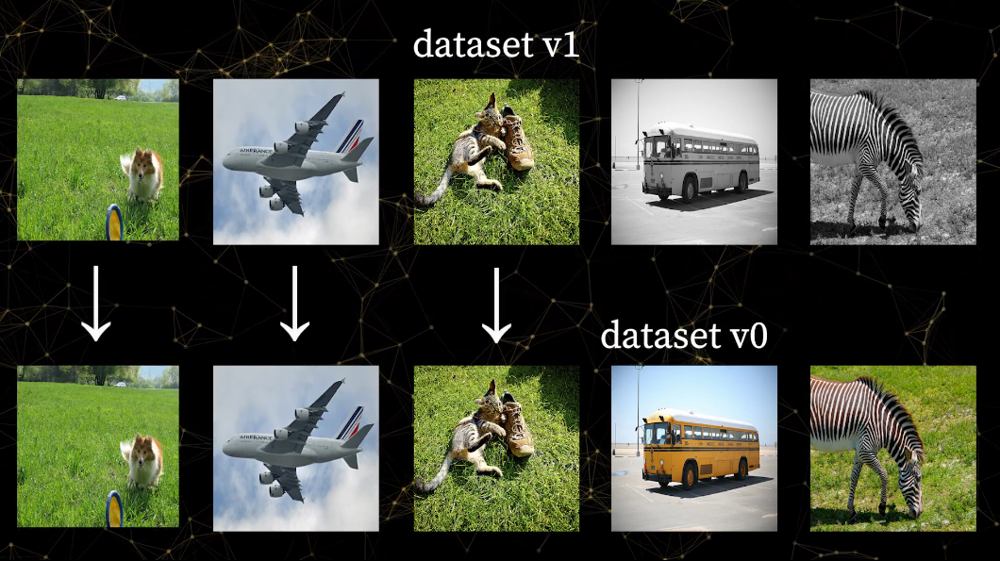

# Artifacts FAQs

## What happens if I log a new version of same artifact with only minor changes? Does the storage used double?

No need to worry! When logging a new version of an artifact, W&B only uploads the files that changed between the last version and the new version. For example, if your first version uploads 100 files and the second version adds 10 more files, the second artifact will only consume the space of the 10 new files.



## How do I programmatically update artifacts?

You can update various artifact properties \(such as `description`, `metadata`, and `aliases`\) directly from your scripts simply by setting them to the desired values and then calling `.save()`:

```python
api = wandb.Api()
artifact = api.artifact('bike-dataset:latest')

# Update the description
artifact.description = "My new description"

# Selectively update metadata keys
artifact.metadata["oldKey"] = "new value"

# Replace the metadata entirely
artifact.metadata = {"newKey": "new value"}

# Add an alias
artifact.aliases.append('best')

# Remove an alias
artifact.aliases.remove('latest')

# Completely replace the aliases
artifact.aliases = ['replaced']

# Persist all artifact modifications
artifact.save()
```

## How do I log an artifact to an existing run?

Occasionally, you may want to mark an artifact as the output of a previously logged run. In that scenario, you can reinitialize the old run and log new artifacts to it as follows:

```python
with wandb.init(id="existing_run_id", resume="allow") as run:
    artifact = wandb.Artifact("artifact_name", "artifact_type")
    artifact.add_file("my_data/file.txt")
    run.log_artifact(artifact)
```

## How do I log an artifact without launching a run?

You can use the handy `wandb artifact put` command to log artifacts without needing to write a script to handle the upload:

```bash
$ wandb artifact put -n project/artifact -t dataset mnist/
```

Similarly, you can then download artifacts to a directory with this command:

```bash
$ wandb artifact get project/artifact:alias --root mnist/
```

## How do I download an artifact outside of a run?

You can use the handy `wandb artifact get` command to download artifacts:

```bash
$ wandb artifact get project/artifact:alias --root mnist/
```

Alternatively, you could write a script that uses the public API:

```python
api = wandb.Api()

artifact = api.artifact('data:v0')
artifact_dir = artifact.checkout()
```

## How do I clean up unused artifact versions?

As an artifact evolves over time, you might end up with a large number of versions that clutter the UI and eat up storage space. This is especially true if you are using artifacts for model checkpoints, where only the most recent version \(the version tagged latest\) of your artifact is useful. Here's how you can delete all versions of an artifact that don't have any aliases:

```python
api = wandb.Api()

artifact_type, artifact_name = ... # fill in the desired type + name
for version in api.artifact_versions(artifact_type, artifact_name):
    # Clean up all versions that don't have an alias such as 'latest'.
		#
		# NOTE: You can put whatever deletion logic you want here.
    if len(version.aliases) == 0:
        version.delete()
```

## How do I traverse the artifact graph?

W&B automatically tracks the artifacts a given run has logged as well as the artifacts a given run has used. You can walk this graph programmatically via the API:

```python
api = wandb.Api()

artifact = api.artifact('data:v0')

# Walk up and down the graph from an artifact:
producer_run = artifact.logged_by()
consumer_runs = artifact.used_by()

# Walk up and down the graph from a run:
logged_artifacts = run.logged_artifacts()
used_artifacts = run.used_artifacts()
```

## How do I clean up my local artifact cache?

W&B caches artifact files to speed up downloads across versions that share many files in common. Over time, however, this cache directory can become large. You can run the following command to prune the cache, cleaning up any files that haven't been used recently:

```text
$ wandb artifact cache cleanup 1GB
```

Running the above command will limit the size of the cache to 1GB, prioritizing files to delete based on how long ago they were last accessed.

## How do I log an artifact with distributed processes?

For large datasets or distributed training, multiple parallel runs might need to contribute to a single artifact. You can use the following pattern to construct such parallel artifacts:

```python
import wandb
import time

# We will use ray to launch our runs in parallel
# for demonstration purposes. You can orchestrate
# your parallel runs however you want.
import ray

ray.init()

artifact_type = "dataset"
artifact_name = "parallel-artifact"
table_name = "distributed_table"
parts_path = "parts"
num_parallel = 5

# Each batch of parallel writers should have its own
# unique group name.
group_name = "writer-group-{}".format(round(time.time()))

@ray.remote
def train(i):
  """
  Our writer job. Each writer will add one image to the artifact.
  """
  with wandb.init(group=group_name) as run:
    artifact = wandb.Artifact(name=artifact_name, type=artifact_type)
    
    # Add data to a wandb table. In this case we use example data
    table = wandb.Table(columns=["a", "b", "c"], data=[[i, i*2, 2**i]])
    
    # Add the table to folder in the artifact
    artifact.add(table, "{}/table_{}".format(parts_path, i))
    
    # Upserting the artifact creates or appends data to the artifact
    run.upsert_artifact(artifact)
  
# Launch your runs in parallel
result_ids = [train.remote(i) for i in range(num_parallel)]

# Join on all the writers to make sure their files have
# been added before finishing the artifact. 
ray.get(result_ids)

# Once all the writers are done writing, finish the artifact
# to mark it ready.
with wandb.init(group=group_name) as run:
  artifact = wandb.Artifact(artifact_name, type=artifact_type)
  
  # Create a "PartitionTable" pointing to the folder of tables
  # and add it to the artifact.
  artifact.add(wandb.data_types.PartitionedTable(parts_path), table_name)
  
  # Finish artifact finalizes the artifact, disallowing future "upserts"
  # to this version.
  run.finish_artifact(artifact)
```

## How do I find an artifact from the best run in a sweep?

Within a sweep, you may have the individual runs each emitting its own artifacts instead of having all the runs produce versions of the same artifact. With this pattern, you can use the following code to retrieve the artifacts associated with the best performing run in a sweep:

```python
import wandb
api = wandb.Api()
sweep = api.sweep("<entity>/<project>/<sweep_id>")
runs = sorted(sweep.runs, key=lambda run: run.summary.get("val_acc", 0), reverse=True)
best_run = runs[0]
for artifact in best_run.logged_artifacts():
  artifact_path = artifact.download()
  print(artifact_path)
```

## How do I best log models from runs in a sweep?

One effective pattern for logging models in a sweep is to have a model artifact for the sweep, where the versions will correspond to different runs from the sweep. More concretely, you would have:

```text
wandb.Artifact(name=<sweep_name>, type='model')
```

## How do I save code?‌

Use `save_code=True` in `wandb.init` to save the main script or notebook where you’re launching the run. To save all your code to a run, version code with Artifacts. Here’s an example:

```python
code_artifact = wandb.Artifact(type='code')
code_artifact.add_dir('.')
wandb.log_artifact(code_artifact)
```

## Where are artifact files stored?

By default, W&B stores artifact files in a private Google Cloud Storage bucket located in the United States. All files are encrypted at rest and in transit.

For sensitive files, we recommend a private W&B installation or the use of reference artifacts.

## When are artifact files deleted?

W&B stores artifact files in a way that minimizes duplication across successive artifact versions. This means that if you log a dataset with 1,000 images and then log a subsequent version that just adds 100 more images, the second version is only and exactly as big as the files that were introduced.

When deleting artifact versions, W&B checks which files are completely safe to delete. In other words, it guarantees that the file is not in use by a previous or subsequent artifact version. If it is safe to remove, the file is deleted immediately and no trace of it remains on our servers.

## Who has access to my artifacts?

Artifacts inherit the access of their parent project:

* If the project is private, then only members of the project's team have access to its artifacts.
* For public projects, all users have read access to artifacts but only members of the project's team can create or modify them.
* For open projects, all uses have read and write access to artifacts.

