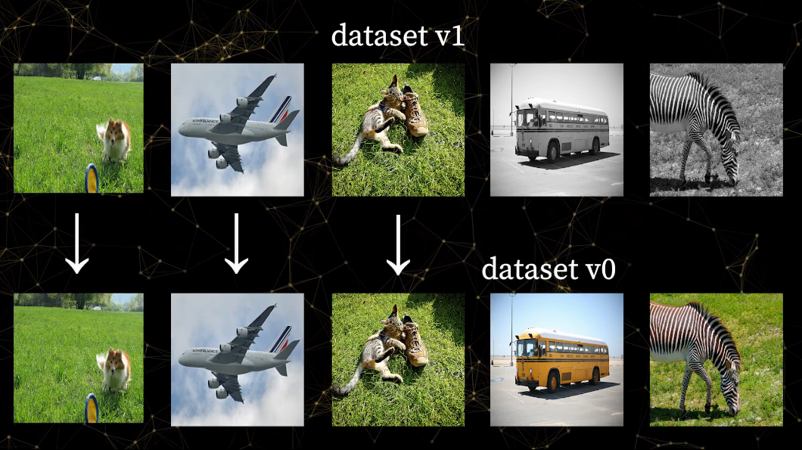

# Storage

Weights & Biases stores artifact files in a private Google Cloud Storage bucket located in the United States by default. All files are encrypted at rest and in transit.

For sensitive files, we recommend you set up [Private Hosting](https://docs.wandb.ai/guides/self-hosted) or use [reference artifacts](https://docs.wandb.ai/guides/artifacts/track-external-files).

During training, Weights & Biases locally saves logs, artifacts, and configuration files in the following local directories:

| File      | Default location  | To change default location set:                                   |
| --------- | ----------------- | ----------------------------------------------------------------- |
| logs      | `./wandb`         | `dir` in `wandb.init` or set the `WANDB_DIR` environment variable |
| artifacts | `~/.cache/wandb`  | the `WANDB_CACHE_DIR` environment variable                        |
| configs   | `~/.config/wandb` | the `WANDB_CONFIG_DIR` environment variable                       |


Depending on the machine on `wandb` is initialized on, these default folders may not be located in a writeable part of the file system. This might trigger an error.


### Clean up local artifact cache

Weights & Biases caches artifact files to speed up downloads across versions that share files in common. Over time this cache directory can become large. Run the [`wandb artifact cache cleanup`](https://docs.wandb.ai/ref/cli/wandb-artifact/wandb-artifact-cache) command to prune the cache and to remove any files that have not been used recently.

The proceeding code snippet demonstrates how to limit the size of the cache to 1GB. Copy and paste the code snippet into your terminal:

```bash
$ wandb artifact cache cleanup 1GB
```

### How much storage does each artifact version use?

Only files that change between two artifact versions incur a storage cost.



For example, suppose you create an image artifact named `animals` that contains two image files cat.png and dog.png:

```
images
|-- cat.png (2MB) # Added in `v0`
|-- dog.png (1MB) # Added in `v0`
```

This artifact will automatically be assigned a version `v0`.

If you add a new image `rat.png` to your artifact, a new artifact version is create, `v1`, and it will have the following contents:

```
images
|-- cat.png (2MB) # Added in `v0`
|-- dog.png (1MB) # Added in `v0`
|-- rat.png (3MB) # Added in `v1`
```

`v1` tracks a total of 6MB worth of files, however, it only takes up 3MB of space because it shares the remaining 3MB in common with `v0`. If you delete `v1`, you will reclaim the 3MB of storage associated with `rat.png`. If you delete `v0`, then `v1` will inherit the storage costs of `cat.png` and `dog.png` bringing its storage size to 6MB.
