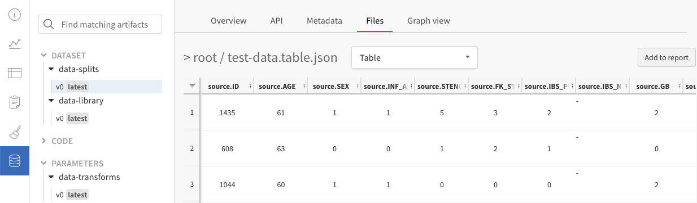

# Data Visualization

Use **W\&B Tables** to log, query, and analyze tabular data. Understand your datasets, visualize model predictions, and share insights in a central dashboard.

* Compare changes precisely across models, epochs, or individual examples
* Understand higher-level patterns in your data
* Capture and communicate your insights with visual samples

## Tables Quickstart

[](http://wandb.me/tables-colab)

The fastest way to try Tables is to log a dataframe and see the Table UI.

```python
wandb.log({"table": my_dataframe})
```

.png>)

### Rich media

Add rich media to your logged [Table](log-tables.md) (images, audio, point clouds, etc) with `wandb` [data types](../../ref/python/data-types/).

.png>)

## What are W\&B Tables?

A W\&B Table (`wandb.Table`) is a two dimensional grid of data where each column has a single type of data—think of this as a more powerful DataFrame. Tables support primitive and numeric types, as well as nested lists, dictionaries, and rich media types. Log a Table to W\&B, then query, compare, and analyze results in the UI.

Tables are great for storing, understanding, and sharing any form of data critical to your ML workflow—from datasets to model predictions and everything in between.

## Why use Tables?

### **Actually see your data**

Log metrics and rich media during model training or evaluation, then visualize results in a persistent database synced to the cloud, or to your [self-hosted instance](https://docs.wandb.ai/guides/self-hosted). For example, check out this [balanced split of a photos dataset →](https://wandb.ai/stacey/mendeleev/artifacts/balanced\_data/inat\_80-10-10\_5K/ab79f01e007113280018/files/data\_split.table.json)


### **Interactively explore your data**

View, sort, filter, group, join, and query Tables to understand your data and model performance—no need to browse static files or rerun analysis scripts. For example, see this project on [style-transfered audio →](https://wandb.ai/stacey/cshanty/reports/Whale2Song-W-B-Tables-for-Audio--Vmlldzo4NDI3NzM)


### **Compare model versions**

Quickly compare results across different training epochs, datasets, hyperparameter choices, model architectures etc. For example, take a look at this comparison of [two models on the same test images →](https://wandb.ai/stacey/evalserver\_answers\_2/artifacts/results/eval\_Daenerys/c2290abd3d7274f00ad8/files/eval\_results.table.json#b6dae62d4f00d31eeebf$eval\_Bob)


### **Track every detail and see the bigger picture**

Zoom in to visualize a specific prediction at a specific step. Zoom out to see the aggregate statistics, identify patterns of errors, and understand opportunities for improvement. This tool works for comparing steps from a single model training, or results across different model versions. Check out this example table analyzing results [after 1 vs 5 epochs on MNIST →](https://wandb.ai/stacey/mnist-viz/artifacts/predictions/baseline/d888bc05719667811b23/files/predictions.table.json#7dd0cd845c0edb469dec)


## Example Projects with W\&B Tables

### Image classification

Read [this report](https://wandb.ai/stacey/mendeleev/reports/Visualize-Data-for-Image-Classification--VmlldzozNjE3NjA), follow [this colab](https://wandb.me/dsviz-nature-colab), or explore this [artifacts context](https://wandb.ai/stacey/mendeleev/artifacts/val\_epoch\_preds/val\_pred\_gawf9z8j/2dcee8fa22863317472b/files/val\_epoch\_res.table.json) for a CNN identifying 10 types of living things (plants, bird, insects, etc) from [iNaturalist](https://www.inaturalist.org/pages/developers) photos.


### Audio

Interact with audio Tables in[ this report](https://wandb.ai/stacey/cshanty/reports/Whale2Song-W-B-Tables-for-Audio--Vmlldzo4NDI3NzM) on timbre transfer. You can compare a recorded whale song with a synthesized rendition of the same melody on an instrument like violin or trumpet. You can also record your own songs and explore their synthesized versions in W\&B via [this colab →](http://wandb.me/audio-transfer)


### Text

Browse text samples from training data or generated output, dynamically group by relevant fields, and align your evaluation across model variants or experiment settings. Explore a simple character-based RNN for generating Shakespeare in [this report →](https://wandb.ai/stacey/nlg/reports/Visualize-Text-Data-Predictions--Vmlldzo1NzcwNzY)


### Video

Browse and aggregate over videos logged during training to understand your models. Here is an early example using the [SafeLife benchmark](https://wandb.ai/safelife/v1dot2/benchmark) for RL agents seeking to [minimize side effects →](https://wandb.ai/stacey/saferlife/artifacts/video/videos\_append-spawn/c1f92c6e27fa0725c154/files/video\_examples.table.json)


### Tabular data

A report on [splitting and preprocessing tabular data](https://wandb.ai/dpaiton/splitting-tabular-data/reports/Tabular-Data-Versioning-and-Deduplication-with-Weights-Biases--VmlldzoxNDIzOTA1) with version control and deduplication.



### Comparing model variants (semantic segmentation)

An [interactive notebook](https://wandb.me/dsviz-cars-demo) and [live example](https://wandb.ai/stacey/evalserver\_answers\_2/artifacts/results/eval\_Daenerys/c2290abd3d7274f00ad8/files/eval\_results.table.json#a57f8e412329727038c2$eval\_Ada) of logging Tables for semantic segmentation and comparing different models. Try your own queries [in this Table →](https://wandb.ai/stacey/evalserver\_answers\_2/artifacts/results/eval\_Daenerys/c2290abd3d7274f00ad8/files/eval\_results.table.json)


### Analyzing improvement over training time

A detailed report on [visualizing predictions over time](https://wandb.ai/stacey/mnist-viz/reports/Visualize-Predictions-over-Time--Vmlldzo1OTQxMTk) and the accompanying [interactive notebook →](https://wandb.me/dsviz-mnist-colab)
