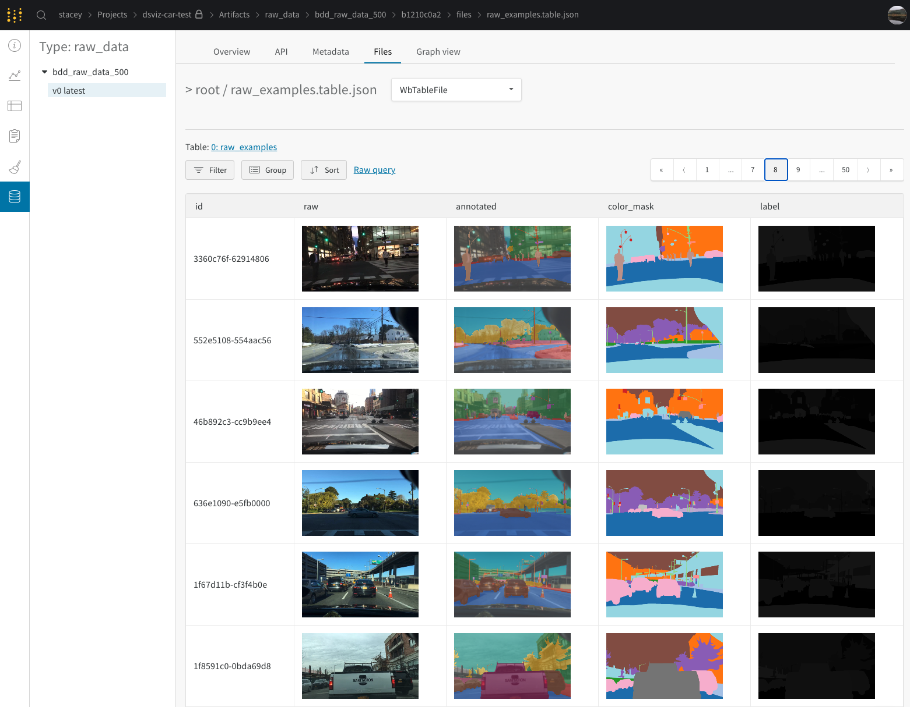
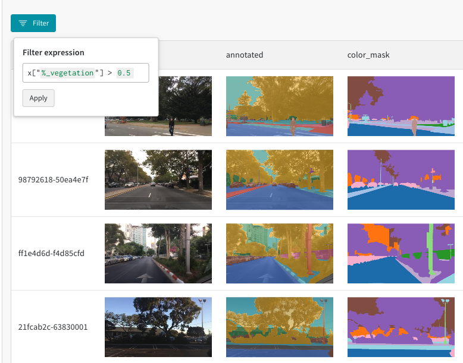
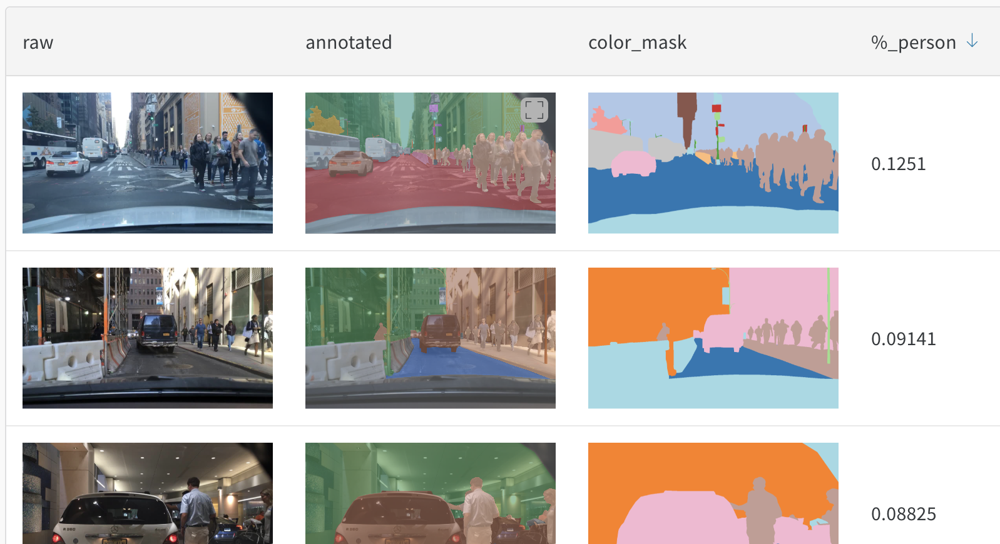
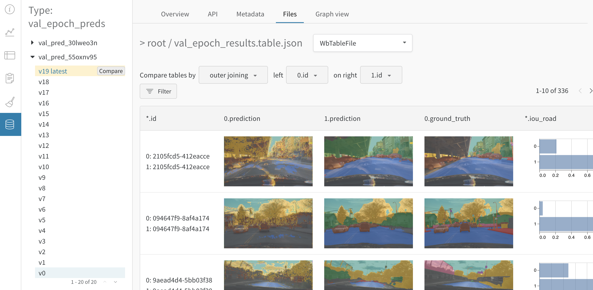
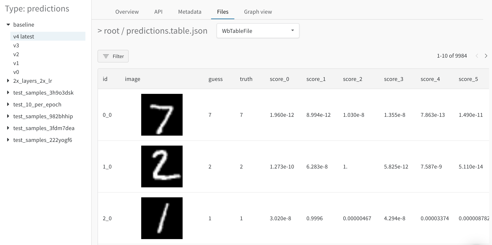
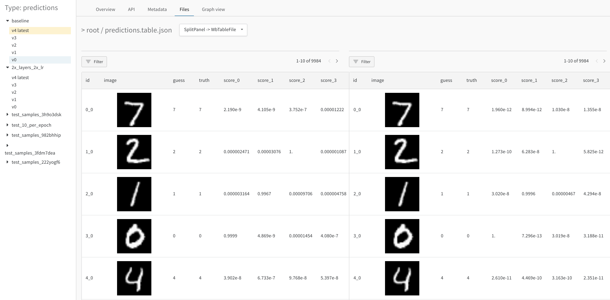
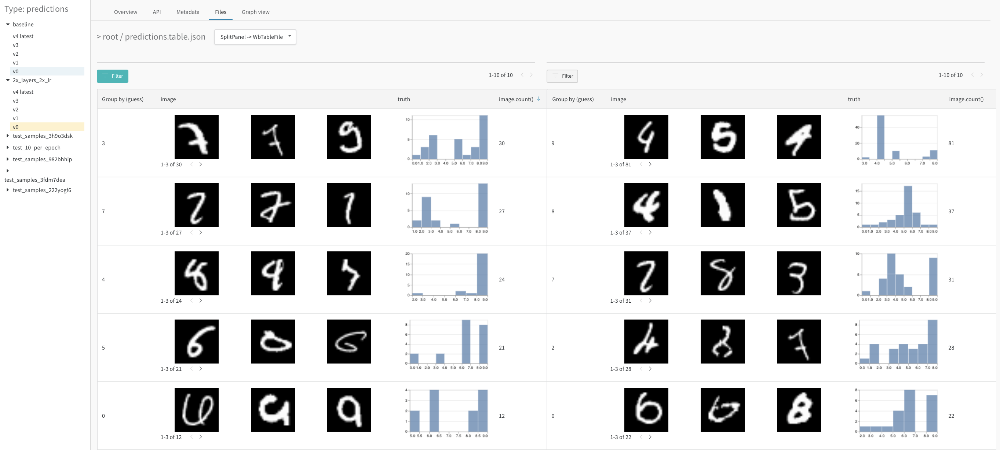

# Data Visualization

_This feature is currently in the early-access phase. You can use it in our production service at wandb.ai, with_ [_some limitations_](https://docs.wandb.com/untitled#current-limitations)_. APIs are subject to change. We'd love to hear questions, comments, and ideas! Drop us a line at_ [_feedback@wandb.com_](mailto:feedback@wandb.com)_._

Data is at the core of every ML workflow. We’ve added powerful new features to W&B Artifacts to let you visualize and query datasets and model evaluations at the example level. You can use this new tool to analyze and understand your datasets, and to measure and debug model performance.

Dive in and try an end-to-end demo: [](http://wandb.me/dsviz-cars-demo)



## How it works

Our goal is to give you highly scalable, flexible and configurable tools, with rich out-of-the-box visualizations available for common tasks. The system is constructed out of:

* The ability to save large wandb.Table objects, optionally containing rich media \(like images with bounding boxes\), inside of W&B Artifacts.
* Support for cross-artifact file references, and the ability to join tables together in the UI. This is used, for example, to log a set of bounding box predictions against a ground-truth dataset artifact, without duplicating the source images and labels.
* \[future\] Backend API support for large-scale queries over tables stored in W&B Artifacts.
* An all new “typed, run-time-swappable UI-panel architecture”. This is what powers the rich visualizations and charts you see as you compare and group your data tables. Eventually we’ll open this up, so users can add completely custom visualizers that work everywhere in the W&B UI.

## W&B Web UI

_Follow along by opening this_ [_example project_](https://wandb.ai/stacey/dsviz-demo/artifacts/train_data/bdd_train_data_500/0d2650b62d7e6201f9eb/files/train_table.table.json)_, which was generated from our_ [_demo colab_](http://wandb.me/dsviz-cars-demo)_._

### **Visualizing tables**

Here's an [example table](https://wandb.ai/stacey/dsviz-demo/artifacts/raw_data/bdd_raw_data_500/afcb923f719b14370215/files/raw_examples.table.json) with a raw logged dataset. To visualize logged tables and media objects, open an artifact, go to the **Files** tab, and click on the table or object. Switch to the **Graph view** to see how artifacts and runs in the project are connected. Toggle **Explode** to see the individual executions of each step in the pipeline.


### Filtering

Specify filters on any column to limit the visible rows down to only rows that match. In the [demo](https://wandb.ai/stacey/dsviz-demo/artifacts/raw_data/bdd_raw_data_500/afcb923f719b14370215/files/raw_examples.table.json), try filtering down to just rows that are mostly vegetation with `%_vegetation > 0.5`.



### Sorting

Sort by metadata to find the most interesting or troublesome examples. In the [demo](https://wandb.ai/stacey/dsviz-demo/artifacts/train_data/bdd_train_data_500/0d2650b62d7e6201f9eb/files/train_table.table.json), sort by the `%_person` column to find the images with the most pedestrians.



### **Comparison**

Compare any two artifact versions in the table. In this [comparison of model predictions](https://wandb.ai/stacey/dsviz-demo/artifacts/val_epoch_preds/val_pred_55oxnv95/e7956e9367bf5369712c/files/val_epoch_results.table.json#8ea156e10e0099fe58d8), we're comparing v0 with v19, as seen in the left sidebar highlights. This shows predictions from both artifact versions in a single table. Think of both tables being overlaid on top of eachother. The table decides to render bar charts for incoming numeric columns, with one bar for each table being compared.



## Python API

Try our demo colab for an end-to-end example: [](http://wandb.me/dsviz-cars-demo)

To visualize datasets and predictions, log rich media to an artifact. In addition to saving raw files in W&B Artifacts, you can now save, retrieve, and visualize other rich media types provided by the wandb API.

The following types are currently supported:

* wandb.Table\(\)
* wandb.Image\(\)

Support for additional media types is coming soon.

### **New Artifacts methods**

There are two new methods on Artifact objects:

`artifact.add(object, name)`

* Add a media object to an artifact. Currently supported types are wandb.Table and wandb.Image, with more coming soon.
* This recursively adds any child media objects and assets \(like raw ‘.png’ files\) to the artifact.

`artifact.get(name)`

* Return a reconstructed media object from a stored artifact.

These methods are symmetrical. You can store an object in an artifact using .add\(\), and be sure you’ll get the same exact object back using .get\(\), on whatever machine you need it on.

### **wandb.\* media objects**

`wandb.Table`

Tables are at the core of dataset and prediction visualization. To visualize a dataset, put it in a wandb.Table, adding wandb.Image objects, arrays, dictionaries, strings and numbers as needed, and then add your table to an artifact. Currently, each table is limited to 200,000 rows. You can log as many tables as you like to an artifact.

The following example code saves 1000 images and labels from the Keras cifar10 test dataset as a wandb.Table inside an artifact:

```python
import tensorflow as tf
import wandb

classes = ['airplane', 'automobile', 'bird', 'cat',
           'deer', 'dog', 'frog', 'horse', 'ship', 'truck']
_, (x_test, y_test) = tf.keras.datasets.cifar10.load_data()

wandb.init(job_type='create-dataset') # start tracking program execution

# construct a table containing our dataset
table = wandb.Table(('image', 'label'))
for x, y in zip(x_test[:1000], y_test[:1000]):
    table.add_data(wandb.Image(x), classes[y[0]])

# put the table in an artifact and save it
dataset_artifact = wandb.Artifact('my-dataset', type='dataset')
dataset_artifact.add(table, 'dataset')
wandb.log_artifact(dataset_artifact)
```

After running this code, you’ll be able to visualize the table in the W&B UI. Click on “dataset.table.json” in the artifact Files tab. Try grouping by “label” to get examples of each class in the “image” column.

  
`wandb.Image`

You can construct wandb.Image objects, as described in our [wandb.log documentation](https://docs.wandb.com/library/log#images-and-overlays)**.**

wandb.Image allows you to attach segmentation masks and bounding boxes to images, as specified in the docs above. When saving wandb.Image\(\) objects in artifacts, there is one change: we’ve factored out “class\_labels”, which previously needed to be stored in each wandb.Image.

Now you should create class labels separately, if using bounding boxes or segmentation masks, like this:

```python
class_set = wandb.Classes(...)
example = wandb.Image(<path_to_image_file>, classes=class_set, masks={
            "ground_truth": {"path": <path_to_mask>}})
```

You can also construct a wandb.Image that refers to a wandb.Image that has been logged to a different artifact. This will use a _cross-artifact-file-reference_ to avoid duplicating the underlying image.

```python
artifact = wandb.use_artifact('my-dataset-1:v1')
dataset_image = artifact.get('an-image')  # if you've logged a wandb.Image here 
predicted_image = wandb.Image(dataset_image, classes=class_set, masks={
            "predictions": {"path": <path_to_mask>}})
```

  
`wandb.Classes`

Used to define a mapping from class id \(a number\) to label \(a string\):

```python
CLASSES = ['dog', 'cat']
class_set = wandb.Classes([{'name': c, 'id': i} for i, c in enumerate(CLASSES)])
```


`wandb.JoinedTable`

Used to tell the W&B UI to render the join of two tables. The tables may be stored in other artifacts.

```python
jt = wandb.JoinedTable(table1, table2, 'id')
artifact.add(jt, 'joined')
```

## Examples and guides

### Overview

Dive in and try an end-to-end demo using semantic segmentation: [](http://wandb.me/dsviz-cars-demo)

* dataset constructions and visualization
* model training
* logging predictions against the dataset and visualizing them

### Image classification

Explore a more detailed image classification example using photos of plants and animals. Try it yourself in a notebook: [](http://wandb.me/dsviz-nature-colab)or follow along with [this report](https://wandb.ai/stacey/mendeleev/reports/Visualize-Data-for-Image-Classification--VmlldzozNjE3NjA).

### **Visualize audio data**

[Explore this example](https://wandb.ai/stacey/cshanty/reports/Visualize-Audio-Data-in-W-B--Vmlldzo1NDMxMDk) to learn how to log audio data in tables and visualize predictions.

### Visualize predictions over time

Track changes at the level of model predictions on specific examples from your dataset at a specific step in your training pipeline. Aggregate over these dynamically, and interactively analyze the specific predictions to understand patterns of errors and opportunities for improvement—within the same model over time or across different model variants. Note that you'll need to log a unique identifier for each row \(e.g. the example id of each image in your dataset\) to join across different tables for comparison views.

Try this yourself on MNIST: [](http://wandb.me/dsviz-mnist-colab)or read a [more detailed walkthrough](https://wandb.ai/stacey/mnist-viz/reports/Visualize-Predictions-over-Time--Vmlldzo1OTQxMTk).

**Log details for each prediction; query dynamically** \([live example](https://wandb.ai/stacey/mnist-viz/artifacts/predictions/baseline/7dd0cd845c0edb469dec/files/predictions.table.json)\)

View the image pixels, true and guessed labels, example id, confidence scores for all labels, and any other useful information for each example in your data. Once you've logged this to a wandb.Table, you can execute dynamic visual queries without needing to rerun any code: filter, sort, group, create new columns with derived information, and more. 



**Compare a single model's predictions after 1 vs 5 epochs of training** \([live example](https://wandb.ai/stacey/mnist-viz/artifacts/predictions/baseline/d888bc05719667811b23/files/predictions.table.json#7dd0cd845c0edb469dec)\)

The left side shows the baseline model's predictions on the validation data after one epoch of training \(v0 of the predictions, blue highlight\), and the right shows predictions on the same images after five epochs of training \(v4, yellow highlight\).



**Compare across model variants** \([live example](https://wandb.ai/stacey/mnist-viz/artifacts/predictions/baseline/d888bc05719667811b23/files/predictions.table.json#2bb3b1d40aa777496b5d$2x_layers_2x_lr)\)

The left side shows a baseline model's predictions after 1 epoch of training. The right side shows a new variant's predictions on the same images after 1 epoch of training. The new variant has a few architectural changes for illustration purposes \(double the size of the two convolutional layers, double the learning rate\). In a few clicks, we can see the most confused classes for each model variant and a distribution of true labels for each of those guessed classes. For step-by-step instructions, see [this report.](https://wandb.ai/stacey/mnist-viz/reports/Visualize-Predictions-over-Time--Vmlldzo1OTQxMTk) 



## FAQ

**I pack my dataset into a binary format for training. How does that relate to W&B Dataset Artifacts?**

There are a few approaches you can take here:

1. Use the wandb.Table format as the system of record for your datasets. From here you can do one of two things:
   1. at training time derive a packed format from the W&B format artifact.
   2. OR, have a pipeline step that produces a packed format artifact, and train from that artifact
2. Store your packed format and the wandb.Table in the same artifact
3. Make a job that given your packed format, logs a wandb.Table artifact

\[note: in the Alpha phase there is a 50k row-limit in tables saved to W&B Artifacts\]  
If you want to query and visualize model predictions, you need to consider how to pass example IDs through your training step, so that your prediction table can be joined back to source dataset table. See our linked examples for a few approaches.  
Over time we’ll provide converters for common formats, many more examples, and deep integrations with popular frameworks.

## Current limitations

_This feature is currently in the early-access phase, you can use it in our production service at wandb.ai, with some limitations. APIs are subject to change. If you have any questions, comments or ideas, we want to talk! Drop us a line at_ [_feedback@wandb.com_](mailto:feedback@wandb.com)_._

* Scale: tables logged to Artifacts are currently limited to 50,000 rows. We’ll be raising this with each release, with the goal of handling 100m+ rows per table in the future.
* Currently supported wandb.\* media types:
  * wandb.Table
  * wandb.Image
* There is no way to save and persist queries and views in the W&B UI, such as selected filters or columns
* There is no way to add visualizations to W&B Reports

## Upcoming work

* A whole heap of ongoing UX & UI improvements
* Increase row-limit per table
* Use a columnar binary format \(parquet\) for table storage
* Handle dataframes and other common python table formats, in addition to wandb.Table
* Add a more powerful query system, supporting deeper aggregation and analysis
* Support more media types
* Add the ability to persist UI state via save views / workspaces
* Ability to save visualizations & analysis to W&B Reports, for sharing with colleagues
* Ability to save queries and subsets for relabeling and other workflows
* Ability to query from Python
* Ability to add other visualizations that use large table data \(like a cluster visualizer\)
* Support user-authored panels, for completely custom visualizations

