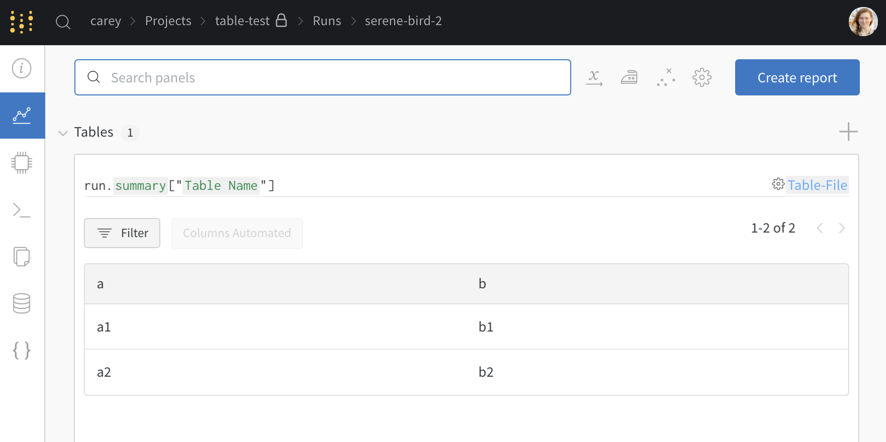
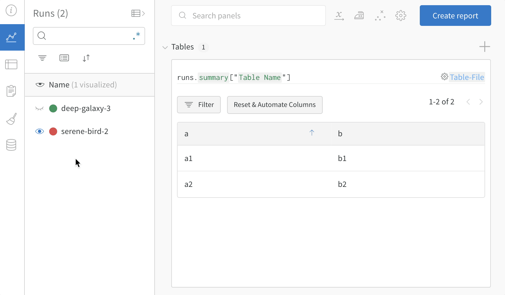
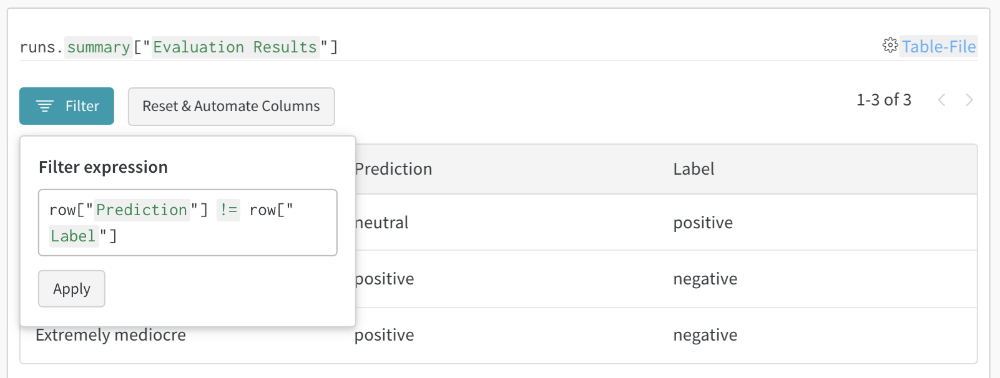

# Tables Quickstart

Try logging data and visualize and query that data in the W&B UI. Click the button below to try a PyTorch quickstart example project on MNIST data.

[](http://wandb.me/tables-quickstart)

## 1. Log a table

Initialize a run, create a `wandb.Table()`, then log it to the run.

```python
run = wandb.init(project="table-test")
my_table = wandb.Table(columns=["a", "b"], data=[["a1", "b1"], ["a2", "b2"]])
run.log({"Table Name": my_table})
```

## 2. Visualize in the dashboard

See the resulting table in the Weights & Biases web app.



## 3. Compare across model versions

Log sample tables from multiple different runs, then compare results in the project workspace. In this [example workspace](https://wandb.ai/carey/table-test?workspace=user-carey), we show how to combine rows from multiple different versions in the same table.



Use the table filter, sort, and grouping features to explore and evaluate model results.




